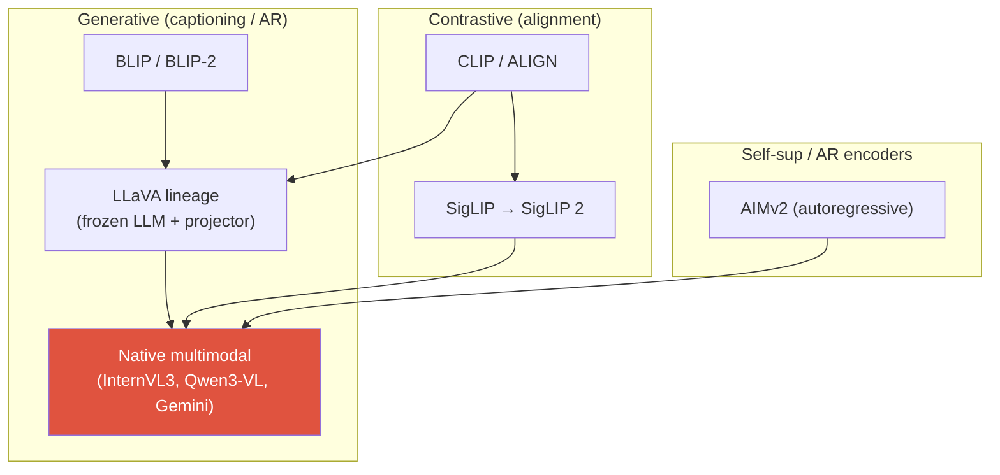
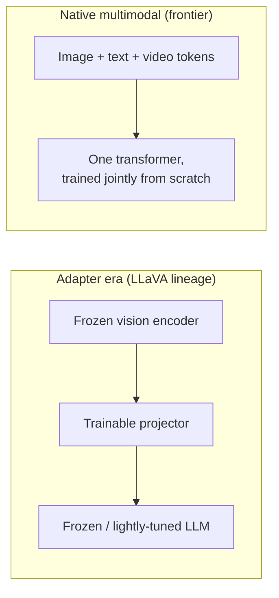

# Vision-Language Pretraining

CLIPcontrastive VLPSigLIP 2AIMv2native multimodalprojectors

> [!TIP] 이것부터 말하세요
> 현대 VLM은 세 가지 결정으로 요약됩니다: **(1)** 어떤 vision encoder가 feature를 만드는가, **(2)** 그 feature를 LLM의 token 공간으로 어떻게 *align*하는가, **(3)** vision과 text를 *처음부터 함께* 학습하는가 아니면 따로 붙이는가(frozen LLM + adapter). 모든 질문을 이 세 축으로 잡으면 항상 체계적으로 들립니다.

프런티어는 "LLM을 freeze하고, CLIP encoder를 붙이고, projector를 학습한다"(LLaVA 레시피, 이제 프런티어 작업에서는 레거시)에서 **native multimodal pretraining** — vision+text(+audio/video)를 한 단계에서 함께 학습하는 방식 — 으로 이동했습니다. 하지만 LLaVA 계보는 여전히 *부품들이 어떻게 연결되는지*에 대한 올바른 멘탈 모델이고, 대부분의 실무 역할에서 실제로 만들게 될 것입니다. 이 장에서는 objective, encoder, alignment 설계를 다룹니다.

## The objective landscape

| Objective | Loss (sketch) | 얻는 것 | 약점 |
| --- | --- | --- | --- |
| Global contrastive | InfoNCE / sigmoid over image↔text | zero-shot classification, retrieval, 깔끔한 공유 공간 | spatial/compositional/counting에 약함, generation 불가 |
| Image-text matching (ITM) | binary matched/not | fine-grained 구별 | 짝짓기 비용이 quadratic |
| Captioning / LM | caption에 대한 cross-entropy next-token | open-ended 답변, instruction following | hallucination, 명시적 alignment 신호 없음 |
| Region-text | phrase↔box/mask alignment | localization, grounding | annotation 비용이 큼 |
| Preference / RLVR | DPO / verifier reward | alignment, hallucination 감소 | reward hacking, verifier 커버리지 |

## 1 · Contrastive VLP: CLIP and its successors

CLIP은 매칭되는 image-text 쌍은 당기고 매칭되지 않는 쌍은 밀어내면서 **공유 embedding 공간**을 학습합니다. $N$개 쌍의 batch, image feature $v_i$와 text feature $t_i$(L2-normalized), temperature $\tau$에 대해:

$$\mathcal{L}_{\text{CLIP}} = -\frac{1}{2N}\sum_{i=1}^{N}\Big[\log\frac{e^{\langle v_i,t_i\rangle/\tau}}{\sum_j e^{\langle v_i,t_j\rangle/\tau}} + \log\frac{e^{\langle v_i,t_i\rangle/\tau}}{\sum_j e^{\langle v_j,t_i\rangle/\tau}}\Big]$$

이것은 symmetric InfoNCE입니다(batch에 대한 softmax, 양방향). 면접관이 파고드는 두 가지 귀결:

- **Batch *가* negative입니다.** 품질은 batch size에 따라 스케일합니다 — CLIP은 ~32k를 썼습니다. 이는 통계적 품질을 시스템(디바이스 간 대규모 all-gather)과 결합시킵니다.
- **Softmax는 global합니다.** "고양이가 있는가"는 얻지만 "왼쪽의 빨간 컵"은 못 얻습니다 — CLIP은 spatial relation, counting, OCR에 약합니다. 그 격차가 바로 generative VLM과 grounded 모델이 존재하는 *이유*입니다.

> [!NOTE] SigLIP: the sigmoid fix
> **SigLIP**은 softmax를 쌍마다 독립적인 **sigmoid** loss로 대체합니다 — 모든 (image, text) 쌍이 이진 "match / no-match" logistic 문제가 됩니다. 이는 loss를 global batch normalizer로부터 분리하므로 *작은* batch size에서도 잘 학습되고 손쉽게 shard됩니다. **SigLIP 2**(Google DeepMind, Feb 2025) [VERIFIED]는 그 위에 caption 기반 pretraining, self-distillation, masked prediction, online data curation를 더하고, 더 나은 localization/dense feature를 가진 **native-aspect-ratio** 변형을 제공합니다 — encoder가 *grounded* VLM에 feed할 때 정확히 원하는 특성입니다.

## 2 · Generative VLP: captioning and autoregressive objectives

Generative 계열은 image를 조건으로 text를 **생성**하도록 모델을 학습합니다 — caption/answer에 대한 순수 cross-entropy next-token loss. 이것이 VLM을 *대화형*으로 만드는 요소입니다.

<dl class="kv">
<dt>BLIP</dt><dd>Captioning + filtering "bootstrap": 합성 caption을 생성한 뒤 학습된 matcher로 노이즈가 있는 웹 caption을 걸러냅니다. <b>data curation이 일급 objective</b>라는 초기 교훈입니다.</dd>
<dt>BLIP-2</dt><dd><b>Q-Former</b>(learnable query + cross-attention)가 <b>frozen</b> ViT와 <b>frozen</b> LLM을 잇습니다 — connector만 학습됩니다. 저렴하지만 bottleneck이 정보 흐름을 제한합니다.</dd>
<dt>Flamingo</dt><dd>Gated cross-attention layer를 frozen LLM에 끼워 넣고, Perceiver resampler가 visual token을 압축합니다. Few-shot in-context multimodal prompting을 가능하게 했습니다.</dd>
<dt>LLaVA</dt><dd>승리한 미니멀리스트: CLIP feature에서 LLM embedding 공간으로 가는 <b>linear/MLP projector</b> + <b>visual instruction tuning</b>. 두 단계: (1) caption에 대한 projector-only alignment, (2) full instruction SFT.</dd>
</dl>

## 3 · The central 2026 axis: native multimodal vs. frozen-LLM + adapter

Frozen-LLM + adapter (LLaVA)

- 저렴함: projector(그리고 어쩌면 LoRA)만 학습.
- 강한 text LLM과 강한 vision encoder를 그대로 재사용.
- 빠른 반복; 실무/제품 작업과 대부분의 fine-tuning에 훌륭.
- 모듈러: encoder나 LLM을 독립적으로 교체.

Native multimodal (InternVL3, Qwen3-VL, Gemini, GPT-5)

- Vision과 language가 co-adapt → 더 높은 상한, 더 나은 fusion.
- Encoder에 고정되어 박히는 "modality gap"이 없음.
- 훨씬 비쌈; 거대한 interleaved multimodal corpus 필요.
- 배합이 잘못되면 순수 text 능력이 저하될 위험.

**2026 기준 [VERIFIED]인 것:** 프런티어는 native입니다. *InternVL3*(arXiv 2504.10479)는 **Variable Visual Position Encoding**과 Mixed Preference Optimization으로 native multimodal pretraining을 하고, *Qwen2.5-VL / Qwen3-VL*은 **native dynamic-resolution ViT**를 처음부터 학습합니다. 솔직한 뉘앙스에 주목하세요: **전용 understanding VLM이 여전히 순수 perception에서 앞섭니다**. 그리고 frozen-adapter 레시피는 실무 fine-tuning의 주력으로 남아 있습니다 — 그래서 "native가 더 낫다"는 프런티어 진술이지 보편적 진술이 아닙니다.

## 4 · Vision encoders: CLIP → SigLIP 2 / AIMv2

Encoder는 VLM의 눈입니다. 이걸 업그레이드하는 게 종종 가장 저렴한 품질 향상입니다.

| Encoder | Objective | VLM에 왜 중요한가 |
| --- | --- | --- |
| CLIP ViT | softmax contrastive | 수년간 기본; 좋은 global semantics, 약한 dense feature |
| SigLIP / SigLIP 2 | sigmoid contrastive (+ self-distill, masked pred) | 더 나은 localization/dense feature, native-res 변형, multilingual |
| AIMv2 | **autoregressive** (image + text token 예측) | multimodal generative pretraining; 강한 frozen-trunk feature, native resolution |
| DINOv2 / DINOv3 | self-supervised (self-distillation) | dense/spatial feature; 종종 contrastive encoder와 **fuse** |

> [!EXAMPLE] Multi-encoder fusion
> 2025-2026 반복 트릭: **semantic encoder와 self-supervised encoder를 fuse** — 예를 들어 OpenVLA와 여러 VLM은 **DINOv2 (dense/spatial) + SigLIP (semantic)** feature를 concat합니다. Contrastive encoder는 *무엇*을 알고, SSL encoder는 *어디*를 압니다. Grounded 및 spatial task는 둘 다에서 이득을 봅니다.

Why did the field move from CLIP to SigLIP 2 / AIMv2 as VLM backbones?

**Short:** CLIP의 softmax contrastive objective는 *global* image-text 매칭을 최적화하는데, 이는 훌륭한 semantics를 주지만 dense/localization feature는 평범하고 거대한 batch에 대한 강한 의존성을 낳습니다. SigLIP 2(sigmoid + self-distillation + masked prediction + native resolution)와 AIMv2(autoregressive)는 VLM이 점점 중시하는 *dense, spatial, high-resolution* task(OCR, document, grounding)에 더 나은 feature를 만듭니다.

**Deep:** Sigmoid loss는 global batch normalizer를 없애므로 학습이 batch size로부터 분리되고 깔끔하게 shard됩니다. Self-distillation과 masked prediction은 global contrastive loss가 무시하는 *local* 구조를 주입합니다. AIMv2는 encoder를 autoregressive multimodal predictor로 재구성 — 자신이 feed하는 LLM과 같은 objective 계열 — 하여 매끄럽고 전이 가능한 frozen-trunk feature를 주는 경향이 있습니다. 둘 다 **native-aspect-ratio** 변형을 제공하므로 square-crop으로 text/얇은 구조 정보를 파괴하지 않게 됩니다. 관통하는 흐름: VLM backbone은 contrastive-only CLIP을 넘어 **native resolution에서의 generative/self-supervised objective**로 향하고 있습니다.

## 5 · Alignment / projector designs

Projector는 vision feature(차원 $D_v$, 개수 $N$)를 LLM의 token 공간(차원 $D_{\text{llm}}$)으로 매핑합니다. 두 문제를 동시에 해결합니다: **차원 불일치**와 **modality gap**.

<figure>
<svg viewBox="0 0 660 210" xmlns="http://www.w3.org/2000/svg" font-family="Inter, sans-serif" font-size="12">
  <rect x="20" y="80" width="90" height="44" rx="6" fill="none" stroke="#0ea5e9" stroke-width="2"/>
  <text x="65" y="98" text-anchor="middle" fill="#0ea5e9">ViT feats</text>
  <text x="65" y="114" text-anchor="middle" fill="#6b7686">N × D_v</text>
  <path d="M110 102 H165" stroke="#98a3b2" stroke-width="1.5" marker-end="url(#ar)"/>
  <rect x="165" y="70" width="140" height="64" rx="6" fill="none" stroke="#e0533f" stroke-width="2"/>
  <text x="235" y="94" text-anchor="middle" fill="#e0533f">projector</text>
  <text x="235" y="112" text-anchor="middle" fill="#6b7686">MLP / Q-Former /</text>
  <text x="235" y="126" text-anchor="middle" fill="#6b7686">Perceiver / pixel-shuffle</text>
  <path d="M305 102 H360" stroke="#98a3b2" stroke-width="1.5" marker-end="url(#ar)"/>
  <rect x="360" y="80" width="120" height="44" rx="6" fill="none" stroke="#12a150" stroke-width="2"/>
  <text x="420" y="98" text-anchor="middle" fill="#12a150">visual tokens</text>
  <text x="420" y="114" text-anchor="middle" fill="#6b7686">M × D_llm</text>
  <path d="M480 102 H535" stroke="#98a3b2" stroke-width="1.5" marker-end="url(#ar)"/>
  <rect x="535" y="80" width="90" height="44" rx="6" fill="#6366f1"/>
  <text x="580" y="106" text-anchor="middle" fill="#fff">LLM</text>
  <defs><marker id="ar" markerWidth="8" markerHeight="8" refX="6" refY="3" orient="auto"><path d="M0 0 L6 3 L0 6" fill="#98a3b2"/></marker></defs>
</svg>
<figcaption>projector는 N개의 ViT patch를 M개의 LLM-space token으로 변환합니다. M = N이면 모든 patch 유지(MLP); M &lt; N이면 압축(Q-Former, resampler, pixel-shuffle)하여 context를 절약합니다.</figcaption>
</figure>

| Design | Mechanism | Token count | Trade-off |
| --- | --- | --- | --- |
| Linear | single matrix $D_v\to D_{\text{llm}}$ | M = N | 가장 단순; LLaVA-1.0 |
| MLP | Linear → GELU → Linear | M = N | LLaVA-1.5 기본; 강한 baseline |
| Pixel-shuffle / concat | 인접 patch 병합 | M = N/4 | token을 1/2·1/4로; InternVL |
| Q-Former | learnable query + cross-attn | M = fixed (e.g. 32/64) | 큰 압축, 정보 bottleneck; BLIP-2 |
| Perceiver resampler | fixed latent가 patch에 attend | M = fixed | Flamingo; 다수 frame/video에 좋음 |

긴장 지점은 **충실도 vs. context 예산**입니다: 모든 $N$개 patch를 유지(MLP)하면 디테일은 보존되지만 high-res나 video에서 sequence 길이가 폭발하고, 압축기(Q-Former, resampler)는 더 많은 image/frame을 담지만 정보를 버립니다. Token count가 dynamic-resolution tiling과 어떻게 상호작용하는지는 [VLM Implementation Details](#/vlm/practical)를 참고하세요.

## 6 · Freezing schedules & catastrophic forgetting

정석적인 2단계 LLaVA 레시피:

1. **Alignment (projector-only):** vision encoder + LLM을 freeze하고, image-caption 데이터로 projector만 학습. 저렴함; projector에게 "LLM 언어를 말하도록" 가르침.
2. **Instruction tuning:** LLM을 unfreeze(full 또는 LoRA)하고, vision encoder는 유지하거나 부분적으로 unfreeze하고, 대화로 학습.

> [!WARNING] The forgetting trap
> Visual 데이터로 LLM을 순진하게 full-fine-tuning하면 **언어 능력이 저하됩니다**(catastrophic forgetting). 완화책: text-only 데이터를 섞기, LoRA 사용, **layer-wise learning rate**(projector ≫ LLM) 사용, 초기에 vision encoder freeze 유지. 이는 continual-learning 작업과 연결할 수 있는 "adapt vs. preserve" 긴장과 동일합니다 — [Continual Learning](#/cv/continual-learning)를 참고하세요.

## Q&A

Contrast contrastive and generative VLP. Which do you use?

**Short:** Contrastive(CLIP/SigLIP)는 공유 *retrieval/matching* 공간을 학습하고, generative(BLIP/LLaVA)는 image를 조건으로 언어를 *생성*하도록 학습합니다. 실제 시스템은 둘을 **쌓습니다**: contrastive하게 pretrain된 encoder가 generative VLM에 feed됩니다.

**Deep:** Contrastive는 zero-shot classification, retrieval, 깔끔한 embedding geometry를 주지만 open-ended 출력이 없고 spatial reasoning이 약합니다. Generative는 dialogue, instruction following, grounding을 주지만 hallucination이 있고 명시적 alignment 신호가 없습니다. 지배적 레시피는 **contrastive (또는 AR) encoder → projector → LLM**를 generative하게 학습한 뒤 preference/RLVR로 align합니다. 그러니 둘 중 하나가 아니라 — contrastive pretraining이 *encoder*이고 generative가 *head*입니다.

Why is CLIP weak at spatial reasoning, and how do downstream VLMs fix it?

**Short:** Global softmax는 image를 caption에 매칭되는 하나의 벡터로 뭉갭니다 — "맞는 것이 존재한다"는 보상하지만 "어디에 / 몇 개 / 어떤 관계로"는 아닙니다. 해결책: dense/native-res encoder(SigLIP 2, DINOv3), region-text objective, 명시적 grounding.

**Deep:** 감독이 단일 global similarity이기 때문에 gradient가 encoder에게 *국소적* spatial 구조를 보존하도록 강제하지 않습니다; counting, 좌/우, OCR이 저하됩니다. Downstream VLM은 이를 (a) 미세 구조가 살아남도록 더 높은 resolution / native-aspect encoder, (b) SSL dense feature(DINOv2) fusion, (c) **region-text** pretraining과 coordinate/mask 출력, (d) 정밀 측정을 위한 tool/agent 분해로 회복합니다. 이것이 정확히 grounded VLM의 동기입니다 — [Grounding & Region Reasoning](#/vlm/grounding)를 참고하세요.

**나올 법한 follow-up**

- "SigLIP의 sigmoid loss는 왜 작은 batch size에서 학습되는데 CLIP은 32k가 필요한가?" (Global normalizer가 없음 → 각 쌍이 독립적 logistic term.)
- "Native-multimodal 학습에서 모델이 언어를 잊지 않게 어떻게 막나?" (Data mixing 비율, replay, LoRA, LR schedule.)
- "언제 *여전히* native pretraining보다 frozen-LLM + adapter를 고르나?" (Compute 예산, 모듈성 필요, downstream fine-tuning, 제품 일정.)
- "Full 재학습 없이 encoder 선택을 어떻게 평가하나?" (Linear-probe / frozen-trunk dense benchmark, 그다음 작은 projector-only align.)

## Cheat-sheet

| Concept | One-liner |
| --- | --- |
| CLIP loss | batch에 대한 symmetric InfoNCE; batch = negative; global → 약한 spatial |
| SigLIP | 쌍마다 sigmoid loss → 작은 batch, shard 가능; SigLIP 2는 self-distill + native res 추가 |
| AIMv2 | autoregressive multimodal encoder pretraining; 강한 frozen feature, native res |
| LLaVA recipe | frozen encoder + MLP projector + 2단계 (align → instruction SFT) |
| Native multimodal | vision+text 처음부터 joint pretraining; 프런티어 기본 (InternVL3, Qwen3-VL) |
| Projector trade-off | MLP는 모든 N token 유지(충실도) vs Q-Former/resampler 압축(context 예산) |
| Encoder fusion | dense/grounding task를 위해 DINOv2 (where) + SigLIP (what) |
| Forgetting | vision으로 full-FT LLM하면 언어 손상 → text 데이터 섞기, LoRA, layer-wise LR |

**Related:** [VLM Implementation Details](#/vlm/practical) · [Instruction Tuning & Decoding](#/vlm/instruction-tuning) · [Grounding & Region Reasoning](#/vlm/grounding) · [Vision Foundation Models](#/cv/foundation-models) · [The 2026 Landscape](#/start/landscape-2026)
