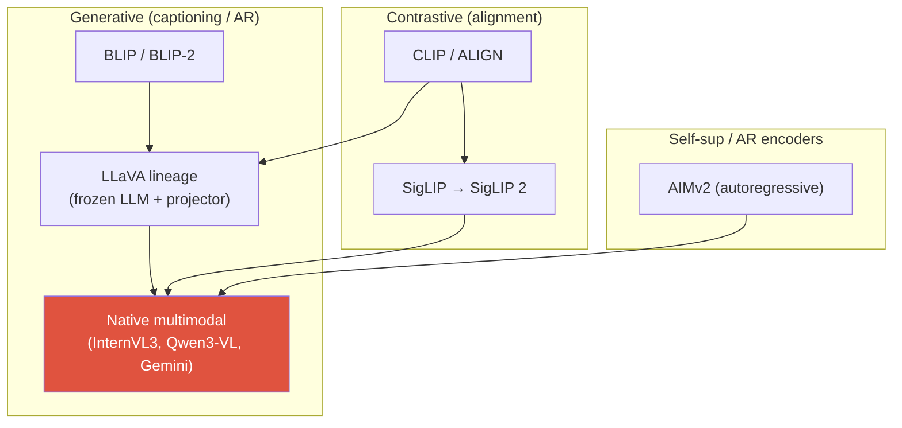
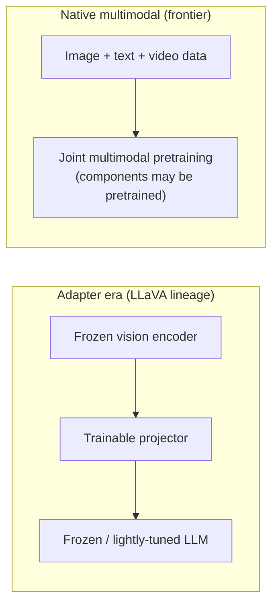

# Vision-Language Pretraining

<div class="tag-row"><span class="tag">CLIP</span><span class="tag">contrastive VLP</span><span class="tag">SigLIP 2</span><span class="tag">AIMv2</span><span class="tag">native multimodal</span><span class="tag">projectors</span></div>

> [!NOTE] 이 챕터의 목표
> [VLM 101](#/vlm/vlm-101)에서 "이미지가 어떻게 토큰이 되는가"를 잡았다면, 이제 그 vision과 language를 **어떻게 함께 학습시키는가**를 봅니다. 목표는 하나 — **이미지와 텍스트를 동시에 이해하는 모델을 사전학습(pretrain)하기**. 큰 갈래는 둘입니다: (1) **대조 학습(contrastive, 대조 학습)** 으로 이미지와 텍스트를 같은 공간에 정렬하는 **CLIP** 계열, (2) 이미지를 보고 **텍스트를 생성**하도록 배우는 생성형 계열. §0~§1은 입문용, 뒤는 심화입니다. 대조 학습의 밑바탕 직관은 [자기지도학습 입문](#/cv/self-supervised)에서 먼저 잡으면 좋습니다.

## §0 · 무엇을, 왜

우리가 원하는 건 이겁니다 — **"강아지가 눈밭에서 뛰는 사진"이라는 말과 실제 그 사진이, 모델의 머릿속에서 같은 뜻으로 통하게** 만드는 것. 그러면 사진을 주고 맞는 설명을 고르거나, 설명을 주고 맞는 사진을 찾거나, 처음 보는 카테고리를 학습 없이 분류할 수 있습니다.

대조 학습 계열은 이미지와 텍스트의 **global embedding을 같은 metric space**에 놓습니다. 반면 생성형 계열은 vision feature를 LLM이 조건으로 사용할 수 있게 연결할 뿐, 이미지·텍스트 token이 하나의 거리 공간에 있어야 하는 것은 아닙니다. 큰 두 답은 다음과 같습니다.

- **대조 학습(contrastive)** — 이미지와 텍스트를 각각 벡터로 만들고, **짝이 맞는 쌍은 서로 가깝게, 안 맞는 쌍은 멀게** 밀당하며 공통 공간을 배웁니다. 대표가 **CLIP**입니다. → 검색·분류·정렬에 강함.
- **생성형(generative)** — 이미지를 조건으로 **텍스트를 이어서 생성**하도록 배웁니다(다음 토큰 맞히기). → 대화·질의응답·설명에 강함.

많은 모듈러 VLM은 대조/자기지도 사전학습 인코더와 생성형 LLM을 **쌓지만**, joint generative pretraining 등 다른 조합도 있습니다. VLM 학습을 볼 때는 다음 세 결정을 확인하세요.

1. **어떤 vision encoder(시각 인코더)** 로 이미지에서 feature를 뽑는가 — CLIP? SigLIP? DINO?
2. 그 feature를 **LLM의 토큰 공간에 어떻게 정렬(align)** 하는가 — projector(프로젝터)? cross-attention?
3. 어느 component를 pretrained 상태로 고정하고, 어느 단계부터 vision과 language를 **공동 최적화**하는가? 논문이 이를 `native multimodal`이라 부르는지, frozen LLM + adapter인지?

> [!TIP] 면접 한 줄
> "VLM 설계는 encoder, fusion/connector, 학습·동결 범위의 세 축으로 설명할 수 있다." `native`와 `adapter`는 이분법적 표준 용어가 아니며, 최신 모델도 pretrained encoder·projector·LLM을 유지한 채 공동학습할 수 있습니다. 모델 카드에서 초기화와 각 단계의 trainable component를 확인하세요.

## The objective landscape



| Objective | Loss (sketch) | 얻는 것 | 약점 |
| --- | --- | --- | --- |
| Global contrastive | InfoNCE / sigmoid over image↔text | zero-shot classification, retrieval, 깔끔한 공유 공간 | spatial/compositional/counting에 약함, generation 불가 |
| Image-text matching (ITM) | binary matched/not | fine-grained 구별 | cross-encoder라면 후보 쌍별 계산; all-pairs 구성 시 $O(N^2)$ |
| Captioning / LM | caption에 대한 cross-entropy next-token | open-ended 답변, instruction following | hallucination, 명시적 alignment 신호 없음 |
| Region-text | phrase↔box/mask alignment | localization, grounding | annotation 비용이 큼 |
| Post-training(별도 단계) | preference optimization / RL·verifier | 지시 준수·선호·검증 가능 행동 | reward hacking, verifier 커버리지 |

마지막 행은 **pretraining objective가 아니라 post-training**입니다. DPO는 선호쌍을, RLVR은 검증 가능한 reward를 쓰며 같은 것으로 묶지 않습니다. 상세는 [Instruction Tuning & Decoding](#/vlm/instruction-tuning)과 [Post-Training & Alignment](#/llm/alignment)이 담당합니다.

## 1 · Contrastive VLP: CLIP과 그 후예들

**CLIP**(Contrastive Language-Image Pre-training)의 아이디어는 한 문장입니다: **매칭되는 (이미지, 텍스트) 쌍은 서로 당기고, 매칭 안 되는 쌍은 밀어내면서 하나의 공유 embedding 공간(공유 임베딩 공간)을 학습한다.** 그러면 고양이 사진의 벡터와 "a photo of a cat"이라는 문장의 벡터가 가까워집니다.

구조부터 그림으로 잡아 봅시다. CLIP은 **이중 인코더(dual encoder)** — 이미지를 벡터로 만드는 인코더 하나, 텍스트를 벡터로 만드는 인코더 하나 — 로 되어 있습니다. 두 인코더의 출력을 **같은 차원의 공유 공간**에 놓고, 배치 안 모든 쌍의 유사도를 계산해 정답 쌍(대각선)만 골라내도록 학습합니다.

<figure>
<svg viewBox="0 0 700 380" xmlns="http://www.w3.org/2000/svg" font-family="Inter, sans-serif" font-size="12">
  <!-- ===== Stage A: dual encoders ===== -->
  <text x="80" y="26" text-anchor="middle" fill="#98a3b2" font-weight="700">① 이중 인코더</text>
  <!-- image inputs -->
  <g fill="none" stroke="#0ea5e9" stroke-width="1.4">
    <rect x="20" y="42" width="30" height="30" rx="4"/><rect x="20" y="80" width="30" height="30" rx="4"/><rect x="20" y="118" width="30" height="30" rx="4"/>
  </g>
  <text x="35" y="63" text-anchor="middle">🐱</text><text x="35" y="101" text-anchor="middle">🐶</text><text x="35" y="139" text-anchor="middle">🚗</text>
  <rect x="62" y="46" width="70" height="102" rx="8" fill="none" stroke="#0ea5e9" stroke-width="1.8"/>
  <text x="97" y="92" text-anchor="middle" fill="#0ea5e9">이미지</text><text x="97" y="108" text-anchor="middle" fill="#0ea5e9">인코더</text>
  <!-- text inputs -->
  <g fill="currentColor" font-size="10">
    <text x="35" y="238" text-anchor="middle">"cat"</text><text x="35" y="266" text-anchor="middle">"dog"</text><text x="35" y="294" text-anchor="middle">"car"</text>
  </g>
  <rect x="62" y="220" width="70" height="90" rx="8" fill="none" stroke="#12a150" stroke-width="1.8"/>
  <text x="97" y="260" text-anchor="middle" fill="#12a150">텍스트</text><text x="97" y="276" text-anchor="middle" fill="#12a150">인코더</text>
  <!-- ===== Stage B: shared embedding space ===== -->
  <text x="270" y="26" text-anchor="middle" fill="#98a3b2" font-weight="700">② 공유 임베딩 공간</text>
  <circle cx="270" cy="185" r="98" fill="none" stroke="#98a3b2" stroke-width="1" stroke-dasharray="4 4"/>
  <!-- paired dots (image=blue, text=green) close together -->
  <circle cx="240" cy="120" r="6" fill="#0ea5e9"/><circle cx="256" cy="112" r="6" fill="#12a150"/>
  <path d="M246 118 L252 114" stroke="#e0533f" stroke-width="1.6"/><text x="266" y="104" fill="#98a3b2" font-size="10">cat</text>
  <circle cx="315" cy="220" r="6" fill="#0ea5e9"/><circle cx="330" cy="228" r="6" fill="#12a150"/>
  <path d="M321 223 L326 226" stroke="#e0533f" stroke-width="1.6"/><text x="343" y="234" fill="#98a3b2" font-size="10">car</text>
  <circle cx="215" cy="235" r="6" fill="#0ea5e9"/><circle cx="230" cy="243" r="6" fill="#12a150"/>
  <path d="M221 238 L226 241" stroke="#e0533f" stroke-width="1.6"/><text x="196" y="258" fill="#98a3b2" font-size="10">dog</text>
  <text x="270" y="300" text-anchor="middle" fill="#e0533f" font-size="10">짝은 당겨서 가깝게</text>
  <!-- arrows from encoders into the space -->
  <path d="M132 97 C170 110 180 140 195 150" stroke="#0ea5e9" stroke-width="1.3" fill="none" marker-end="url(#cp)"/>
  <path d="M132 262 C170 250 180 225 195 215" stroke="#12a150" stroke-width="1.3" fill="none" marker-end="url(#cp)"/>
  <!-- ===== Stage C: NxN similarity matrix ===== -->
  <text x="560" y="26" text-anchor="middle" fill="#e0533f" font-weight="700">③ N×N 유사도 행렬</text>
  <path d="M370 185 H430" stroke="#98a3b2" stroke-width="1.4" fill="none" marker-end="url(#cp)"/>
  <text x="490" y="62" fill="#98a3b2" font-size="10">T₁</text><text x="535" y="62" fill="#98a3b2" font-size="10">T₂</text><text x="580" y="62" fill="#98a3b2" font-size="10">T₃</text>
  <text x="455" y="92" fill="#98a3b2" font-size="10">I₁</text><text x="455" y="137" fill="#98a3b2" font-size="10">I₂</text><text x="455" y="182" fill="#98a3b2" font-size="10">I₃</text>
  <!-- row 1 -->
  <rect x="478" y="70" width="42" height="42" fill="#e0533f"/><rect x="524" y="70" width="42" height="42" fill="rgba(99,102,241,0.15)"/><rect x="570" y="70" width="42" height="42" fill="rgba(99,102,241,0.15)"/>
  <!-- row 2 -->
  <rect x="478" y="116" width="42" height="42" fill="rgba(99,102,241,0.15)"/><rect x="524" y="116" width="42" height="42" fill="#e0533f"/><rect x="570" y="116" width="42" height="42" fill="rgba(99,102,241,0.15)"/>
  <!-- row 3 -->
  <rect x="478" y="162" width="42" height="42" fill="rgba(99,102,241,0.15)"/><rect x="524" y="162" width="42" height="42" fill="rgba(99,102,241,0.15)"/><rect x="570" y="162" width="42" height="42" fill="#e0533f"/>
  <text x="499" y="96" text-anchor="middle" fill="#fff" font-size="11">✓</text><text x="545" y="142" text-anchor="middle" fill="#fff" font-size="11">✓</text><text x="591" y="188" text-anchor="middle" fill="#fff" font-size="11">✓</text>
  <text x="545" y="238" text-anchor="middle" fill="#e0533f" font-size="10">대각선 = 정답 쌍 ↑</text>
  <text x="545" y="254" text-anchor="middle" fill="#98a3b2" font-size="10">나머지 = 오답 ↓</text>
  <text x="545" y="280" text-anchor="middle" fill="#98a3b2" font-size="10">각 행/열 softmax →</text>
  <text x="545" y="294" text-anchor="middle" fill="#98a3b2" font-size="10">대각선이 정답이 되도록 학습</text>
  <defs><marker id="cp" markerWidth="8" markerHeight="8" refX="6" refY="3" orient="auto"><path d="M0 0 L6 3 L0 6" fill="#98a3b2"/></marker></defs>
</svg>
<figcaption>CLIP의 큰 그림: <b>①</b> 이미지·텍스트를 각각 인코더로 벡터화하고 → <b>②</b> 같은 공유 공간에 놓아 짝이 맞는 쌍(빨강 연결)을 당기고 → <b>③</b> 배치 안 모든 쌍의 유사도 행렬에서 대각선(정답)만 높이도록 학습합니다. 즉 "각 이미지에 맞는 텍스트 고르기" 분류 문제입니다.</figcaption>
</figure>

### 왜 "행렬의 대각선"인가

배치에 $N$개의 (이미지, 텍스트) 쌍이 들어오면 $N\times N$ 유사도 행렬을 만들고 대각선을 지정 positive로 학습합니다. 나머지는 **in-batch negative로 취급**하지만, 실제로 같은 개념을 설명하거나 여러 이미지에 맞는 caption이 섞이면 false negative일 수 있습니다. 따라서 "모두 진짜 오답"이라는 의미가 아니라 데이터 구성상 대조 손실이 그렇게 라벨링한다는 뜻입니다.

### zero-shot로 분류하는 예시 (학습 없이)

CLIP의 마법은 여기서 나옵니다. 개·고양이·자동차를 구분하는 분류기를 **따로 학습하지 않고** 만들 수 있습니다:

1. 후보 class 이름을 프롬프트 틀에 넣어 텍스트로 만듭니다 → "a photo of a **cat**", "a photo of a **dog**", "a photo of a **car**".
2. 이 문장들을 텍스트 인코더로 벡터화합니다 (= class 벡터 3개).
3. 분류할 이미지 한 장을 이미지 인코더로 벡터화합니다.
4. 이미지 벡터와 가장 **cosine 유사도가 높은** class 문장을 고릅니다 → 그게 예측입니다.

분류기가 말 그대로 *텍스트로부터 즉석에서 만들어지기* 때문에, 새 카테고리를 문장만 바꿔 추가할 수 있습니다. 그래서 프롬프트 문구를 다듬는 **prompt engineering / template ensembling**("a photo of a {}", "a blurry photo of a {}" 여러 개 평균)이 정확도를 눈에 띄게 올립니다.

### 수식으로 (symmetric InfoNCE)

$N$개 쌍의 batch, image feature $v_i$와 text feature $t_i$(L2-normalized), temperature(온도) $\tau$에 대해:

$$\mathcal{L}_{\text{CLIP}} = -\frac{1}{2N}\sum_{i=1}^{N}\Big[\log\frac{e^{\langle v_i,t_i\rangle/\tau}}{\sum_j e^{\langle v_i,t_j\rangle/\tau}} + \log\frac{e^{\langle v_i,t_i\rangle/\tau}}{\sum_j e^{\langle v_j,t_i\rangle/\tau}}\Big]$$

이것이 **symmetric InfoNCE**(양방향 대조 손실)입니다 — 첫 항은 이미지→텍스트 방향, 둘째 항은 텍스트→이미지 방향. 면접관이 파고드는 두 귀결:

- **배치의 비매칭 항목을 negative로 사용합니다.** 큰 batch가 더 많은 후보를 주지만 false negative와 통신 비용도 늘며, 품질이 batch size에 무조건 단조 비례하지는 않습니다. 원 CLIP의 큰 batch는 디바이스 간 all-gather와 얽힙니다.
- **Softmax가 global입니다.** "고양이가 있는가"는 얻지만 "왼쪽의 빨간 컵"은 못 얻습니다 — CLIP은 공간 관계, counting, OCR에 약합니다. 그 격차가 생성형 VLM과 grounded 모델이 존재하는 *이유*입니다.

**구조 요약:** 두 인코더 — image encoder(ViT 또는 ResNet)와 text encoder(Transformer) — 각각 공유 $d$-차원 공간으로 가는 linear projection을 갖습니다; embedding은 **L2-normalized**되어 dot product가 곧 cosine similarity입니다. Temperature $\tau$는 **학습되는** scalar입니다($\log(1/\tau)$로 저장하고 clip). 정제된 label이 아니라 스케일 + 단순한 objective로, ~**400M**개의 노이즈 있는 웹 (image, alt-text) 쌍으로 학습됩니다.

학습 한 스텝은 위 그림을 거의 그대로 코드로 옮길 수 있습니다.

<details class="concept-code">
<summary>개념 코드로 보기</summary>

> 아래는 symmetric InfoNCE의 PyTorch식 **의사코드**입니다. 분산 all-gather의 gradient 정책은 구현에 따라 달라집니다.

```python
def clip_train_step(images, texts):
    image_encoder.train(); text_encoder.train()
    I_local = l2_normalize(image_encoder(images) @ W_i)  # [N_local,d]
    T_local = l2_normalize(text_encoder(texts) @ W_t)    # [N_local,d]

    # global negative를 쓰면 rank 순서를 고정하고 positive index offset을 맞춘다.
    I = differentiable_all_gather(I_local)               # [N_global,d]
    T = differentiable_all_gather(T_local)
    scale = exp(logit_scale).clamp(max=MAX_SCALE)
    logits = scale * (I @ T.T)                           # [N_global,N_global]
    labels = arange(N_global, device=logits.device)      # 대각선이 지정 positive

    loss_i2t = cross_entropy(logits, labels)             # 각 image가 text를 분류
    loss_t2i = cross_entropy(logits.T, labels)           # 각 text가 image를 분류
    loss = 0.5 * (loss_i2t + loss_t2i)
    optimizer.zero_grad(); loss.backward(); optimizer.step()
    # 중복 caption/동일 개념은 off-diagonal이어도 false negative일 수 있다.
```

</details>

### 직접 돌려보기 — 이미지마다 맞는 텍스트 고르기

CLIP zero-shot의 심장은 딱 한 줄, **유사도 행렬의 각 행에서 argmax**입니다. 이미지 임베딩들과 텍스트(class) 임베딩들을 받아, 각 이미지에 가장 잘 맞는 텍스트의 인덱스를 돌려주는 함수를 채워 보세요. cosine 유사도를 쓰려면 먼저 각 벡터를 정규화해야 합니다. (막히면 **Solution**을 열어 보세요.)

<div class="widget" data-widget="code">
<script type="application/json" class="code-config">
{"func":"match_images_to_texts","packages":["numpy"],"starter":"def match_images_to_texts(image_embs, text_embs):\n    # image_embs: (N, d) 이미지 임베딩, text_embs: (M, d) 텍스트(class) 임베딩.\n    # 각 이미지에 대해 cosine 유사도가 가장 높은 텍스트의 인덱스를 담은 길이 N 리스트를 반환.\n    # 힌트: 각 벡터를 L2 정규화 → sims = I @ T.T → 각 행의 argmax.\n    import numpy as np\n    I = np.asarray(image_embs, float)\n    T = np.asarray(text_embs, float)\n    # TODO\n    pass","tests":[{"args":[[[1,0],[0,1]],[[0,1],[1,0]]],"expect":[1,0]},{"args":[[[1,0],[0,1],[1,1]],[[1,0],[0,1],[1,1]]],"expect":[0,1,2]},{"args":[[[2,0],[1,1]],[[3,0],[0,5],[1,1]]],"expect":[0,2]}],"solution":"import numpy as np\n\ndef match_images_to_texts(image_embs, text_embs):\n    I = np.asarray(image_embs, float)\n    T = np.asarray(text_embs, float)\n    I = I / np.linalg.norm(I, axis=1, keepdims=True)\n    T = T / np.linalg.norm(T, axis=1, keepdims=True)\n    sims = I @ T.T          # (N, M) cosine 유사도 행렬\n    return [int(j) for j in sims.argmax(axis=1)]"}
</script>
</div>

이게 곧 zero-shot 분류입니다 — `text_embs`가 "a photo of a {class}" 문장들의 임베딩이면, 반환값이 각 이미지의 예측 class 인덱스가 됩니다.

> [!NOTE] SigLIP: the sigmoid fix
> **SigLIP**은 softmax 정규화 대신 image-text 쌍별 **sigmoid** loss를 사용합니다. global softmax normalizer 의존을 없애 분산 구현과 batch-size scaling의 성질을 바꾸지만, 작은 batch에서 언제나 같은 품질이 나거나 batch size와 독립적이라는 뜻은 아닙니다. **SigLIP 2**는 caption 기반 objective, self-distillation, masked prediction, online data curation와 native-aspect-ratio 변형을 결합하며, 개선 폭은 downstream·해상도별로 확인해야 합니다.

## 1.5 · Contrastive learning (일반 레시피)

CLIP은 더 넓은 아이디어의 한 사례입니다: **"positive(정답)" 쌍은 당기고 "negative(오답)"는 밀어내면서 representation을 학습한다** — class label 없이, 무엇이 비슷해야 하는가라는 개념만으로. 이 일반 레시피의 그림·직관은 [자기지도학습 입문](#/cv/self-supervised)에서 먼저 잡을 수 있습니다.

**InfoNCE**, 주력 loss. Anchor $x$에 대해 positive $x^+$ 하나와 negative $\{x^-_j\}$, similarity $s(\cdot,\cdot)$(cosine), temperature $\tau$가 주어졌을 때:

$$
\mathcal L_{\text{InfoNCE}}=-\log\frac{e^{s(x,x^+)/\tau}}{e^{s(x,x^+)/\tau}+\sum_j e^{s(x,x^-_j)/\tau}}
$$

이것은 **"어느 후보가 positive인가?"를 묻는 softmax cross-entropy**입니다. CLIP은 정확히 이것으로, *다른 modality의* embedding을 후보로 씁니다(in-batch 항목 = negative).

<dl class="kv">
<dt>Positives</dt><dd>같은 대상의 두 view: 한 image의 두 augmentation(SimCLR), image와 그 caption(CLIP), query와 그 key.</dd>
<dt>Negatives</dt><dd>그 외 전부. 더 많고/더 어려운 negative → 어느 지점까지는 더 나은 feature; 이들이 어디서 오는가가 핵심 설계 축입니다.</dd>
<dt>Temperature $\tau$</dt><dd>Softmax를 sharpen(뾰족하게)합니다. 낮은 $\tau$는 가장 어려운 negative에 집중(더 sharp, 더 위험); 높은 $\tau$는 더 부드럽습니다. 민감하고 중요한 knob입니다.</dd>
</dl>

| Method | Positives / negatives | Key trick |
| --- | --- | --- |
| **SimCLR** | image의 augmentation 2개; negative = batch의 나머지 | **큰 batch** 필요; 강한 augmentation + projection head |
| **MoCo** | 동일하되, negative는 **momentum queue**에서 | #negative를 batch size와 분리(memory bank + EMA encoder) |
| **CLIP** | image ↔ 그 text; negative = 다른 쌍들 | cross-modal; batch = negative (~32k) |
| **Triplet** | (anchor, positive, negative) | margin loss; hard-negative mining 필요 |

**고전적 metric-learning loss**(InfoNCE 이전): **contrastive loss**는 positive 쌍을 거리 0으로 당기고 negative는 margin $m$ 너머로 밀어냅니다, $\;y\,d^2+(1-y)\max(0,m-d)^2$; **triplet loss**는 positive가 negative보다 margin만큼 더 가깝도록 순위를 매깁니다, $\;\max(0,\,d(a,p)-d(a,n)+m)$. 이들은 face recognition과 [visual-search](#/system-design/case-studies) embedding을 구동합니다.

> [!WARNING] Representation collapse — 그리고 non-contrastive 방법이 이를 피하는 법
> 실패 모드는 **collapse**: encoder가 모든 입력을 같은 표현으로 매핑하는 것입니다. Contrastive 방법은 negative와 정규화 구조로 이를 피합니다. Non-contrastive 방법의 장치는 서로 다릅니다. **BYOL과 DINO는 momentum/EMA teacher와 stop-gradient**를 쓰고, DINO는 centering/sharpening도 사용합니다. **SimSiam은 EMA target 없이** predictor와 stop-gradient로 collapse를 피합니다. [DINO training detail](#/cv/foundation-models) 참고.

## 2 · Generative VLP: captioning과 autoregressive objective

Generative(생성형) 계열은 image를 조건으로 text를 **생성**하도록 모델을 학습합니다 — caption/answer에 대한 순수 cross-entropy next-token loss. 이것이 VLM을 *대화형*으로 만드는 요소입니다.

<dl class="kv">
<dt>BLIP</dt><dd>Captioning + filtering "bootstrap": 합성 caption을 생성한 뒤 학습된 matcher로 노이즈가 있는 웹 caption을 걸러냅니다. <b>data curation이 일급 objective</b>라는 초기 교훈입니다.</dd>
<dt>BLIP-2</dt><dd><a href="https://arxiv.org/abs/2301.12597"><b>Q-Former</b></a>의 learnable query가 frozen image encoder feature에 cross-attend하고, 그 출력을 projection해 frozen LLM에 넣습니다. 두 단계에서 Q-Former와 projection 등 연결부를 학습하며, 고정 query 수가 정보 bottleneck이 될 수 있습니다.</dd>
<dt>Flamingo</dt><dd><a href="https://arxiv.org/abs/2204.14198">Perceiver resampler</a>가 visual token을 압축하고 gated cross-attention layer가 frozen LLM 중간에 들어갑니다. Q-Former가 connector 안에서 cross-attend한 뒤 prefix를 만드는 BLIP-2와 구분하세요.</dd>
<dt>LLaVA</dt><dd>CLIP feature를 linear/MLP projector로 LLM에 연결하고 visual instruction tuning을 수행합니다. 전형적 두 단계는 (1) projector-only feature alignment, (2) vision encoder는 고정한 채 projector와 LLM 전체 또는 adapter를 instruction 데이터로 학습하는 방식이며 버전별 범위가 다릅니다.</dd>
</dl>

## 3 · 2026년의 핵심 축: native multimodal vs. frozen-LLM + adapter



<div class="proscons"><div><div class="pros-t">Frozen-LLM + adapter (LLaVA)</div>

- 저렴함: projector(그리고 어쩌면 LoRA)만 학습.
- 강한 text LLM과 강한 vision encoder를 그대로 재사용.
- 빠른 반복; 실무/제품 작업과 대부분의 fine-tuning에 훌륭.
- 모듈러: encoder나 LLM을 독립적으로 교체.
</div><div><div class="cons-t">Joint/native multimodal training</div>

- Vision과 language component가 함께 적응할 수 있음.
- 고정 connector만 학습하는 경우보다 fusion을 넓게 최적화할 여지.
- 훨씬 비쌈; 거대한 interleaved multimodal corpus 필요.
- 배합이 잘못되면 순수 text 능력이 저하될 위험.
</div></div>

`native multimodal`은 논문마다 의미가 달라 구조를 확인해야 합니다. [InternVL3](https://arxiv.org/abs/2504.10479)는 vision·language component를 함께 학습하는 native multimodal pretraining을 강조하지만, **Mixed Preference Optimization은 별도 post-training 단계**입니다. [Qwen2.5-VL](https://arxiv.org/abs/2502.13923)은 dynamic resolution과 window attention, multimodal RoPE를 사용합니다. 이 사례들도 반드시 "단일 transformer를 무작위 초기화부터 학습"했다는 뜻은 아닙니다. frozen-adapter와 joint training의 우열은 데이터·예산·task·업데이트 용이성으로 결정합니다.

## 4 · Vision encoders: CLIP → SigLIP 2 / AIMv2

Encoder는 VLM의 눈입니다. 이걸 업그레이드하는 게 종종 가장 저렴한 품질 향상입니다.

| Encoder | Objective | VLM에 왜 중요한가 |
| --- | --- | --- |
| CLIP ViT | softmax contrastive | 수년간 기본; 좋은 global semantics, 약한 dense feature |
| SigLIP / SigLIP 2 | sigmoid contrastive (+ self-distill, masked pred) | 더 나은 localization/dense feature, native-res 변형, multilingual |
| AIMv2 | **autoregressive** (image + text token 예측) | multimodal generative pretraining; 강한 frozen-trunk feature, native resolution |
| DINOv2 / DINOv3 | self-supervised (self-distillation) | dense/spatial feature; 종종 contrastive encoder와 **fuse** |

> [!EXAMPLE] Multi-encoder fusion
> 일부 VLA/VLM은 **DINOv2 계열 dense feature와 SigLIP 계열 semantic feature를 fuse**합니다. 이를 "where + what"으로 기억할 수 있지만 두 encoder의 능력이 그렇게 완전히 분리되는 것은 아니며, concat이 항상 이득인 것도 아닙니다. token·memory 비용을 포함해 ablation해야 합니다.

<details class="qa"><summary>왜 VLM backbone이 CLIP에서 SigLIP 2 / AIMv2로 옮겨갔나?</summary>
<div class="qa-body">

**Short:** CLIP의 softmax contrastive objective는 *global* image-text 매칭을 최적화하는데, 이는 훌륭한 semantics를 주지만 dense/localization feature는 평범하고 거대한 batch에 대한 강한 의존성을 낳습니다. SigLIP 2(sigmoid + self-distillation + masked prediction + native resolution)와 AIMv2(autoregressive)는 VLM이 점점 중시하는 *dense, spatial, high-resolution* task(OCR, document, grounding)에 더 나은 feature를 만듭니다.

**Deep:** Sigmoid loss는 global batch normalizer를 없애므로 학습이 batch size로부터 분리되고 깔끔하게 shard됩니다. Self-distillation과 masked prediction은 global contrastive loss가 무시하는 *local* 구조를 주입합니다. AIMv2는 encoder를 autoregressive multimodal predictor로 재구성 — 자신이 feed하는 LLM과 같은 objective 계열 — 하여 매끄럽고 전이 가능한 frozen-trunk feature를 주는 경향이 있습니다. 둘 다 **native-aspect-ratio** 변형을 제공하므로 square-crop으로 text/얇은 구조 정보를 파괴하지 않게 됩니다.
</div></details>

## 5 · Alignment / projector 설계

Projector(프로젝터/투영기)는 vision feature(차원 $D_v$, 개수 $N$)를 LLM의 token 공간(차원 $D_{\text{llm}}$)으로 매핑합니다. 두 문제를 동시에 해결합니다: **차원 불일치**와 **modality gap(모달리티 간극)**. 개념 그림은 [VLM 101](#/vlm/vlm-101)의 "통역사"를 참고하세요.

<figure>
<svg viewBox="0 0 660 210" xmlns="http://www.w3.org/2000/svg" font-family="Inter, sans-serif" font-size="12">
  <rect x="20" y="80" width="90" height="44" rx="6" fill="none" stroke="#0ea5e9" stroke-width="2"/>
  <text x="65" y="98" text-anchor="middle" fill="#0ea5e9">ViT feats</text>
  <text x="65" y="114" text-anchor="middle" fill="#98a3b2">N × D_v</text>
  <path d="M110 102 H165" stroke="#98a3b2" stroke-width="1.5" marker-end="url(#ar)"/>
  <rect x="165" y="70" width="140" height="64" rx="6" fill="none" stroke="#e0533f" stroke-width="2"/>
  <text x="235" y="94" text-anchor="middle" fill="#e0533f">projector</text>
  <text x="235" y="112" text-anchor="middle" fill="#98a3b2">MLP / Q-Former /</text>
  <text x="235" y="126" text-anchor="middle" fill="#98a3b2">Perceiver / pixel-shuffle</text>
  <path d="M305 102 H360" stroke="#98a3b2" stroke-width="1.5" marker-end="url(#ar)"/>
  <rect x="360" y="80" width="120" height="44" rx="6" fill="none" stroke="#12a150" stroke-width="2"/>
  <text x="420" y="98" text-anchor="middle" fill="#12a150">visual tokens</text>
  <text x="420" y="114" text-anchor="middle" fill="#98a3b2">M × D_llm</text>
  <path d="M480 102 H535" stroke="#98a3b2" stroke-width="1.5" marker-end="url(#ar)"/>
  <rect x="535" y="80" width="90" height="44" rx="6" fill="#6366f1"/>
  <text x="580" y="106" text-anchor="middle" fill="#fff">LLM</text>
  <defs><marker id="ar" markerWidth="8" markerHeight="8" refX="6" refY="3" orient="auto"><path d="M0 0 L6 3 L0 6" fill="#98a3b2"/></marker></defs>
</svg>
<figcaption>projector는 N개의 ViT patch를 M개의 LLM-space token으로 변환합니다. M = N이면 모든 patch 유지(MLP); M &lt; N이면 압축(Q-Former, resampler, pixel-shuffle)하여 context를 절약합니다.</figcaption>
</figure>

| Design | Mechanism | Token count | Trade-off |
| --- | --- | --- | --- |
| Linear | single matrix $D_v\to D_{\text{llm}}$ | M = N | 가장 단순; LLaVA-1.0 |
| MLP | Linear → GELU → Linear | M = N | LLaVA-1.5 기본; 강한 baseline |
| Pixel-shuffle / concat | 인접 patch 병합 | M = N/4 | token을 1/2·1/4로; InternVL |
| Q-Former | learnable query + cross-attn | M = fixed (e.g. 32/64) | 큰 압축, 정보 bottleneck; BLIP-2 |
| Perceiver resampler | fixed latent가 patch에 attend | M = fixed | Flamingo; 다수 frame/video에 좋음 |

긴장 지점은 **충실도 vs. context 예산**입니다: 모든 $N$개 patch를 유지(MLP)하면 디테일은 보존되지만 high-res나 video에서 sequence 길이가 폭발하고, 압축기(Q-Former, resampler)는 더 많은 image/frame을 담지만 정보를 버립니다. Token count가 dynamic-resolution tiling과 어떻게 상호작용하는지는 [VLM Implementation Details](#/vlm/practical) 참고.

## 6 · Freezing schedule & catastrophic forgetting

정석적인 2단계 LLaVA 레시피:

1. **Alignment (projector-only):** vision encoder + LLM을 freeze(동결)하고, image-caption 데이터로 projector만 학습. 저렴함; projector에게 "LLM 언어를 말하도록" 가르침.
2. **Instruction tuning:** LLM을 unfreeze(full 또는 LoRA)하고, vision encoder는 유지하거나 부분적으로 unfreeze하고, 대화로 학습.

> [!WARNING] The forgetting trap
> Visual 데이터로 LLM을 순진하게 full-fine-tuning하면 **언어 능력이 저하됩니다**(catastrophic forgetting, 파국적 망각). 완화책: text-only 데이터 섞기, LoRA 사용, **layer-wise learning rate**(projector ≫ LLM), 초기에 vision encoder freeze 유지. 이는 continual-learning의 "adapt vs. preserve" 긴장과 동일합니다 — [Continual Learning](#/cv/continual-learning) 참고.

## Q&A

<details class="qa"><summary>Contrastive와 generative VLP를 대조하라. 무엇을 쓰나?</summary>
<div class="qa-body">

**Short:** Contrastive(CLIP/SigLIP)는 공유 *retrieval/matching* 공간을 학습하고, generative(BLIP/LLaVA)는 image를 조건으로 언어를 *생성*하도록 학습합니다. 실제 시스템은 둘을 **쌓습니다**: contrastive하게 pretrain된 encoder가 generative VLM에 feed됩니다.

**Deep:** Contrastive dual encoder는 zero-shot classification·retrieval에 적합하지만 그 자체로 open-ended decoder가 아닙니다. Generative objective는 dialogue를 가능하게 하지만 환각과 약한 spatial grounding이 남을 수 있습니다. 흔한 모듈러 레시피는 pretrained vision encoder → connector → LLM이지만 joint model도 있습니다. 그 뒤의 SFT, preference optimization, verifier RL은 서로 다른 데이터·목표를 가진 선택적 post-training 단계입니다.
</div></details>

<details class="qa"><summary>왜 CLIP은 spatial reasoning에 약하고, downstream VLM은 어떻게 고치나?</summary>
<div class="qa-body">

**Short:** Global softmax는 image를 caption에 매칭되는 하나의 벡터로 뭉갭니다 — "맞는 것이 존재한다"는 보상하지만 "어디에 / 몇 개 / 어떤 관계로"는 아닙니다. 해결책: dense/native-res encoder(SigLIP 2, DINOv3), region-text objective, 명시적 grounding.

**Deep:** 감독이 단일 global similarity이기 때문에 gradient가 encoder에게 *국소적* spatial 구조를 보존하도록 강제하지 않습니다; counting, 좌/우, OCR이 저하됩니다. Downstream VLM은 이를 (a) 더 높은 resolution / native-aspect encoder, (b) SSL dense feature(DINOv2) fusion, (c) **region-text** pretraining과 coordinate/mask 출력, (d) 정밀 측정을 위한 tool/agent 분해로 회복합니다. 이것이 grounded VLM의 동기입니다 — [Grounding & Region Reasoning](#/vlm/grounding) 참고.
</div></details>

**나올 법한 follow-up**

- "SigLIP은 batch-size scaling을 어떻게 바꾸나?" (Global softmax normalizer를 없애 쌍별 logistic term으로 만들지만 negative 수·최적화·품질은 여전히 batch와 데이터에 영향.)
- "Native-multimodal 학습에서 모델이 언어를 잊지 않게 어떻게 막나?" (Data mixing 비율, replay, LoRA, LR schedule.)
- "언제 *여전히* native pretraining보다 frozen-LLM + adapter를 고르나?" (Compute 예산, 모듈성 필요, downstream fine-tuning, 제품 일정.)

## Cheat-sheet

| Concept | One-liner |
| --- | --- |
| CLIP 큰 그림 | 이중 인코더 → 공유 공간 → N×N 유사도 행렬의 대각선(정답) 당기기 |
| CLIP loss | batch에 대한 symmetric InfoNCE; batch = negative; global → 약한 spatial |
| Zero-shot | class 이름을 "a photo of a {}"로 임베딩 → 이미지와 cosine argmax |
| SigLIP | 쌍마다 sigmoid loss → global softmax 제거·분산 용이; 작은 batch 품질은 별도 검증 |
| AIMv2 | autoregressive multimodal encoder pretraining; 강한 frozen feature, native res |
| LLaVA recipe | frozen encoder + MLP projector + 2단계 (align → instruction SFT) |
| Joint/native multimodal | vision·language를 공동 최적화한다는 계열별 용어; pretrained 부품/connector가 남을 수 있음 |
| Projector trade-off | MLP는 모든 N token 유지(충실도) vs Q-Former/resampler 압축(context 예산) |
| Encoder fusion | dense/grounding task를 위해 DINOv2 (where) + SigLIP (what) |
| Forgetting | vision으로 full-FT LLM하면 언어 손상 → text 데이터 섞기, LoRA, layer-wise LR |

**다음:** [VLM Implementation Details](#/vlm/practical) · [Instruction Tuning & Decoding](#/vlm/instruction-tuning) · [Grounding & Region Reasoning](#/vlm/grounding) · [VLM 101](#/vlm/vlm-101) · [자기지도학습 입문](#/cv/self-supervised)
