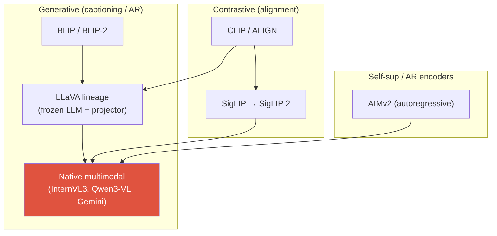
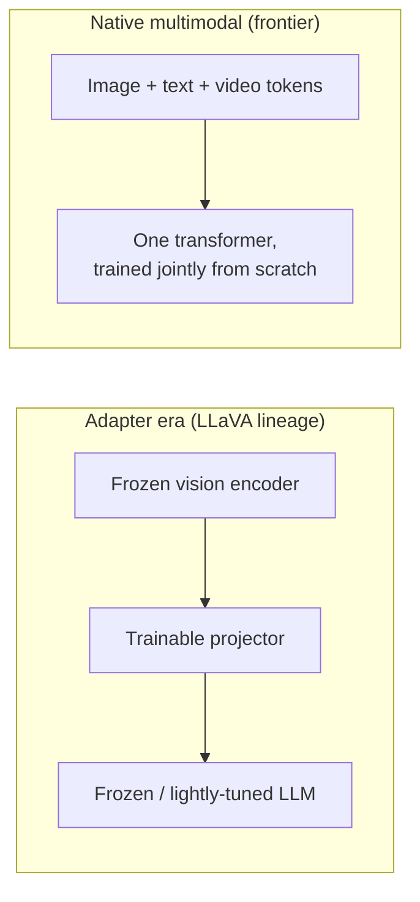

# Vision-Language Pretraining

<div class="tag-row"><span class="tag">CLIP</span><span class="tag">contrastive VLP</span><span class="tag">SigLIP 2</span><span class="tag">AIMv2</span><span class="tag">native multimodal</span><span class="tag">projectors</span></div>

> [!TIP] Say this first
> A modern VLM is three decisions: **(1)** what vision encoder produces the features, **(2)** how those features are *aligned* into the LLM's token space, and **(3)** whether vision and text are trained *jointly from scratch* or bolted together (frozen LLM + adapter). Frame every question along those three axes and you will always sound structured.

The frontier has moved from "freeze an LLM, glue a CLIP encoder, train a projector" (the LLaVA recipe, now legacy for frontier work) to **native multimodal pretraining** — jointly training vision+text (+audio/video) in one stage. But the LLaVA lineage is still the right mental model for *how the pieces connect*, and it is what you will build in most applied roles. This chapter covers the objectives, the encoders, and the alignment designs.

## The objective landscape



| Objective | Loss (sketch) | Buys you | Weakness |
| --- | --- | --- | --- |
| Global contrastive | InfoNCE / sigmoid over image↔text | zero-shot classification, retrieval, a clean shared space | weak on spatial/compositional/counting, no generation |
| Image-text matching (ITM) | binary matched/not | fine-grained discrimination | quadratic pairing cost |
| Captioning / LM | cross-entropy next-token on caption | open-ended answers, instruction following | hallucination, no explicit alignment signal |
| Region-text | phrase↔box/mask alignment | localization, grounding | expensive annotation |
| Preference / RLVR | DPO / verifier reward | alignment, less hallucination | reward hacking, verifier coverage |

## 1 · Contrastive VLP: CLIP and its successors

CLIP learns a **shared embedding space** by pulling matched image-text pairs together and pushing mismatched ones apart. With a batch of $N$ pairs, image features $v_i$ and text features $t_i$ (L2-normalized), temperature $\tau$:

$$\mathcal{L}_{\text{CLIP}} = -\frac{1}{2N}\sum_{i=1}^{N}\Big[\log\frac{e^{\langle v_i,t_i\rangle/\tau}}{\sum_j e^{\langle v_i,t_j\rangle/\tau}} + \log\frac{e^{\langle v_i,t_i\rangle/\tau}}{\sum_j e^{\langle v_j,t_i\rangle/\tau}}\Big]$$

This is symmetric InfoNCE (softmax over the batch, both directions). Two consequences an interviewer probes:

- **The batch *is* the negatives.** Quality scales with batch size — CLIP used ~32k. This couples statistical quality to systems (large all-gather across devices).
- **The softmax is global.** You get "is there a cat" but not "the left red cup" — CLIP is weak on spatial relations, counting, and OCR. That gap is *why* generative VLMs and grounded models exist.

### How CLIP actually trains and does zero-shot

**Architecture:** two encoders — an **image encoder** (ViT or ResNet) and a **text encoder** (Transformer) — each with a linear projection into a shared $d$-dim space; embeddings are **L2-normalized** so a dot product *is* cosine similarity. The temperature $\tau$ is a **learned** scalar (stored as $\log(1/\tau)$ and clipped). Trained on ~**400M** noisy web (image, alt-text) pairs — scale + a simple objective, not clean labels.

One training step is ~6 lines:

```python
I = l2_normalize(image_encoder(images) @ W_i)   # (N, d)
T = l2_normalize(text_encoder(texts)   @ W_t)   # (N, d)
logits = (I @ T.T) * exp(t)                      # (N,N) cosine sims / temperature
labels = arange(N)                               # matched pair = the diagonal
loss = (cross_entropy(logits, labels, axis=0)    # image → text
      + cross_entropy(logits, labels, axis=1)) / 2   # text → image
```

**Zero-shot classification** then needs *no* fine-tuning: embed each class name through a prompt template ("a photo of a {class}"), embed the image, pick the highest cosine similarity. Because the classifier is literally *built from text*, **prompt engineering / template ensembling** measurably lifts accuracy — that reprogrammability is CLIP's magic.

> [!NOTE] SigLIP: the sigmoid fix
> **SigLIP** replaces the softmax with an independent **sigmoid** loss per pair — every (image, text) pair is a binary "match / no-match" logistic problem. This decouples the loss from the global batch normalizer, so it trains well at *small* batch sizes and shards trivially. **SigLIP 2** (Google DeepMind, Feb 2025) [VERIFIED] adds caption-based pretraining, self-distillation, masked prediction, and online data curation on top, and ships **native-aspect-ratio** variants with better localization/dense features — which is exactly what you want when the encoder feeds a *grounded* VLM.

## 1.5 · Contrastive learning (the general recipe)

CLIP is one instance of a broader idea: **learn representations by pulling "positive" pairs together and pushing "negatives" apart** — no class labels, just a notion of what should be similar.

**InfoNCE**, the workhorse loss. For an anchor $x$ with one positive $x^+$ and negatives $\{x^-_j\}$, similarity $s(\cdot,\cdot)$ (cosine) and temperature $\tau$:

$$
\mathcal L_{\text{InfoNCE}}=-\log\frac{e^{s(x,x^+)/\tau}}{e^{s(x,x^+)/\tau}+\sum_j e^{s(x,x^-_j)/\tau}}
$$

It's a **softmax cross-entropy that asks "which candidate is the positive?"** CLIP is exactly this with the *other modality's* embeddings as candidates (in-batch items = negatives).

<dl class="kv">
<dt>Positives</dt><dd>Two views of the same thing: two augmentations of one image (SimCLR), an image and its caption (CLIP), a query and its key.</dd>
<dt>Negatives</dt><dd>Everything else. More/harder negatives → better features, up to a point; where they come from is the main design axis.</dd>
<dt>Temperature $\tau$</dt><dd>Sharpens the softmax. Low $\tau$ focuses on the hardest negatives (sharper, riskier); high $\tau$ is softer. A sensitive, important knob.</dd>
</dl>

| Method | Positives / negatives | Key trick |
| --- | --- | --- |
| **SimCLR** | 2 augmentations of an image; negatives = rest of batch | needs **large batches**; strong augmentation + projection head |
| **MoCo** | same, negatives from a **momentum queue** | decouples #negatives from batch size (memory bank + EMA encoder) |
| **CLIP** | image ↔ its text; negatives = other pairs | cross-modal; batch = negatives (~32k) |
| **Triplet** | (anchor, positive, negative) | margin loss; needs hard-negative mining |

**Classic metric-learning losses** (pre-InfoNCE): the **contrastive loss** pulls a positive pair to distance 0 and pushes negatives past a margin $m$, $\;y\,d^2+(1-y)\max(0,m-d)^2$; the **triplet loss** ranks the positive closer than the negative by a margin, $\;\max(0,\,d(a,p)-d(a,n)+m)$. These power face recognition and [visual-search](#/system-design/case-studies) embeddings.

> [!WARNING] Representation collapse — and how non-contrastive methods avoid it
> The failure mode is **collapse**: the encoder maps everything to one vector (trivially zero positive distance). **Negatives** are what prevent it in contrastive methods. **Non-contrastive** methods — BYOL, SimSiam, and **DINO** — drop negatives entirely and instead avoid collapse with a **momentum/EMA target network + stop-gradient** (plus centering/sharpening in DINO). That's the key conceptual split: *contrastive needs negatives; self-distillation engineers collapse-avoidance differently.* See the [DINO training detail](#/cv/foundation-models).

## 2 · Generative VLP: captioning and autoregressive objectives

The generative branch trains the model to **produce** text conditioned on the image — pure cross-entropy next-token loss on the caption/answer. This is what makes a VLM *conversational*.

<dl class="kv">
<dt>BLIP</dt><dd>Captioning + filtering "bootstrap": generate synthetic captions, then filter noisy web ones with a learned matcher. An early lesson that <b>data curation is a first-class objective</b>.</dd>
<dt>BLIP-2</dt><dd>A <b>Q-Former</b> (learnable queries + cross-attention) bridges a <b>frozen</b> ViT and a <b>frozen</b> LLM — only the connector trains. Cheap, but the bottleneck caps information flow.</dd>
<dt>Flamingo</dt><dd>Gated cross-attention layers interleaved into a frozen LLM; a Perceiver resampler compresses visual tokens. Enabled few-shot in-context multimodal prompting.</dd>
<dt>LLaVA</dt><dd>The minimalist that won: a <b>linear/MLP projector</b> from CLIP features into the LLM embedding space + <b>visual instruction tuning</b>. Two stages: (1) projector-only alignment on captions, (2) full instruction SFT.</dd>
</dl>

## 3 · The central 2026 axis: native multimodal vs. frozen-LLM + adapter



<div class="proscons"><div><div class="pros-t">Frozen-LLM + adapter (LLaVA)</div>

- Cheap: only the projector (and maybe LoRA) trains.
- Reuses a strong text LLM and a strong vision encoder as-is.
- Fast to iterate; great for applied/product work and most fine-tuning.
- Modular: swap the encoder or LLM independently.
</div><div><div class="cons-t">Native multimodal (InternVL3, Qwen3-VL, Gemini, GPT-5)</div>

- Vision and language co-adapt → higher ceiling, better fusion.
- No "modality gap" frozen into the encoder.
- Far more expensive; needs huge interleaved multimodal corpora.
- Risk of degrading pure-text ability if the mix is wrong.
</div></div>

**What's [VERIFIED] as of 2026:** the frontier is native. *InternVL3* (arXiv 2504.10479) does native multimodal pretraining with **Variable Visual Position Encoding** and Mixed Preference Optimization; *Qwen2.5-VL / Qwen3-VL* train a **native dynamic-resolution ViT** from scratch. Note the honest nuance: **dedicated understanding VLMs still lead pure perception**, and the frozen-adapter recipe remains the workhorse for applied fine-tuning — so "native is better" is a frontier statement, not a universal one.

## 4 · Vision encoders: CLIP → SigLIP 2 / AIMv2

The encoder is the VLM's eyes; upgrading it is often the cheapest quality win.

| Encoder | Objective | Why it matters for VLMs |
| --- | --- | --- |
| CLIP ViT | softmax contrastive | the default for years; good global semantics, weaker dense features |
| SigLIP / SigLIP 2 | sigmoid contrastive (+ self-distill, masked pred) | better localization/dense features, native-res variants, multilingual |
| AIMv2 | **autoregressive** (predict image + text tokens) | multimodal generative pretraining; strong frozen-trunk features, native resolution |
| DINOv2 / DINOv3 | self-supervised (self-distillation) | dense/spatial features; often **fused** with a contrastive encoder |

> [!EXAMPLE] Multi-encoder fusion
> A recurring 2025-2026 trick: **fuse a semantic encoder with a self-supervised one** — e.g., OpenVLA and several VLMs concatenate **DINOv2 (dense/spatial) + SigLIP (semantic)** features. Contrastive encoders know *what*; SSL encoders know *where*. Grounded and spatial tasks benefit from both.

<details class="qa"><summary>Why did the field move from CLIP to SigLIP 2 / AIMv2 as VLM backbones?</summary>
<div class="qa-body">

**Short:** CLIP's softmax contrastive objective optimizes a *global* image-text match, which yields great semantics but mediocre dense/localization features and a hard dependence on huge batches. SigLIP 2 (sigmoid + self-distillation + masked prediction + native resolution) and AIMv2 (autoregressive) produce features that are better for the *dense, spatial, high-resolution* tasks VLMs increasingly care about (OCR, documents, grounding).

**Deep:** The sigmoid loss removes the global batch normalizer, so training decouples from batch size and shards cleanly; self-distillation and masked prediction inject *local* structure the global contrastive loss ignores. AIMv2 reframes the encoder as an autoregressive multimodal predictor — the same objective family as the LLM it feeds — which tends to give smooth, transferable frozen-trunk features. Both ship **native-aspect-ratio** variants, so you stop destroying text/thin-structure information by square-cropping. The through-line: VLM backbones are trending toward **generative/self-supervised objectives at native resolution**, beyond contrastive-only CLIP.
</div></details>

## 5 · Alignment / projector designs

The projector maps vision features (dim $D_v$, count $N$) into the LLM's token space (dim $D_{\text{llm}}$). It solves two problems at once: a **dimension mismatch** and a **modality gap**.

<figure>
<svg viewBox="0 0 660 210" xmlns="http://www.w3.org/2000/svg" font-family="Inter, sans-serif" font-size="12">
  <rect x="20" y="80" width="90" height="44" rx="6" fill="none" stroke="#0ea5e9" stroke-width="2"/>
  <text x="65" y="98" text-anchor="middle" fill="#0ea5e9">ViT feats</text>
  <text x="65" y="114" text-anchor="middle" fill="#6b7686">N × D_v</text>
  <path d="M110 102 H165" stroke="#98a3b2" stroke-width="1.5" marker-end="url(#ar)"/>
  <rect x="165" y="70" width="140" height="64" rx="6" fill="none" stroke="#e0533f" stroke-width="2"/>
  <text x="235" y="94" text-anchor="middle" fill="#e0533f">projector</text>
  <text x="235" y="112" text-anchor="middle" fill="#6b7686">MLP / Q-Former /</text>
  <text x="235" y="126" text-anchor="middle" fill="#6b7686">Perceiver / pixel-shuffle</text>
  <path d="M305 102 H360" stroke="#98a3b2" stroke-width="1.5" marker-end="url(#ar)"/>
  <rect x="360" y="80" width="120" height="44" rx="6" fill="none" stroke="#12a150" stroke-width="2"/>
  <text x="420" y="98" text-anchor="middle" fill="#12a150">visual tokens</text>
  <text x="420" y="114" text-anchor="middle" fill="#6b7686">M × D_llm</text>
  <path d="M480 102 H535" stroke="#98a3b2" stroke-width="1.5" marker-end="url(#ar)"/>
  <rect x="535" y="80" width="90" height="44" rx="6" fill="#6366f1"/>
  <text x="580" y="106" text-anchor="middle" fill="#fff">LLM</text>
  <defs><marker id="ar" markerWidth="8" markerHeight="8" refX="6" refY="3" orient="auto"><path d="M0 0 L6 3 L0 6" fill="#98a3b2"/></marker></defs>
</svg>
<figcaption>The projector converts N ViT patches into M LLM-space tokens. M = N keeps all patches (MLP); M &lt; N compresses (Q-Former, resampler, pixel-shuffle) to save context.</figcaption>
</figure>

| Design | Mechanism | Token count | Trade-off |
| --- | --- | --- | --- |
| Linear | single matrix $D_v\to D_{\text{llm}}$ | M = N | simplest; LLaVA-1.0 |
| MLP | Linear → GELU → Linear | M = N | LLaVA-1.5 default; strong baseline |
| Pixel-shuffle / concat | merge adjacent patches | M = N/4 | halves/quarters tokens; InternVL |
| Q-Former | learnable queries + cross-attn | M = fixed (e.g. 32/64) | big compression, info bottleneck; BLIP-2 |
| Perceiver resampler | fixed latents attend to patches | M = fixed | Flamingo; good for many frames/video |

The tension is **fidelity vs. context budget**: keeping all $N$ patches (MLP) preserves detail but blows up sequence length for high-res or video; compressors (Q-Former, resampler) fit more images/frames but throw away information. See [VLM Implementation Details](#/vlm/practical) for how token count interacts with dynamic-resolution tiling.

## 6 · Freezing schedules & catastrophic forgetting

The canonical two-stage LLaVA recipe:

1. **Alignment (projector-only):** freeze vision encoder + LLM, train only the projector on image-caption data. Cheap; teaches the projector to "speak LLM."
2. **Instruction tuning:** unfreeze the LLM (full or LoRA), keep or partially unfreeze the vision encoder, train on conversations.

> [!WARNING] The forgetting trap
> Naively full-fine-tuning the LLM on visual data **degrades its language ability** (catastrophic forgetting). Mitigations: mix in text-only data, use LoRA, use **layer-wise learning rates** (projector ≫ LLM), and keep the vision encoder frozen early. This is the same "adapt vs. preserve" tension you can connect to continual-learning work — see [Continual Learning](#/cv/continual-learning).

## Q&A

<details class="qa"><summary>Contrast contrastive and generative VLP. Which do you use?</summary>
<div class="qa-body">

**Short:** Contrastive (CLIP/SigLIP) learns a shared *retrieval/matching* space; generative (BLIP/LLaVA) learns to *produce* language conditioned on the image. Real systems **stack** them: a contrastively-pretrained encoder feeds a generative VLM.

**Deep:** Contrastive gives you zero-shot classification and retrieval and a clean embedding geometry, but no open-ended output and weak spatial reasoning. Generative gives dialogue, instruction following, and grounding, at the cost of hallucination and no explicit alignment signal. The dominant recipe uses a **contrastive (or AR) encoder → projector → LLM** trained generatively, then aligned with preference/RLVR. So it's not either/or — contrastive pretraining is the *encoder*, generative is the *head*.
</div></details>

<details class="qa"><summary>Why is CLIP weak at spatial reasoning, and how do downstream VLMs fix it?</summary>
<div class="qa-body">

**Short:** The global softmax collapses an image to one vector matched against a caption — it rewards "the right stuff is present," not "where / how many / in what relation." Fixes: dense/native-res encoders (SigLIP 2, DINOv3), region-text objectives, and explicit grounding.

**Deep:** Because supervision is a single global similarity, gradients never force the encoder to preserve *localized* spatial structure; counting, left/right, and OCR degrade. Downstream VLMs recover this with (a) higher-resolution / native-aspect encoders so fine structure survives, (b) fusing SSL dense features (DINOv2), (c) **region-text** pretraining and coordinate/mask outputs, and (d) tool/agent decomposition for precise measurement. This is precisely the motivation for grounded VLMs — see [Grounding & Region Reasoning](#/vlm/grounding).
</div></details>

**Follow-ups you should expect**

- "Why does SigLIP's sigmoid loss train at small batch sizes when CLIP needs 32k?" (No global normalizer → each pair is an independent logistic term.)
- "In a native-multimodal run, how do you stop the model from forgetting language?" (Data mixing ratios, replay, LoRA, LR schedules.)
- "When would you *still* pick a frozen-LLM + adapter over native pretraining?" (Compute budget, need for modularity, downstream fine-tuning, product timelines.)
- "How do you evaluate the encoder choice without full retraining?" (Linear-probe / frozen-trunk dense benchmarks, then a small projector-only align.)

## Cheat-sheet

| Concept | One-liner |
| --- | --- |
| CLIP loss | symmetric InfoNCE over the batch; batch = negatives; global → weak spatial |
| SigLIP | sigmoid per-pair loss → small-batch, shardable; SigLIP 2 adds self-distill + native res |
| AIMv2 | autoregressive multimodal encoder pretraining; strong frozen features, native res |
| LLaVA recipe | frozen encoder + MLP projector + 2-stage (align → instruction SFT) |
| Native multimodal | joint vision+text pretraining from scratch; frontier default (InternVL3, Qwen3-VL) |
| Projector trade-off | MLP keeps all N tokens (fidelity) vs Q-Former/resampler compress (context budget) |
| Encoder fusion | DINOv2 (where) + SigLIP (what) for dense/grounding tasks |
| Forgetting | full-FT LLM on vision hurts language → mix text data, LoRA, layer-wise LR |

**Related:** [VLM Implementation Details](#/vlm/practical) · [Instruction Tuning & Decoding](#/vlm/instruction-tuning) · [Grounding & Region Reasoning](#/vlm/grounding) · [Vision Foundation Models](#/cv/foundation-models) · [The 2026 Landscape](#/start/landscape-2026)
