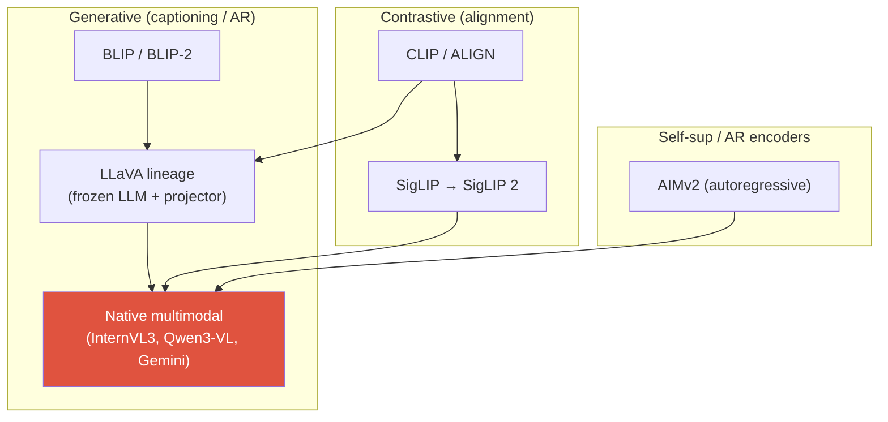
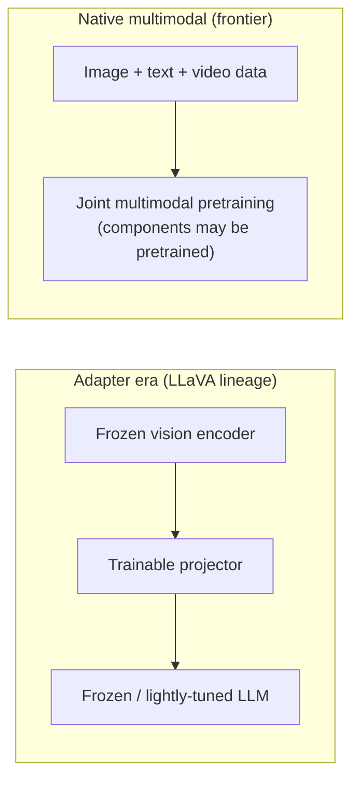

# Vision-Language Pretraining

<div class="tag-row"><span class="tag">CLIP</span><span class="tag">contrastive VLP</span><span class="tag">SigLIP 2</span><span class="tag">AIMv2</span><span class="tag">native multimodal</span><span class="tag">projectors</span></div>

> [!NOTE] Goal of this chapter
> [VLM 101](#/vlm/vlm-101) explained how an image becomes tokens. Now we ask **how vision and language are trained together**. The goal is simple: **pretrain a model that understands images and text jointly**. There are two major branches: (1) the **CLIP** family, which aligns images and text in the same space through **contrastive learning**, and (2) generative models that learn to **produce text** from images. §0–§1 are introductory; the later sections go deeper. For the intuition behind contrastive learning, start with [Self-Supervised Learning](#/cv/self-supervised).

## §0 · What and why

What we want is this: the phrase **"a photo of a dog running through the snow" and the actual photo should mean the same thing inside the model**. Once that happens, the model can choose the right caption for an image, retrieve an image from a description, or classify unseen categories without task-specific training.

Contrastive methods place the **global embeddings** of images and text in the same metric space. Generative methods, by contrast, only need to connect visual features so an LLM can use them as conditions; image and text tokens do not have to inhabit one distance space. The two broad answers are:

- **Contrastive** — turn images and text into vectors, then learn a shared space by **pulling matched pairs together and pushing mismatched pairs apart**. **CLIP** is the canonical example. → Strong for retrieval, classification, and alignment.
- **Generative** — condition on an image and learn to **continue generating text** through next-token prediction. → Strong for dialogue, question answering, and description.

Many modular VLMs **stack** a contrastive or self-supervised pretrained encoder with a generative LLM, though joint generative pretraining and other combinations also exist. When reading a VLM paper, check three decisions:

1. Which **vision encoder** extracts image features — CLIP, SigLIP, or DINO?
2. How are those features **aligned** with the LLM's token space — a projector or cross-attention?
3. Which components remain frozen from pretraining, and at what stage are vision and language **optimized jointly**? Does the paper call this `native multimodal`, or is it a frozen LLM plus an adapter?

> [!TIP] Interview one-liner
> "A VLM design can be explained along three axes: encoder, fusion/connector, and the trainable-versus-frozen scope." `Native` and `adapter` are not a standardized binary distinction; modern models may retain pretrained encoders, projectors, and LLMs while jointly training them. Check the initialization and trainable components at every stage in the model card.

## The objective landscape



| Objective | Loss (sketch) | What it provides | Weakness |
| --- | --- | --- | --- |
| Global contrastive | InfoNCE / sigmoid over image↔text | zero-shot classification, retrieval, a clean shared space | weak on spatial/compositional/counting tasks; no generation |
| Image-text matching (ITM) | binary matched/not | fine-grained discrimination | if cross-encoded, compute per candidate pair; $O(N^2)$ when constructed over all pairs |
| Captioning / LM | cross-entropy next-token loss on captions | open-ended answers, instruction following | hallucination, no explicit alignment signal |
| Region-text | phrase↔box/mask alignment | localization, grounding | expensive annotation |
| Post-training (separate stage) | preference optimization / RL · verifier | instruction following, preferences, verifiable behavior | reward hacking, verifier coverage |

The final row is **post-training, not a pretraining objective**. DPO uses preference pairs; RLVR uses verifiable rewards. Do not collapse them into the same method. See [Instruction Tuning & Decoding](#/vlm/instruction-tuning) and [Post-Training & Alignment](#/llm/alignment) for details.

## 1 · Contrastive VLP: CLIP and its successors

The idea behind **CLIP** (Contrastive Language-Image Pre-training) fits in one sentence: **learn a shared embedding space by pulling matched (image, text) pairs together and pushing mismatched pairs apart**. The vector for a cat photo then lies near the vector for "a photo of a cat."

Start with the architecture. CLIP is a **dual encoder**: one encoder turns images into vectors, and another turns text into vectors. Their outputs are placed in a **shared space of the same dimension**. Training computes the similarities of every pair in a batch and raises only the correct pairs along the diagonal.

<figure>
<svg viewBox="0 0 700 380" xmlns="http://www.w3.org/2000/svg" font-family="Inter, sans-serif" font-size="12">
  <!-- ===== Stage A: dual encoders ===== -->
  <text x="80" y="26" text-anchor="middle" fill="#98a3b2" font-weight="700">① Dual encoders</text>
  <!-- image inputs -->
  <g fill="none" stroke="#0ea5e9" stroke-width="1.4">
    <rect x="20" y="42" width="30" height="30" rx="4"/><rect x="20" y="80" width="30" height="30" rx="4"/><rect x="20" y="118" width="30" height="30" rx="4"/>
  </g>
  <text x="35" y="63" text-anchor="middle">🐱</text><text x="35" y="101" text-anchor="middle">🐶</text><text x="35" y="139" text-anchor="middle">🚗</text>
  <rect x="62" y="46" width="70" height="102" rx="8" fill="none" stroke="#0ea5e9" stroke-width="1.8"/>
  <text x="97" y="92" text-anchor="middle" fill="#0ea5e9">Image</text><text x="97" y="108" text-anchor="middle" fill="#0ea5e9">encoder</text>
  <!-- text inputs -->
  <g fill="currentColor" font-size="10">
    <text x="35" y="238" text-anchor="middle">"cat"</text><text x="35" y="266" text-anchor="middle">"dog"</text><text x="35" y="294" text-anchor="middle">"car"</text>
  </g>
  <rect x="62" y="220" width="70" height="90" rx="8" fill="none" stroke="#12a150" stroke-width="1.8"/>
  <text x="97" y="260" text-anchor="middle" fill="#12a150">Text</text><text x="97" y="276" text-anchor="middle" fill="#12a150">encoder</text>
  <!-- ===== Stage B: shared embedding space ===== -->
  <text x="270" y="26" text-anchor="middle" fill="#98a3b2" font-weight="700">② Shared embedding space</text>
  <circle cx="270" cy="185" r="98" fill="none" stroke="#98a3b2" stroke-width="1" stroke-dasharray="4 4"/>
  <!-- paired dots (image=blue, text=green) close together -->
  <circle cx="240" cy="120" r="6" fill="#0ea5e9"/><circle cx="256" cy="112" r="6" fill="#12a150"/>
  <path d="M246 118 L252 114" stroke="#e0533f" stroke-width="1.6"/><text x="266" y="104" fill="#98a3b2" font-size="10">cat</text>
  <circle cx="315" cy="220" r="6" fill="#0ea5e9"/><circle cx="330" cy="228" r="6" fill="#12a150"/>
  <path d="M321 223 L326 226" stroke="#e0533f" stroke-width="1.6"/><text x="343" y="234" fill="#98a3b2" font-size="10">car</text>
  <circle cx="215" cy="235" r="6" fill="#0ea5e9"/><circle cx="230" cy="243" r="6" fill="#12a150"/>
  <path d="M221 238 L226 241" stroke="#e0533f" stroke-width="1.6"/><text x="196" y="258" fill="#98a3b2" font-size="10">dog</text>
  <text x="270" y="300" text-anchor="middle" fill="#e0533f" font-size="10">Pull matched pairs together</text>
  <!-- arrows from encoders into the space -->
  <path d="M132 97 C170 110 180 140 195 150" stroke="#0ea5e9" stroke-width="1.3" fill="none" marker-end="url(#cp)"/>
  <path d="M132 262 C170 250 180 225 195 215" stroke="#12a150" stroke-width="1.3" fill="none" marker-end="url(#cp)"/>
  <!-- ===== Stage C: NxN similarity matrix ===== -->
  <text x="560" y="26" text-anchor="middle" fill="#e0533f" font-weight="700">③ N×N similarity matrix</text>
  <path d="M370 185 H430" stroke="#98a3b2" stroke-width="1.4" fill="none" marker-end="url(#cp)"/>
  <text x="490" y="62" fill="#98a3b2" font-size="10">T₁</text><text x="535" y="62" fill="#98a3b2" font-size="10">T₂</text><text x="580" y="62" fill="#98a3b2" font-size="10">T₃</text>
  <text x="455" y="92" fill="#98a3b2" font-size="10">I₁</text><text x="455" y="137" fill="#98a3b2" font-size="10">I₂</text><text x="455" y="182" fill="#98a3b2" font-size="10">I₃</text>
  <!-- row 1 -->
  <rect x="478" y="70" width="42" height="42" fill="#e0533f"/><rect x="524" y="70" width="42" height="42" fill="rgba(99,102,241,0.15)"/><rect x="570" y="70" width="42" height="42" fill="rgba(99,102,241,0.15)"/>
  <!-- row 2 -->
  <rect x="478" y="116" width="42" height="42" fill="rgba(99,102,241,0.15)"/><rect x="524" y="116" width="42" height="42" fill="#e0533f"/><rect x="570" y="116" width="42" height="42" fill="rgba(99,102,241,0.15)"/>
  <!-- row 3 -->
  <rect x="478" y="162" width="42" height="42" fill="rgba(99,102,241,0.15)"/><rect x="524" y="162" width="42" height="42" fill="rgba(99,102,241,0.15)"/><rect x="570" y="162" width="42" height="42" fill="#e0533f"/>
  <text x="499" y="96" text-anchor="middle" fill="#fff" font-size="11">✓</text><text x="545" y="142" text-anchor="middle" fill="#fff" font-size="11">✓</text><text x="591" y="188" text-anchor="middle" fill="#fff" font-size="11">✓</text>
  <text x="545" y="238" text-anchor="middle" fill="#e0533f" font-size="10">Diagonal = positives ↑</text>
  <text x="545" y="254" text-anchor="middle" fill="#98a3b2" font-size="10">Others = negatives ↓</text>
  <text x="545" y="280" text-anchor="middle" fill="#98a3b2" font-size="10">Softmax each row/column →</text>
  <text x="545" y="294" text-anchor="middle" fill="#98a3b2" font-size="10">train diagonal as the answer</text>
  <defs><marker id="cp" markerWidth="8" markerHeight="8" refX="6" refY="3" orient="auto"><path d="M0 0 L6 3 L0 6" fill="#98a3b2"/></marker></defs>
</svg>
<figcaption>The CLIP big picture: <b>①</b> encode images and text separately → <b>②</b> place them in a shared space and pull matched pairs (red links) together → <b>③</b> raise only the diagonal, or correct pairs, in the all-pairs similarity matrix. It is a classification problem: “choose the matching text for each image.”</figcaption>
</figure>

### Why the matrix diagonal?

Given a batch of $N$ (image, text) pairs, CLIP constructs an $N\times N$ similarity matrix and designates its diagonal as positive. The remaining entries are **treated as in-batch negatives**, but they can be false negatives when multiple captions describe the same concept or fit multiple images. They are not necessarily true semantic negatives; the contrastive loss labels them that way because of how the data batch is constructed.

### A zero-shot classification example (no training)

This is where CLIP's magic appears. You can build a classifier for dogs, cats, and cars **without training it separately**:

1. Put each candidate class into a prompt template → "a photo of a **cat**," "a photo of a **dog**," "a photo of a **car**."
2. Encode those sentences with the text encoder (= three class vectors).
3. Encode the image to classify with the image encoder.
4. Choose the class sentence with the **highest cosine similarity** to the image vector → that is the prediction.

Because the classifier is literally *constructed from text on the fly*, a new category can be added by changing only a sentence. This is why **prompt engineering / template ensembling**—averaging several templates such as "a photo of a {}" and "a blurry photo of a {}"—can measurably improve accuracy.

### In equations (symmetric InfoNCE)

For a batch of $N$ pairs, L2-normalized image features $v_i$ and text features $t_i$, and temperature $\tau$:

$$\mathcal{L}_{\text{CLIP}} = -\frac{1}{2N}\sum_{i=1}^{N}\Big[\log\frac{e^{\langle v_i,t_i\rangle/\tau}}{\sum_j e^{\langle v_i,t_j\rangle/\tau}} + \log\frac{e^{\langle v_i,t_i\rangle/\tau}}{\sum_j e^{\langle v_j,t_i\rangle/\tau}}\Big]$$

This is **symmetric InfoNCE**, a bidirectional contrastive loss: the first term is image→text and the second is text→image. Interviewers often probe two consequences:

- **Nonmatching batch elements become negatives.** A larger batch provides more candidates, but it also increases false negatives and communication cost; quality is not guaranteed to rise monotonically with batch size. CLIP's original large batches are coupled to cross-device all-gather.
- **The softmax is global.** You learn whether “a cat is present,” but not “the red cup on the left.” CLIP is weak on spatial relations, counting, and OCR. That gap is *why* generative VLMs and grounded models exist.

**Architecture summary:** two encoders—an image encoder (ViT or ResNet) and a text encoder (Transformer)—each have a linear projection into a shared $d$-dimensional space. Embeddings are **L2-normalized**, so their dot product is cosine similarity. Temperature $\tau$ is a **learned** scalar, stored as $\log(1/\tau)$ and clipped. CLIP was trained on roughly **400M** noisy web (image, alt-text) pairs: scale plus a simple objective rather than curated labels.

One training step is almost a direct transcription of the figure above.

<details class="concept-code">
<summary>View as conceptual code</summary>

> This is PyTorch-style **pseudocode** for symmetric InfoNCE. The gradient policy for distributed all-gather varies by implementation.

```python
def clip_train_step(images, texts):
    image_encoder.train(); text_encoder.train()
    I_local = l2_normalize(image_encoder(images) @ W_i)  # [N_local,d]
    T_local = l2_normalize(text_encoder(texts) @ W_t)    # [N_local,d]

    # With global negatives, fix rank order and offset positive indices correctly.
    I = differentiable_all_gather(I_local)               # [N_global,d]
    T = differentiable_all_gather(T_local)
    scale = exp(logit_scale).clamp(max=MAX_SCALE)
    logits = scale * (I @ T.T)                           # [N_global,N_global]
    labels = arange(N_global, device=logits.device)      # diagonal = designated positives

    loss_i2t = cross_entropy(logits, labels)             # each image classifies text
    loss_t2i = cross_entropy(logits.T, labels)           # each text classifies images
    loss = 0.5 * (loss_i2t + loss_t2i)
    optimizer.zero_grad(); loss.backward(); optimizer.step()
    # Duplicate captions or concepts may be false negatives off the diagonal.
```

</details>

### Try it — match each image to its text

The heart of CLIP zero-shot classification is one line: **take the argmax of each row in the similarity matrix**. Complete a function that receives image and text-class embeddings and returns the index of the best-matching text for every image. Normalize each vector first to use cosine similarity. (Open **Solution** if you get stuck.)

<div class="widget" data-widget="code">
<script type="application/json" class="code-config">
{"func":"match_images_to_texts","packages":["numpy"],"starter":"def match_images_to_texts(image_embs, text_embs):\n    # image_embs: (N, d) image embeddings; text_embs: (M, d) text/class embeddings.\n    # Return a length-N list containing the index of the text with highest cosine similarity for each image.\n    # Hint: L2-normalize each vector → sims = I @ T.T → argmax each row.\n    import numpy as np\n    I = np.asarray(image_embs, float)\n    T = np.asarray(text_embs, float)\n    # TODO\n    pass","tests":[{"args":[[[1,0],[0,1]],[[0,1],[1,0]]],"expect":[1,0]},{"args":[[[1,0],[0,1],[1,1]],[[1,0],[0,1],[1,1]]],"expect":[0,1,2]},{"args":[[[2,0],[1,1]],[[3,0],[0,5],[1,1]]],"expect":[0,2]}],"solution":"import numpy as np\n\ndef match_images_to_texts(image_embs, text_embs):\n    I = np.asarray(image_embs, float)\n    T = np.asarray(text_embs, float)\n    I = I / np.linalg.norm(I, axis=1, keepdims=True)\n    T = T / np.linalg.norm(T, axis=1, keepdims=True)\n    sims = I @ T.T          # (N, M) cosine-similarity matrix\n    return [int(j) for j in sims.argmax(axis=1)]"}
</script>
</div>

This is zero-shot classification: when `text_embs` are the embeddings of "a photo of a {class}" prompts, the return values are the predicted class indices for each image.

> [!NOTE] SigLIP: the sigmoid fix
> **SigLIP** replaces the softmax normalization with a pairwise **sigmoid** loss over image-text pairs. Removing dependence on a global softmax normalizer changes distributed implementation and batch-size scaling, but it does not mean a small batch always produces identical quality or that results are independent of batch size. **SigLIP 2** combines caption-based objectives, self-distillation, masked prediction, online data curation, and native-aspect-ratio variants; verify gains for each downstream task and resolution.

## 1.5 · Contrastive learning (the general recipe)

CLIP is one instance of a broader idea: **learn representations by pulling “positive” pairs together and pushing “negative” pairs apart**—without class labels, only a notion of what should be similar. For the general picture and intuition, start with [Self-Supervised Learning](#/cv/self-supervised).

**InfoNCE** is the workhorse loss. Given an anchor $x$, one positive $x^+$, negatives $\{x^-_j\}$, similarity $s(\cdot,\cdot)$ (cosine), and temperature $\tau$:

$$
\mathcal L_{\text{InfoNCE}}=-\log\frac{e^{s(x,x^+)/\tau}}{e^{s(x,x^+)/\tau}+\sum_j e^{s(x,x^-_j)/\tau}}
$$

This is a **softmax cross-entropy asking “which candidate is positive?”** CLIP uses precisely this formulation, with embeddings from the *other modality* as candidates (in-batch items = negatives).

<dl class="kv">
<dt>Positives</dt><dd>Two views of the same thing: two augmentations of one image (SimCLR), an image and its caption (CLIP), or a query and its key.</dd>
<dt>Negatives</dt><dd>Everything else. More or harder negatives can improve features up to a point; where they come from is a central design axis.</dd>
<dt>Temperature $\tau$</dt><dd>Sharpens the softmax. Low $\tau$ focuses on the hardest negatives (sharper, riskier); high $\tau$ is softer. It is a sensitive, important knob.</dd>
</dl>

| Method | Positives / negatives | Key trick |
| --- | --- | --- |
| **SimCLR** | two augmentations of an image; negatives = rest of batch | needs a **large batch**; strong augmentation + projection head |
| **MoCo** | same, but negatives come from a **momentum queue** | decouples the number of negatives from batch size (memory bank + EMA encoder) |
| **CLIP** | image ↔ its text; negatives = other pairs | cross-modal; batch = negatives (~32k) |
| **Triplet** | (anchor, positive, negative) | margin loss; needs hard-negative mining |

**Classic metric-learning losses** (before InfoNCE): **contrastive loss** pulls positive pairs toward distance 0 and pushes negatives beyond a margin $m$, $\;y\,d^2+(1-y)\max(0,m-d)^2$; **triplet loss** ranks the positive at least one margin closer than the negative, $\;\max(0,\,d(a,p)-d(a,n)+m)$. These losses power face recognition and [visual-search](#/system-design/case-studies) embeddings.

> [!WARNING] Representation collapse — and how non-contrastive methods avoid it
> The failure mode is **collapse**: the encoder maps every input to the same representation. Contrastive methods avoid this through negatives and their normalization structure. Non-contrastive methods use different mechanisms. **BYOL and DINO use a momentum/EMA teacher and stop-gradient**, while DINO also uses centering and sharpening. **SimSiam avoids collapse with a predictor and stop-gradient, without an EMA target.** See [DINO training detail](#/cv/foundation-models).

## 2 · Generative VLP: captioning and autoregressive objectives

The generative branch trains a model to **produce** text conditioned on an image—plain cross-entropy next-token loss on captions or answers. This is what makes a VLM *conversational*.

<dl class="kv">
<dt>BLIP</dt><dd>Captioning + filtering “bootstrap”: generate synthetic captions, then filter noisy web captions with a learned matcher. An early lesson that <b>data curation is a first-class objective</b>.</dd>
<dt>BLIP-2</dt><dd>Learnable queries in the <a href="https://arxiv.org/abs/2301.12597"><b>Q-Former</b></a> cross-attend to frozen image-encoder features, and a projection sends their outputs to a frozen LLM. Its two stages train connecting components such as the Q-Former and projection; the fixed query count can become an information bottleneck.</dd>
<dt>Flamingo</dt><dd>A <a href="https://arxiv.org/abs/2204.14198">Perceiver resampler</a> compresses visual tokens, and gated cross-attention layers are inserted into a frozen LLM. Distinguish this from BLIP-2, whose Q-Former cross-attends inside the connector before producing a prefix.</dd>
<dt>LLaVA</dt><dd>Connects CLIP features to an LLM with a linear/MLP projector and applies visual instruction tuning. A typical two-stage recipe is (1) projector-only feature alignment, then (2) instruction training with the vision encoder frozen while training the projector and either the full LLM or adapters; exact scopes vary by version.</dd>
</dl>

## 3 · The central 2026 axis: native multimodal vs. frozen-LLM + adapter



<div class="proscons"><div><div class="pros-t">Frozen-LLM + adapter (LLaVA)</div>

- Cheap: train only the projector, and perhaps LoRA.
- Reuse a strong text LLM and a strong vision encoder as-is.
- Fast iteration; excellent for applied/product work and most fine-tuning.
- Modular: swap the encoder or LLM independently.
</div><div><div class="cons-t">Joint/native multimodal training</div>

- Vision and language components can adapt together.
- More room to optimize fusion than when training only a fixed connector.
- Far more expensive; requires a huge interleaved multimodal corpus.
- Risks degrading pure-text ability if the mixture is wrong.
</div></div>

`Native multimodal` means different things across papers, so inspect the architecture. [InternVL3](https://arxiv.org/abs/2504.10479) emphasizes native multimodal pretraining that trains vision and language components together, but **Mixed Preference Optimization is a separate post-training stage**. [Qwen2.5-VL](https://arxiv.org/abs/2502.13923) uses dynamic resolution, window attention, and multimodal RoPE. None of these examples necessarily means “one transformer trained from random initialization.” The choice between frozen adapters and joint training depends on data, budget, task, and ease of updating.

## 4 · Vision encoders: CLIP → SigLIP 2 / AIMv2

The encoder is the VLM's eyes. Upgrading it is often the cheapest quality improvement.

| Encoder | Objective | Why it matters for VLMs |
| --- | --- | --- |
| CLIP ViT | softmax contrastive | the default for years; good global semantics, weak dense features |
| SigLIP / SigLIP 2 | sigmoid contrastive (+ self-distill, masked prediction) | better localization/dense features, native-resolution variants, multilingual |
| AIMv2 | **autoregressive** (predict image + text tokens) | multimodal generative pretraining; strong frozen-trunk features, native resolution |
| DINOv2 / DINOv3 | self-supervised (self-distillation) | dense/spatial features; often **fused** with a contrastive encoder |

> [!EXAMPLE] Multi-encoder fusion
> Some VLAs and VLMs **fuse DINOv2-family dense features with SigLIP-family semantic features**. “Where + what” is a useful mnemonic, but the two encoders' capabilities are not perfectly separated, and concatenation is not automatically beneficial. Ablate it while accounting for token and memory cost.

<details class="qa"><summary>Why have VLM backbones shifted from CLIP toward SigLIP 2 / AIMv2?</summary>
<div class="qa-body">

**Short:** CLIP's softmax contrastive objective optimizes a *global* image-text match. This yields strong semantics, but mediocre dense/localization features and a strong dependence on huge batches. SigLIP 2 (sigmoid + self-distillation + masked prediction + native resolution) and AIMv2 (autoregressive) produce features better suited to the *dense, spatial, high-resolution* tasks VLMs increasingly emphasize, including OCR, documents, and grounding.

**Deep:** Sigmoid loss removes the global batch normalizer, changing how training depends on batch size and allowing clean sharding. Self-distillation and masked prediction inject *local* structure ignored by a global contrastive loss. AIMv2 reframes the encoder as an autoregressive multimodal predictor—the same objective family as the LLM it feeds—and tends to provide smooth, transferable frozen-trunk features. Both offer **native-aspect-ratio** variants, avoiding square crops that destroy text and thin structures.
</div></details>

## 5 · Alignment / projector designs

The projector maps vision features (dimension $D_v$, count $N$) into the LLM's token space (dimension $D_{\text{llm}}$). It solves two problems at once: a **dimension mismatch** and a **modality gap**. See the “interpreter” analogy in [VLM 101](#/vlm/vlm-101).

<figure>
<svg viewBox="0 0 660 210" xmlns="http://www.w3.org/2000/svg" font-family="Inter, sans-serif" font-size="12">
  <rect x="20" y="80" width="90" height="44" rx="6" fill="none" stroke="#0ea5e9" stroke-width="2"/>
  <text x="65" y="98" text-anchor="middle" fill="#0ea5e9">ViT feats</text>
  <text x="65" y="114" text-anchor="middle" fill="#98a3b2">N × D_v</text>
  <path d="M110 102 H165" stroke="#98a3b2" stroke-width="1.5" marker-end="url(#ar)"/>
  <rect x="165" y="70" width="140" height="64" rx="6" fill="none" stroke="#e0533f" stroke-width="2"/>
  <text x="235" y="94" text-anchor="middle" fill="#e0533f">projector</text>
  <text x="235" y="112" text-anchor="middle" fill="#98a3b2">MLP / Q-Former /</text>
  <text x="235" y="126" text-anchor="middle" fill="#98a3b2">Perceiver / pixel-shuffle</text>
  <path d="M305 102 H360" stroke="#98a3b2" stroke-width="1.5" marker-end="url(#ar)"/>
  <rect x="360" y="80" width="120" height="44" rx="6" fill="none" stroke="#12a150" stroke-width="2"/>
  <text x="420" y="98" text-anchor="middle" fill="#12a150">visual tokens</text>
  <text x="420" y="114" text-anchor="middle" fill="#98a3b2">M × D_llm</text>
  <path d="M480 102 H535" stroke="#98a3b2" stroke-width="1.5" marker-end="url(#ar)"/>
  <rect x="535" y="80" width="90" height="44" rx="6" fill="#6366f1"/>
  <text x="580" y="106" text-anchor="middle" fill="#fff">LLM</text>
  <defs><marker id="ar" markerWidth="8" markerHeight="8" refX="6" refY="3" orient="auto"><path d="M0 0 L6 3 L0 6" fill="#98a3b2"/></marker></defs>
</svg>
<figcaption>The projector converts N ViT patches into M LLM-space tokens. M = N preserves every patch (MLP); M &lt; N compresses them (Q-Former, resampler, pixel-shuffle) to save context.</figcaption>
</figure>

| Design | Mechanism | Token count | Trade-off |
| --- | --- | --- | --- |
| Linear | single matrix $D_v\to D_{\text{llm}}$ | M = N | simplest; LLaVA-1.0 |
| MLP | Linear → GELU → Linear | M = N | LLaVA-1.5 default; strong baseline |
| Pixel-shuffle / concat | merge adjacent patches | M = N/4 | halves/quarters tokens; InternVL |
| Q-Former | learnable queries + cross-attn | M = fixed (e.g. 32/64) | large compression, information bottleneck; BLIP-2 |
| Perceiver resampler | fixed latents attend to patches | M = fixed | Flamingo; good for many frames/video |

The tension is **fidelity vs. context budget**: preserving all $N$ patches with an MLP retains detail but makes sequence length explode for high resolution or video; compressors such as Q-Former and resamplers fit more images or frames but discard information. See [VLM Implementation Details](#/vlm/practical) for how token count interacts with dynamic-resolution tiling.

## 6 · Freezing schedules & catastrophic forgetting

The canonical two-stage LLaVA recipe:

1. **Alignment (projector-only):** freeze the vision encoder and LLM; train only the projector on image-caption data. This is cheap and teaches the projector to “speak LLM.”
2. **Instruction tuning:** unfreeze the LLM, fully or through LoRA; keep the vision encoder frozen or partially unfreeze it; train on conversations.

> [!WARNING] The forgetting trap
> Naively full-fine-tuning the LLM on visual data **degrades its language ability** through catastrophic forgetting. Mitigations include mixing in text-only data, using LoRA, applying **layer-wise learning rates** (projector ≫ LLM), and keeping the vision encoder frozen early. This is the same “adapt vs. preserve” tension as continual learning; see [Continual Learning](#/cv/continual-learning).

## Q&A

<details class="qa"><summary>Contrast contrastive and generative VLP. Which should you use?</summary>
<div class="qa-body">

**Short:** Contrastive VLP (CLIP/SigLIP) learns a shared *retrieval/matching* space; generative VLP (BLIP/LLaVA) learns to *produce* language conditioned on an image. Real systems often **stack** them: a contrastively pretrained encoder feeds a generative VLM.

**Deep:** A contrastive dual encoder is ideal for zero-shot classification and retrieval, but it is not an open-ended decoder. A generative objective enables dialogue, but hallucination and weak spatial grounding may remain. A common modular recipe is pretrained vision encoder → connector → LLM, though jointly trained models also exist. SFT, preference optimization, and verifier RL are optional post-training stages with distinct data and objectives.
</div></details>

<details class="qa"><summary>Why is CLIP weak at spatial reasoning, and how do downstream VLMs fix it?</summary>
<div class="qa-body">

**Short:** The global softmax compresses an image into one vector matched to a caption. It rewards “the right thing is present,” not “where, how many, or in what relation.” Fixes include dense/native-resolution encoders (SigLIP 2, DINOv3), region-text objectives, and explicit grounding.

**Deep:** Because supervision is a single global similarity, gradients do not force the encoder to preserve *localized* spatial structure; counting, left/right relations, and OCR degrade. Downstream VLMs recover this through (a) higher-resolution/native-aspect encoders, (b) fusion with self-supervised dense features such as DINOv2, (c) **region-text** pretraining and coordinate/mask outputs, and (d) decomposition into tools or agents for precise measurement. This motivates grounded VLMs; see [Grounding & Region Reasoning](#/vlm/grounding).
</div></details>

**Likely follow-ups**

- “How does SigLIP change batch-size scaling?” (It removes the global softmax normalizer and uses pairwise logistic terms, but the number of negatives, optimization, and quality still depend on batch and data.)
- “How do you stop a native-multimodal model from forgetting language?” (Data-mixing ratios, replay, LoRA, and learning-rate schedules.)
- “When would you *still* choose a frozen-LLM + adapter over native pretraining?” (Compute budget, need for modularity, downstream fine-tuning, and product timelines.)

## Cheat-sheet

| Concept | One-liner |
| --- | --- |
| CLIP big picture | dual encoders → shared space → pull up the correct diagonal of the N×N similarity matrix |
| CLIP loss | symmetric InfoNCE over the batch; batch = negatives; global → weak spatial reasoning |
| Zero-shot | embed class names as “a photo of a {}” → cosine argmax against the image |
| SigLIP | pairwise sigmoid loss → no global softmax, easier distribution; small-batch quality still needs validation |
| AIMv2 | autoregressive multimodal encoder pretraining; strong frozen features, native resolution |
| LLaVA recipe | frozen encoder + MLP projector + two stages (align → instruction SFT) |
| Joint/native multimodal | family-dependent term for joint vision-language optimization; pretrained parts/connectors may remain |
| Projector trade-off | MLP preserves all N tokens (fidelity) vs. Q-Former/resampler compression (context budget) |
| Encoder fusion | DINOv2 (where) + SigLIP (what) for dense/grounding tasks |
| Forgetting | full-FT LLM on vision can hurt language → mix text data, LoRA, layer-wise LR |

**Next:** [VLM Implementation Details](#/vlm/practical) · [Instruction Tuning & Decoding](#/vlm/instruction-tuning) · [Grounding & Region Reasoning](#/vlm/grounding) · [VLM 101](#/vlm/vlm-101) · [Self-Supervised Learning](#/cv/self-supervised)
