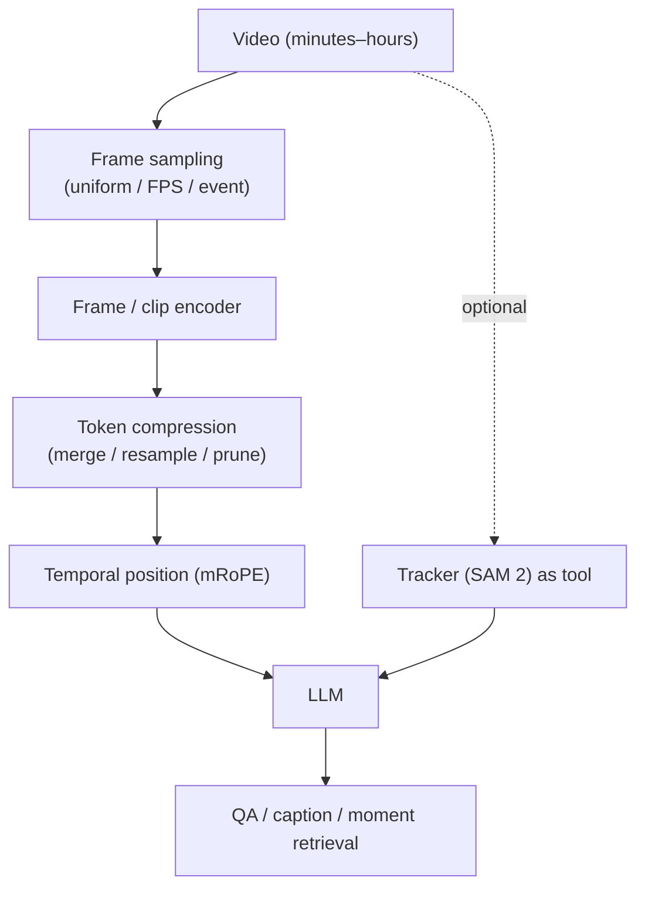
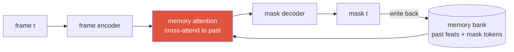

# Video-Language Models

frame samplingmRoPEtoken compressionVideo-MMELongVideoBenchstreaming

> [!TIP] 핵심 긴장을 한 줄로
> Video는 spatial 문제에 **시간**과 **long-horizon memory**를 더하고, 이는 **visual token 예산**과 정면 충돌합니다: 밀집 frame은 sequence를 폭발시키고, 희소 frame은 event를 놓칩니다. 모든 설계 선택 — sampling, temporal position encoding, compression — 은 그 trade-off 안의 한 수입니다. 답을 그 주위로 프레이밍하세요.

## The problem

1시간 video를 1 fps로 하면 3,600 frame이고; frame당 ~256 token이면 ~920k visual token입니다 — raw로 feed하기 불가능. 그래서 video-language는 대체로 **고정된 token 예산을 정보가 있는 곳에 쓰는** 기술입니다.

## Two worlds: video *understanding* vs video *perception*

"video를 처리한다"는 것은 task에 따라 아주 다른 것을 뜻하고, 이를 뭉뚱그리는 것이 흔한 실수입니다. **세 가지 temporal paradigm**이 있습니다 — *task가 무엇을 필요로 하는지*와 *online으로 돌아가야 하는지*로 고르세요:

| Paradigm | Frame이 들어오는 방식 | 보는 것 | 용도 | Latency |
| --- | --- | --- | --- | --- |
| **Sparse sampling → VLM** (understanding) | K개 keyframe을 골라 tokenize, 함께 feed | sample된 frame(≈global) | video QA, captioning, long-video (이 chapter) | token 예산에 의해 제한 |
| **Streaming / recurrent (causal)** | 한 번에 한 frame씩, **memory/state**를 앞으로 이월 | **과거만** | tracking, VOS, robotics, live assistant | 낮음, bounded memory, real-time |
| **Clip / window (offline, bidirectional)** | window $[t{-}k,\dots,t,\dots,t{+}k]$를 쌓아 함께 처리 | **과거 + 미래** | offline video segmentation, action recognition | 높음, 전체 clip 필요 |

### Streaming / recurrent memory — the SAM 2 pattern
이것이 **perception**의 기본값이고, keyframe sampling이 *아닙니다*. SAM 2는 frame을 **순서대로** 처리하고 **memory bank**를 유지합니다: 현재 frame을 encode한 뒤 **memory-attention** block이 그 feature를 **과거 frame들의 feature + 과거 mask 예측(object pointer)에 대한 memory에 cross-attend**하게 합니다; 현재 mask를 출력하고 이를 미래 frame을 위해 memory에 **다시 write**합니다. 이전 state가 현재 예측에 **재귀적으로** 들어갑니다 — RNN hidden state와 비슷하지만, 최근 frame의 FIFO에 대한 attention으로 구현됩니다.

특성: **causal**(과거만), **constant memory**(고정 크기 bank), **online/real-time** → tracking과 interactive/streaming video에 맞는 설계. 실패 양상: 긴 occlusion 후 ID-switch와 drift.

### Clip / window — bidirectional context
real-time가 필요 없는 offline task는 **과거 *와* 미래**를 한 번에 보는 편이 낫습니다: temporal window를 쌓아 **3D convolution**이나 **spatio-temporal attention**으로 섞습니다(action recognition에는 Video Swin / UniFormer; video instance segmentation에는 Mask2Former-VIS / VisTR 계열). 미래 맥락이 현재를 disambiguate합니다 — *지금* 잠깐 occlusion된 객체가 나중 frame으로 해소됩니다. 비용: 전체 clip이 필요하고(streaming 불가) window 길이에 따라 compute가 커집니다.

### Per-frame + association (tracking-by-detection)
가장 단순한 방식: 매 frame마다 **image** 모델을 돌린 뒤 tracker(ByteTrack / SORT)나 mask propagation으로 시간에 걸쳐 detection을 **연결**합니다. 모듈적이고 강력하지만, association이 별도의 오류 나기 쉬운 단계입니다(ID-switch 문제).

> [!NOTE] The distinction to say out loud
> **Video-LLM은 희소 keyframe을 sample**하고 그 위에서 reasoning합니다(spatial-semantic, token-예산 제약). **Video perception은 temporal-first입니다**: online tracking/VOS에는 causal recurrent memory(SAM 2), offline segmentation에는 bidirectional clip/window(3D conv / spatio-temporal attention). *"과거만(online) 필요한가, 과거+미래(offline) 필요한가?"*가 첫 질문이고 — 그것이 paradigm을 고릅니다.

## 1 · Frame sampling

| Strategy | Idea | Failure |
| --- | --- | --- |
| Uniform | 매 k번째 frame | sample 사이 짧은 event 놓침 |
| Fixed FPS | 일정 temporal density | 긴 video → 너무 많은 token |
| Dynamic FPS | motion이 있는 곳에 더 밀집 | motion/scene 신호 필요 |
| Scene-change | cut/shot 경계에서 sample | 정적 long take 과소 sampling |
| Query-conditioned retrieval | 질문에 관련된 frame retrieve | index 필요; 맥락 놓칠 수 있음 |
| Learned selector | 모델이 frame 선택 | 추가 컴포넌트, 학습 비용 |

> [!NOTE] Dynamic FPS + absolute time
> **[VERIFIED]** *Qwen2.5-VL*(arXiv 2502.13923)는 **dynamic FPS**로 sample하고 **absolute time**을 position scheme에 인코딩하여 "X 후 몇 초"가 답변 가능하고 한 시간짜리 video가 다룰 만하게 유지됩니다. 교훈: 모델은 각 frame이 순서뿐 아니라 *언제* 발생했는지 알아야 합니다.

## 2 · Temporal position encoding (mRoPE)

Image VLM은 2D position(row, col)이 필요합니다. Video는 **3D**가 필요합니다: (time, row, col). **mRoPE (multimodal RoPE)**는 rotary embedding을 이 축들에 걸쳐 확장하여 모델이 spatial 레이아웃 *과* temporal 순서를 한 scheme에서 reasoning하게 합니다.

<figure>
<svg viewBox="0 0 620 150" xmlns="http://www.w3.org/2000/svg" font-family="Inter, sans-serif" font-size="11.5">
  <text x="10" y="20" fill="#6b7686">RoPE dimensions split across axes:</text>
  <rect x="20" y="40" width="150" height="40" rx="6" fill="none" stroke="#e0533f" stroke-width="2"/>
  <text x="95" y="58" text-anchor="middle" fill="#e0533f">temporal (t)</text>
  <text x="95" y="73" text-anchor="middle" fill="#6b7686">frame index / seconds</text>
  <rect x="190" y="40" width="150" height="40" rx="6" fill="none" stroke="#0ea5e9" stroke-width="2"/>
  <text x="265" y="58" text-anchor="middle" fill="#0ea5e9">height (h)</text>
  <rect x="360" y="40" width="150" height="40" rx="6" fill="none" stroke="#12a150" stroke-width="2"/>
  <text x="435" y="58" text-anchor="middle" fill="#12a150">width (w)</text>
  <text x="20" y="115" fill="#6b7686">one token's position = (t, h, w) → rotary phase per axis-group</text>
  <text x="20" y="135" fill="#6b7686">text tokens: t=h=w advance together (degenerates to 1D RoPE)</text>
</svg>
<figcaption>mRoPE는 rotary 차원을 (time, height, width) 사이에 분할합니다. Image는 t를 상수로; video는 frame마다 t를 전진; text는 표준 1D RoPE로 붕괴.</figcaption>
</figure>

왜 중요한가: 순진한 "모든 frame을 1D sequence로 flatten"은 "이 frame의 다음 patch"와 "같은 patch, 다음 frame"의 구별을 잃습니다. mRoPE는 그것들을 기하학적으로 분리해 유지하는데, 이것이 모델이 temporal-order와 duration 질문에 답하게 하는 것입니다.

## 3 · Token compression

예산 레버. 기법, 저렴한 것에서 학습된 것 순으로:

<dl class="kv">
<dt>Pooling / patch-merge</dt><dd>인접 patch(spatial)나 frame(temporal)을 평균 또는 concat. 단순, 빠른 motion에 lossy.</dd>
<dt>Resampler / Q-Former</dt><dd>고정 개수의 학습된 query가 많은 frame에 attend → 길이와 무관한 상수 M(Perceiver-style). 다수 frame에 좋음.</dd>
<dt>Token pruning / merging</dt><dd>중복(정적 배경) token을 drop/merge; salient한 것 유지. Content-adaptive.</dd>
<dt>Memory bank</dt><dd>모든 frame을 들고 있는 대신 video 전반에 걸친 압축된 running state 유지(SAM 2-style streaming memory).</dd>
</dl>

> [!WARNING] Naive mean-pooling kills order
> Frame feature를 하나의 벡터로 pooling하면 temporal 순서를 버립니다 — 모델은 "문이 열리고 사람이 들어온다"를 그 반대와 구별할 수 없습니다. *언제* 또는 *어떤 순서로*를 묻는 어떤 task를 위해서든 *약간의* temporal 구조(mRoPE + frame별 token, 또는 event token)를 유지하세요.

## 4 · Long-video understanding & benchmarks

몇 분에서 몇 시간은 memory, event localization, 시간 추정에 부담을 줍니다. 실패 양상: video 중간 사실 망각, ID switch, 틀린 duration/시간 답변.

| Benchmark | Scale (as reported) | Tests |
| --- | --- | --- |
| **Video-MME** | ~900 videos, ~254h, ~2.7k QA | 넓은 short→long video QA |
| **LongVideoBench** | ~1,760 videos, 5min–2hr | long-context referring/QA |
| **LVBench** | ~103 hour-long videos, ~1.5k MCQ | 극단 long-video |
| EgoSchema / MLVU | long egocentric / multi-task | long-form 이해 |

> [!NOTE] Quote benchmarks by capability, hedge numbers
> 이 규모들은 benchmark 논문이 보고한 대로입니다([VERIFIED] 존재, [secondary] 정확한 수치) — 각각이 *측정하는 것*(short vs. hour-long, QA vs. temporal grounding)을 인용하고, long-video의 단일 정확도 수치는 낙관적으로 취급하세요(모델이 진짜 보지 않고 language prior를 악용하는 경우가 많음). Gemini의 video 결과(예: Video-MMMU)는 강하지만 vendor-reported입니다 — 수치는 hedge하고 capability를 인용하세요.

## 5 · Temporal grounding & tracking-as-tool

- **Moment retrieval / temporal grounding:** query에 맞는 span $[t_s, t_e]$ 찾기(Charades-STA, ActivityNet Captions). Spatio-temporal grounding은 frame당 box/mask를 더함. Metric: temporal IoU(그리고 recall threshold에 대한 mIoU), box IoU의 video 유사물.
- **Tracking ↔ language:** "빨간 차가 차선을 바꿨나?"는 association + semantics입니다. **SAM 2**(streaming memory, near-real-time video segmentation)나 **SAM 3**(concept prompt → 모든 instance track)을 *tool*로 쓰고, VLM이 trajectory를 언어화/reasoning하게 하세요. [Vision Foundation Models](#/cv/foundation-models) 참고.

이 tool 기반 분해가 agent로 가는 다리입니다: `track(obj) → get_trajectory() → compare_speed()` 같은 프로그램이 end-to-end VLM이 틀리는 multi-step temporal reasoning을 처리합니다 — [Visual Reasoning Agents](#/vlm/visual-agents)의 동기.

## 6 · Efficient video encoders & egocentric video

**효율**이 실무적 병목입니다. 흔한 레시피: frozen CLIP/SigLIP per-frame + 가벼운 temporal 모듈; motion을 위한 video-native encoder(Video Swin, UniFormer); 시간에 걸친 token merging; on-device를 위한 작은 모델로의 distillation. 지원자의 on-device segmentation 경험(빡빡한 mobile compute, ~10ms 예산)이 "real-time video를 위한 compress/distill" 마인드셋에 직접 매핑됩니다.

**Egocentric video**(Ego4D, EPIC-Kitchens)는 별개 영역입니다: 1인칭, 심한 motion blur, hand-object interaction, 짧은 action. Spatial *과* temporal grounding을 tight하게 결합하며 embodied/AR assistant의 기반입니다. Hand-object segmentation(VISOR-style)은 픽셀 수준 perception이 temporal reasoning을 만나는 곳입니다.

> [!EXAMPLE] Product scenarios to reason about
> - *"공이 바닥에 닿는 순간을 찾아라"* → moment retrieval + event detection (event 근처 밀집 sampling).
> - *"같은 사람이 나갔다가 다시 들어왔나?"* → tracking + re-identification across a gap (occlusion re-ID).
> - *"이 90분 강의를 요약하라"* → long-context memory + retrieval-augmented frame, 모든 frame 아님.
>
> 각각이 다른 sampling + compression + memory 선택에 매핑됩니다 — 단일 "video 설정"은 없습니다.

## 7 · Understanding vs. generation, and temporal consistency

Video *understanding*(QA, captioning, grounding)과 video *generation*(text-to-video)은 다른 제품이지만 하나의 어려운 문제를 공유합니다: **temporal consistency** — frame에 걸친 일관된 identity, motion, causality. Mask/segmentation은 video 편집의 control 신호로 작용할 수 있고, tracker는 두 task 모두가 필요로 하는 temporal association을 제공합니다. Understanding 모델은 QA/grounding metric으로, generation 모델은 fidelity/consistency로 판단됩니다 — 면접에서 둘을 혼동하지 마세요.

## 8 · Streaming video

Offline video는 전체 clip이 이용 가능하다고 가정하고; **streaming**은 *frame이 도착하는 대로* 답하기를 요구합니다(live assistant, robotics, monitoring). 이는 다음을 요구합니다: bounded-memory running state(모든 history를 re-attend 불가), 낮은 frame당 latency, 답변/event를 online으로 emit하는 능력. Memory-bank와 KV-compression 접근이 지배적이고; 지원자의 on-device / tight-latency perception 경험과 연결됩니다.

Streaming 세팅은 평가도 바꿉니다: 최종-clip 정확도만이 아니라 **첫 유용한 답변까지의 latency**와 **anytime correctness**(지금까지 본 frame만으로 답이 맞나?)를 중시합니다. 끝에서는 맞지만 stream 중간에 쓸모없는 모델은 제품 기준을 못 넘습니다.

## Q&A

How do you extend an image VLM to video without exploding the token budget?

**Short:** Frame을 지능적으로 sample(dynamic FPS / event 기반, 모든 frame 아님), frame당 token 압축(resampler, merging, pruning), temporal position(mRoPE) 추가로 순서 보존. 선택적으로 tracking을 전문가에게 offload하고 trajectory를 reasoning.

**Deep:** 예산이 제약입니다: 몇 시간의 밀집 frame은 불가능하므로 (1) 정보가 있는 곳에 frame 할당 — dynamic FPS, scene cut, 또는 query-conditioned retrieval; (2) pixel-shuffle/pooling, fixed-latent resampler, 또는 content-adaptive pruning으로 frame당 token 절감; (3) mRoPE와 absolute-time encoding으로 temporal 구조 보존하여 "언제/얼마나/어떤 순서로"가 답변 가능하게. Long-horizon이나 streaming에는 모든 frame을 들고 있는 대신 압축된 memory bank 추가. 반복되는 실수는 frame을 mean-pooling하는 것 — 순서를 파괴합니다.

A video VLM aces short-clip QA but fails hour-long questions. Why, and how do you evaluate honestly?

**Short:** 짧은 clip은 예산에 맞고 종종 답이 한 frame에 있음; long video는 memory, event localization, 시간 추정에 부담을 주고 모델은 language prior에 기댐. Aggregate 정확도만이 아니라 long-video benchmark(LongVideoBench, LVBench)와 temporal-grounding metric으로 평가하세요.

**Deep:** Under-sampling이 관련 순간을 놓치고; compression이 미세 event를 흐리고; absolute-time encoding 없이는 duration/order 질문이 추측입니다. 많은 "long-video" 승리가 보지 않고 그럴듯하게 답하는 LLM prior에서 옵니다 — 그러니 순간을 localize해야 *하는* 질문(temporal IoU), distractor가 많은 MCQ, counterfactual edit로 탐침하세요. 길이별 breakdown을 보고하세요; 단일 수치는 긴 duration에서의 절벽을 숨깁니다.

How would you build a real-time streaming video assistant on-device?

**Short:** Memory 한정(모든 frame이 아니라 고정 크기 압축 state), frame당 perception 저렴하게 유지(distilled encoder, 낮은 resolution, token merging), 빠른 perception 루프를 느린 reasoning 루프와 분리, 답변/event를 점진적으로 emit.

**Deep:** Streaming은 무한 history의 re-attend를 금하므로, 무슨 일이 있었는지 요약하는 running memory bank(SAM 2-style)나 KV-compressed state를 유지합니다. Perception은 latency 예산에 맞아야 함 — encoder distill, resolution/FPS 상한, 정적 token prune. 관심사 분리: 경량 tracker/detector가 매 frame 실행; VLM은 frame마다가 아니라 필요 시 또는 event 경계에서 reasoning. 이것은 on-device segmentation과 같은 효율 규율을 시간 축으로 확장한 것입니다.

**Follow-ups**

- "mRoPE가 1D RoPE가 못 하는 무엇을 인코딩하나?" (temporal vs. spatial 축 분리 → 순서와 레이아웃 구별.)
- "언제 tracker-as-tool이 end-to-end video VLM보다 나은가?" (정밀 association/trajectory, occlusion re-ID, 측정 — 전문가가 요약하는 forward pass를 이김.)
- "Streaming vs. offline — 아키텍처적으로 무엇이 바뀌나?" (Bounded memory, online emission, frame당 latency 예산.)
- "왜 순진한 frame pooling이 치명적일 수 있나?" (temporal 순서 상실; causal/시간에 걸친 counting 질문 실패.)
- "Query가 짧은 event를 겨냥할 때 frame을 어떻게 sample하나?" (Query-conditioned retrieval 또는 coarse-to-fine pass: 희소하게 sample, 관심 region localize, 그 주위에 밀집 재-sample.)
- "Video 길이가 커지면 무엇이 먼저 깨지나?" (시간/duration 추정과 video 중간 사실 회상 — 객체 인식보다 먼저.)

## Cheat-sheet

| Concept | One-liner |
| --- | --- |
| Core tension | 밀집 frame은 token 폭발; 희소 frame은 event 놓침 |
| Dynamic FPS | motion으로 sample + absolute time 인코딩 (Qwen2.5-VL) |
| mRoPE | rotary position을 (time, height, width)로 분할; text → 1D RoPE |
| Compression | pool / resampler (fixed M) / prune / memory bank |
| Mean-pool trap | temporal 순서 파괴 → frame별/event 구조 유지 |
| Benchmarks | Video-MME, LongVideoBench, LVBench (정확한 수치 hedge) |
| Moment retrieval | text → time span [t_s, t_e]; spatio-temporal에는 box/mask 추가 |
| Tracking-as-tool | SAM 2/3 track + VLM이 trajectory reasoning |
| Streaming | bounded memory, online 답변, frame당 latency, anytime correctness |
| Egocentric | 1인칭, blur, hand-object, 짧은 action (Ego4D/EPIC) |
| Efficiency | frozen frame encoder + 가벼운 temporal; on-device용 distill |

**Related:** [VLM Implementation Details](#/vlm/practical) · [Grounding & Region Reasoning](#/vlm/grounding) · [Visual Reasoning Agents](#/vlm/visual-agents) · [Vision Foundation Models](#/cv/foundation-models) · [Vision-Language Pretraining](#/vlm/pretraining)
