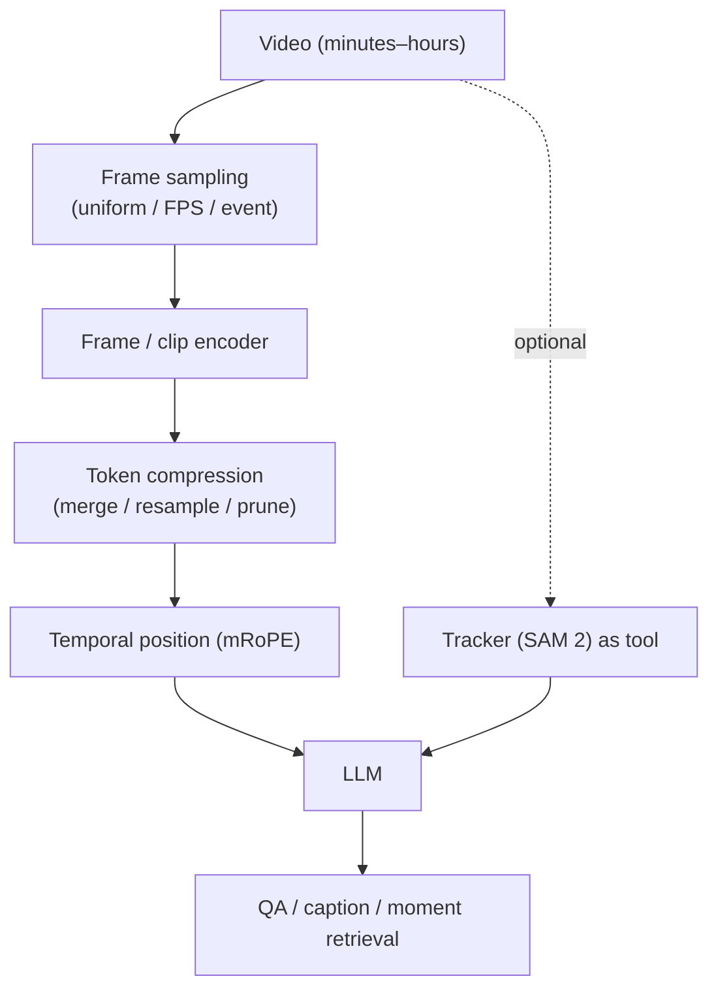
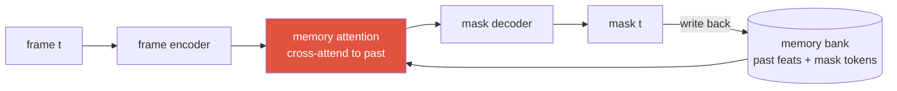

# Video-Language Models

<div class="tag-row"><span class="tag">frame sampling</span><span class="tag">mRoPE</span><span class="tag">token compression</span><span class="tag">Video-MME</span><span class="tag">LongVideoBench</span><span class="tag">streaming</span></div>

> [!NOTE] Goal of this chapter
> A video-language model extends the "image → tokens" pipeline from [VLM 101](#/vlm/vlm-101) across **many frames**. One tension drives the chapter: video has so many frames that the **token budget** explodes. Build that intuition first, then place sampling, position, and compression techniques on top of it.

## What & why — the token-budget explosion

One image typically becomes hundreds of **visual tokens**. A video, however, can contain thousands of frames.

**Do the arithmetic:** even one hour of video at 1 fps is 3,600 frames. At 256 tokens per frame, that is **921,600 visual tokens**. Some models advertise nominal contexts of 1M or more, but raw input is still usually impractical after reserving space for the visual encoder, text and output, attention/KV cost, upload limits, and effective long-range recall. Distinguish "fits in the window" from "uses the information effectively."

<figure>
<svg viewBox="0 0 640 190" xmlns="http://www.w3.org/2000/svg" font-family="Inter, sans-serif" font-size="12">
  <text x="20" y="22" fill="#98a3b2">Timeline (the same one-hour video)</text>
  <!-- dense sampling -->
  <text x="20" y="52" fill="#e0533f" font-weight="700">Dense sampling</text>
  <g fill="#e0533f">
    <rect x="150" y="42" width="6" height="16"/><rect x="166" y="42" width="6" height="16"/><rect x="182" y="42" width="6" height="16"/><rect x="198" y="42" width="6" height="16"/><rect x="214" y="42" width="6" height="16"/><rect x="230" y="42" width="6" height="16"/><rect x="246" y="42" width="6" height="16"/><rect x="262" y="42" width="6" height="16"/><rect x="278" y="42" width="6" height="16"/><rect x="294" y="42" width="6" height="16"/><rect x="310" y="42" width="6" height="16"/><rect x="326" y="42" width="6" height="16"/><rect x="342" y="42" width="6" height="16"/><rect x="358" y="42" width="6" height="16"/><rect x="374" y="42" width="6" height="16"/><rect x="390" y="42" width="6" height="16"/><rect x="406" y="42" width="6" height="16"/><rect x="422" y="42" width="6" height="16"/><rect x="438" y="42" width="6" height="16"/><rect x="454" y="42" width="6" height="16"/><rect x="470" y="42" width="6" height="16"/><rect x="486" y="42" width="6" height="16"/><rect x="502" y="42" width="6" height="16"/><rect x="518" y="42" width="6" height="16"/>
  </g>
  <text x="548" y="55" fill="#e0533f">💥 token explosion</text>
  <!-- sparse sampling -->
  <text x="20" y="102" fill="#12a150" font-weight="700">Sparse sampling</text>
  <g fill="#12a150"><rect x="150" y="92" width="6" height="16"/><rect x="240" y="92" width="6" height="16"/><rect x="330" y="92" width="6" height="16"/><rect x="420" y="92" width="6" height="16"/><rect x="510" y="92" width="6" height="16"/></g>
  <text x="548" y="105" fill="#12a150">budget OK</text>
  <text x="150" y="135" fill="#98a3b2">…but brief events between samples (for example, a bounce) may be missed</text>
  <line x1="150" y1="150" x2="520" y2="150" stroke="#98a3b2" stroke-width="1"/>
  <text x="150" y="170" fill="#98a3b2">0 min</text><text x="500" y="170" fill="#98a3b2">60 min</text>
</svg>
<figcaption>The fundamental video-language trade-off: <b>dense</b> frame sampling explodes the token count, while <b>sparse</b> sampling meets the budget but misses brief events. Every technique in this chapter is a way to spend a fixed token budget where the information is.</figcaption>
</figure>

> [!TIP] One interview line
> Video adds **time** and **long-horizon memory** to the spatial problem, and it collides head-on with the **visual token budget**: dense frames explode the sequence; sparse frames miss events. Every design choice—sampling, temporal position encoding, and compression—is one move in that trade-off.

## The problem



An hour of video at 1 fps and 256 tokens per frame produces 921,600 tokens. Even when this nominally fits a long context, cost and effective recall remain problems, so video-language is largely the art of **spending a fixed token budget where the information is**.

## Two worlds: video *understanding* vs video *perception*

"Process video" means very different things by task, and conflating them is a common stumble. There are **three temporal paradigms** — pick by *what the task needs* and *whether it must run online*:

| Paradigm | How frames enter | Sees | Used for | Latency |
| --- | --- | --- | --- | --- |
| **Sparse sampling → VLM** (understanding) | pick K keyframes, tokenize, feed together | the sampled frames (≈global) | video QA, captioning, long-video (this chapter) | bounded by token budget |
| **Streaming / recurrent (causal)** | one frame at a time, carry a **memory/state** forward | **past only** | tracking, VOS, robotics, live assistants | low, bounded memory, real-time |
| **Clip / window (offline, bidirectional)** | stack a window $[t{-}k,\dots,t,\dots,t{+}k]$, process jointly | **past + future** | offline video segmentation, action recognition | high, needs whole clip |

### Streaming / recurrent memory — the SAM 2 pattern
This is the **perception** default, and it is *not* keyframe sampling. SAM 2 processes frames **in order** and keeps a **memory bank**: encode the current frame, then a **memory-attention** block lets its features **cross-attend to a memory of past frames' features + past mask predictions (object pointers)**; it outputs the current mask and **writes it back** into the memory for future frames. The previous state feeds **recursively** into the current prediction — like an RNN hidden state, but implemented as attention over a FIFO of recent frames.



It is causal—past only—and recent-frame memory can be capped, making it suitable for online processing. But "constant memory" depends on configuration, object count, stored pointers, and implementation, while real-time behavior depends on resolution, hardware, and object count. Failure modes include ID switches and drift after long occlusions.

### Clip / window — bidirectional context
Offline tasks that don't need real-time do better by seeing **past *and* future** at once: stack a temporal window and mix it with **3D convolutions** or **spatio-temporal attention** (Video Swin / UniFormer for action recognition; Mask2Former-VIS / VisTR-style for video instance segmentation). Future context disambiguates the present — an object briefly occluded *now* is resolved by a later frame. Cost: you need the whole clip (no streaming) and compute grows with window length.

### Per-frame + association (tracking-by-detection)
The simplest: run an **image** model every frame, then **link** detections across time with a tracker (ByteTrack / SORT) or mask propagation. Modular and strong, but association is a separate, error-prone stage (the ID-switch problem).

> [!NOTE] The distinction to say out loud
> Video LLMs do not always use only sparse keyframes. Inputs may use uniform or dynamic sampling, dense clip encoders, retrieval, or memory models. First decide whether the task is online-causal or offline-bidirectional, and what temporal resolution and token/latency budget it needs; then choose sampling and memory.

## 1 · Frame sampling

| Strategy | Idea | Failure |
| --- | --- | --- |
| Uniform | every k-th frame | misses brief events between samples |
| Fixed FPS | constant temporal density | long videos → too many tokens |
| Dynamic FPS | denser where motion is | needs a motion/scene signal |
| Scene-change | sample at cut/shot boundaries | static long takes under-sampled |
| Query-conditioned retrieval | retrieve frames relevant to the question | needs an index; can miss context |
| Learned selector | a model picks frames | extra component, train cost |

> [!NOTE] Dynamic FPS + absolute time
> *Qwen2.5-VL* (arXiv 2502.13923) uses **dynamic FPS** sampling and encodes **absolute time** in its position scheme, supporting questions such as "how many seconds after X" while keeping long video tractable. The lesson is that the model must know *when* each frame occurred, not only its order.

## 2 · Temporal position encoding (mRoPE)

Video tokens need positional signals that distinguish time from 2D location. **mRoPE** is one design used by the Qwen-VL family; it allocates rotary dimensions across time, height, and width. Other choices include factorized embeddings, relative bias, or frame delimiters with 1D positions. (For the foundation, see [Positional Encoding & RoPE](#/ml-coding/positional-encoding-rope).)

<figure>
<svg viewBox="0 0 620 150" xmlns="http://www.w3.org/2000/svg" font-family="Inter, sans-serif" font-size="11.5">
  <text x="10" y="20" fill="#6b7686">RoPE dimensions split across axes:</text>
  <rect x="20" y="40" width="150" height="40" rx="6" fill="none" stroke="#e0533f" stroke-width="2"/>
  <text x="95" y="58" text-anchor="middle" fill="#e0533f">temporal (t)</text>
  <text x="95" y="73" text-anchor="middle" fill="#6b7686">frame index / seconds</text>
  <rect x="190" y="40" width="150" height="40" rx="6" fill="none" stroke="#0ea5e9" stroke-width="2"/>
  <text x="265" y="58" text-anchor="middle" fill="#0ea5e9">height (h)</text>
  <rect x="360" y="40" width="150" height="40" rx="6" fill="none" stroke="#12a150" stroke-width="2"/>
  <text x="435" y="58" text-anchor="middle" fill="#12a150">width (w)</text>
  <text x="20" y="115" fill="#6b7686">one token's position = (t, h, w) → rotary phase per axis-group</text>
  <text x="20" y="135" fill="#6b7686">text tokens: t=h=w advance together (degenerates to 1D RoPE)</text>
</svg>
<figcaption>mRoPE partitions the rotary dimensions among (time, height, width). Images set t constant; video advances t per frame; text collapses to standard 1D RoPE.</figcaption>
</figure>

A simple 1D flattening can still distinguish tokens when order and frame delimiters are present, but it provides a weaker inductive bias for 2D/3D axes and may generalize poorly across resolutions. mRoPE separates the axes explicitly, but it does not automatically guarantee temporal-order or duration accuracy; absolute timestamps and suitable training data still matter.

## 3 · Token compression

The budget lever. Techniques, from cheap to learned:

<dl class="kv">
<dt>Pooling / patch-merge</dt><dd>Average or concat adjacent patches (spatial) or frames (temporal). Simple, lossy on fast motion.</dd>
<dt>Resampler / Q-Former</dt><dd>Fixed number of learned queries attend to many frames → constant M regardless of length (Perceiver-style). Good for many frames.</dd>
<dt>Token pruning / merging</dt><dd>Drop or merge redundant (static background) tokens; keep salient ones. Content-adaptive.</dd>
<dt>Memory bank</dt><dd>Maintain a compressed running state across the video (SAM 2-style streaming memory) instead of holding all frames.</dd>
</dl>

> [!WARNING] Naive mean-pooling kills order
> Simply averaging frame features **before temporal encoding** is permutation-invariant and loses order. A pooled summary after an order-aware temporal encoder can preserve some order information. State where compression occurs, then test order reversal and brief-event slices.

<details class="concept-code">
<summary>View as conceptual code</summary>

> This is PyTorch-style **pseudocode** for compressing frames while preserving timestamps. It is not the executable API of a particular video VLM.

```python
@no_grad()
def encode_video_for_query(frames, timestamps_sec, query, token_budget):
    vision_encoder.eval(); temporal_encoder.eval()
    chosen = sample_frames(frames, timestamps_sec, query=query,
                           max_frames=frame_budget(token_budget))
    pixels, t = batch_preprocess(chosen)              # [F,C,H,W], [F]
    patch = vision_encoder(pixels)                    # [F,N_patch,Dv]

    # Add actual timestamps and 2D patch positions before pooling to preserve order.
    patch = projector(patch)                          # [F,N_patch,Dlm]
    patch = add_spatiotemporal_position(patch, time=t, grid=(Hp, Wp))
    valid = make_patch_mask(chosen)                   # [F,N_patch], padding=False
    sequence = temporal_encoder(flatten_F_N(patch),
                                mask=flatten_F_N(valid))
    tokens, token_mask = resampler(sequence, max_tokens=token_budget)
    return tokens, token_mask, t                      # Retain timestamps with answers/evidence

@no_grad()
def update_stream(state, frame, timestamp_sec):
    # Online path that never sees future frames. State must have a window/memory cap.
    vision_encoder.eval()
    feature = vision_encoder(preprocess(frame))
    state.memory.append(feature.detach(), timestamp_sec)
    state.memory.evict_older_than(timestamp_sec - state.max_history_sec)
    return causal_temporal_update(state.memory)       # Distinct from offline bidirectional attention
```

</details>

## 4 · Long-video understanding & benchmarks

Minutes to hours stress memory, event localization, and time estimation. Failure modes: forgetting mid-video facts, ID switches, wrong duration/time answers.

| Benchmark | Scale (as reported) | Tests |
| --- | --- | --- |
| **Video-MME** | ~900 videos, ~254h, ~2.7k QA | broad short→long video QA |
| **LongVideoBench** | 3,763 videos, 6,678 human-annotated MCQ (8 sec–1 hour) | long-context video-language understanding |
| **LVBench** | ~103 hour-long videos, ~1.5k MCQ | extreme long-video |
| EgoSchema / MLVU | long egocentric / multi-task | long-form comprehension |

> [!NOTE] Quote benchmarks by capability, hedge numbers
> Cite numbers and splits with the version. The LongVideoBench figures above—3,763 videos and 6,678 questions—come from the [original paper](https://arxiv.org/abs/2407.15754). Do not infer effective temporal use from one long-video accuracy; inspect a text-only baseline, length breakdowns, frame ablations, and temporal grounding. For vendor results, state the evaluation setup and whether they were independently reproduced.

## 5 · Temporal grounding & tracking-as-tool

- **Moment retrieval / temporal grounding:** find the span $[t_s,t_e]$ matching a query. Common metrics are **R@K at tIoU=$\theta$**—for example R@1@0.5—and **mIoU** between predicted and ground-truth spans. For spatio-temporal grounding, define the temporal range and per-frame box or mask metrics together.
- **Tracking ↔ language:** "did the red car change lanes?" is association + semantics. Use **SAM 2** (streaming memory, near-real-time video segmentation) or **SAM 3** (concept prompts → track every instance) as a *tool*, and let the VLM verbalize/reason over the trajectories. See [Vision Foundation Models](#/cv/foundation-models).

This tool-based decomposition is the bridge to agents: a program like `track(obj) → get_trajectory() → compare_speed()` handles multi-step temporal reasoning that end-to-end VLMs get wrong — the motivation in [Visual Reasoning Agents](#/vlm/visual-agents).

## 6 · Efficient video encoders & egocentric video

**Efficiency** is the practical bottleneck. Common recipes include a frozen CLIP/SigLIP frame encoder plus a lightweight temporal module, a video-native encoder such as Video Swin or UniFormer for motion, token merging across time, and distillation into a smaller on-device model. If you connect this to personal deployment experience, use a latency budget only when its device, runtime, input, and measurement are documented.

**Egocentric video** (Ego4D, EPIC-Kitchens) is a distinct regime: first-person, heavy motion blur, hand-object interactions, and short actions. It couples spatial *and* temporal grounding tightly and is the substrate for embodied/AR assistants. Hand-object segmentation (VISOR-style) is where pixel-level perception meets temporal reasoning.

> [!EXAMPLE] Product scenarios to reason about
> - *"Find the moment the ball hits the floor"* → moment retrieval + event detection (dense sampling near the event).
> - *"Did the same person leave and re-enter?"* → tracking + re-identification across a gap (occlusion re-ID).
> - *"Summarize this 90-minute lecture"* → long-context memory + retrieval-augmented frames, not all-frames.
>
> Each maps to a different sampling + compression + memory choice — there is no single "video setting."

## 7 · Understanding vs. generation, and temporal consistency

Video *understanding* (QA, captioning, grounding) and video *generation* (text-to-video) are different products but share one hard problem: **temporal consistency** — coherent identity, motion, and causality across frames. Masks/segmentation can act as control signals for video editing, and trackers provide the temporal association that both tasks need. Understanding models are judged on QA/grounding metrics; generation models on fidelity/consistency — don't conflate the two in an interview.

## 8 · Streaming video

Offline video can use the full clip, while **streaming** must answer from frames seen so far. It needs a bounded-memory state, low per-frame latency, and online emission; compare memory banks, recurrent state, retrieval, and KV compression according to the workload.

The streaming setting also changes evaluation: you care about **latency to first useful answer** and **anytime correctness** (is the answer right given only frames seen so far?), not just final-clip accuracy. A model that's right at the end but useless mid-stream fails the product bar.

## Q&A

<details class="qa"><summary>How do you extend an image VLM to video without exploding the token budget?</summary>
<div class="qa-body">

**Short:** Sample frames intelligently (dynamic FPS / event-based, not all frames), compress per-frame tokens (resampler, merging, pruning), and add temporal position (mRoPE) so order survives. Optionally offload tracking to a specialist and reason over trajectories.

**Deep:** (1) Allocate frames with dynamic FPS, scene cuts, or query-conditioned retrieval; (2) reduce tokens through merging, a resampler, or pruning; and (3) add mRoPE or another spatio-temporal position scheme together with timestamps. Averaging raw frames before temporal encoding loses order, while pooling after a temporal encoder is different—state where compression occurs. Evaluate duration, event-length, and order-reversal slices together with a cost curve.
</div></details>

<details class="qa"><summary>A video VLM aces short-clip QA but fails hour-long questions. Why, and how do you evaluate honestly?</summary>
<div class="qa-body">

**Short:** Short clips fit the budget and often the answer is in one frame; long video stresses memory, event localization, and time estimation, and models lean on language priors. Evaluate with long-video benchmarks (LongVideoBench, LVBench) and temporal-grounding metrics, not just aggregate accuracy.

**Deep:** Under-sampling drops the relevant moment; compression blurs fine events; without absolute-time encoding, duration/order questions are guesses. Many "long-video" wins come from the LLM prior answering plausibly without watching — so probe with questions that *require* localizing a moment (temporal IoU), with distractor-heavy MCQs, and with counterfactual edits. Report per-length breakdowns; a single number hides the cliff at long durations.
</div></details>

<details class="qa"><summary>How would you build a real-time streaming video assistant on-device?</summary>
<div class="qa-body">

**Short:** Bound the memory (a fixed-size compressed state, not all frames), keep per-frame perception cheap (distilled encoder, low resolution, token merging), decouple a fast perception loop from a slower reasoning loop, and emit answers/events incrementally.

**Deep:** Streaming forbids re-attending unbounded history, so you maintain a running memory bank (SAM 2-style) or KV-compressed state summarizing what's happened. Perception must fit the latency budget — distill the encoder, cap resolution/FPS, prune static tokens. Split concerns: a lightweight tracker/detector runs every frame; the VLM reasons on demand or at event boundaries, not per frame. This is the same efficiency discipline as on-device segmentation, extended along time.
</div></details>

**Follow-ups**

- "What does mRoPE encode that 1D RoPE can't?" (Separate temporal vs. spatial axes → order and layout distinguished.)
- "When is a tracker-as-tool better than end-to-end video VLM?" (Precise association/trajectory, occlusion re-ID, measurement — specialist beats a summarizing forward pass.)
- "Streaming vs. offline — what changes architecturally?" (Bounded memory, online emission, per-frame latency budget.)
- "Why can naive frame pooling be catastrophic?" (Loses temporal order; causal/counting-over-time questions fail.)
- "How do you sample frames when the query targets a brief event?" (Query-conditioned retrieval or a coarse-to-fine pass: sample sparsely, localize the region of interest, then densely re-sample around it.)
- "What breaks first as video length grows?" (Time/duration estimation and mid-video fact recall — before object recognition does.)

## Cheat-sheet

| Concept | One-liner |
| --- | --- |
| Core tension | dense frames explode tokens; sparse frames miss events |
| Dynamic FPS | sample by motion + encode absolute time (Qwen2.5-VL) |
| mRoPE | rotary positions split across (time, height, width); text → 1D RoPE |
| Compression | pool / resampler (fixed M) / prune / memory bank |
| Mean-pool trap | averaging before temporal encoding destroys order; inspect compression placement and order tests |
| Benchmarks | Video-MME, LongVideoBench (3,763/6,678), LVBench; report version, text baseline, and length slices |
| Moment retrieval | text → span; R@K@tIoU and mIoU, plus boxes/masks for spatio-temporal grounding |
| Tracking-as-tool | SAM 2/3 track + VLM reason over trajectories |
| Streaming | bounded memory, online answers, per-frame latency, anytime correctness |
| Egocentric | first-person, blur, hand-object, short actions (Ego4D/EPIC) |
| Efficiency | frozen frame encoder + light temporal; distill for on-device |

**Next:** [VLM 101](#/vlm/vlm-101) · [VLM Implementation Details](#/vlm/practical) · [Grounding & Region Reasoning](#/vlm/grounding) · [Visual Reasoning Agents](#/vlm/visual-agents) · [Positional Encoding & RoPE](#/ml-coding/positional-encoding-rope) · [Vision Foundation Models](#/cv/foundation-models)
