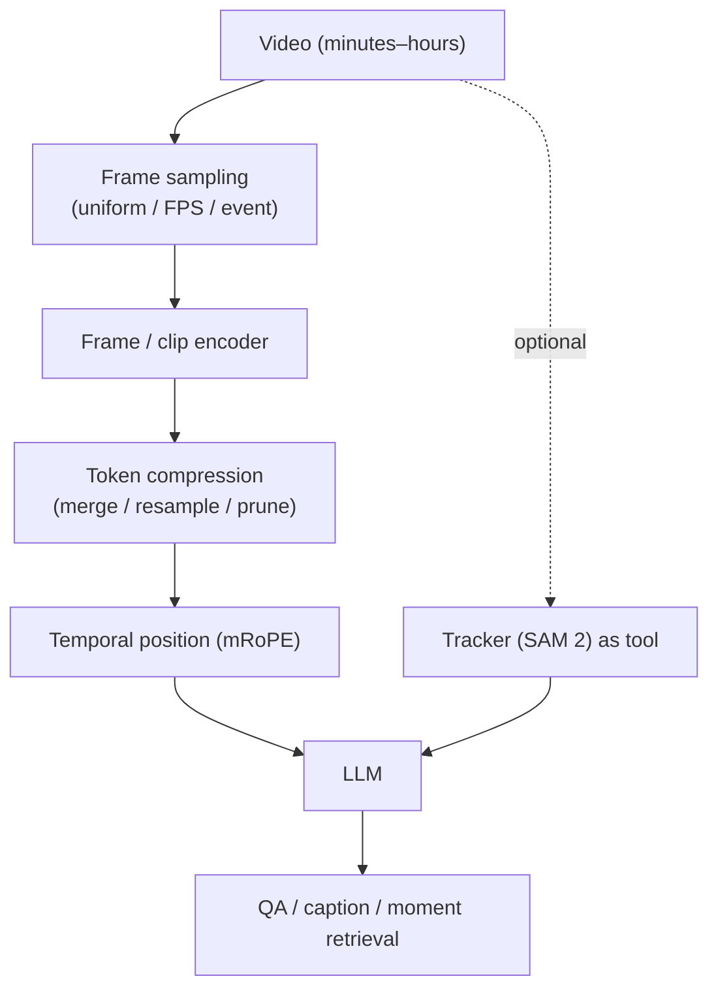

# Video-Language Models

frame samplingmRoPEtoken compressionVideo-MMELongVideoBenchstreaming

> [!TIP] The core tension in one line
> Video adds **time** and **long-horizon memory** to the spatial problem, and it collides head-on with the **visual token budget**: dense frames explode the sequence; sparse frames miss events. Every design choice — sampling, temporal position encoding, compression — is a move in that trade-off. Frame your answers around it.

## The problem

An hour of video at 1 fps is 3,600 frames; at ~256 tokens/frame that is ~920k visual tokens — impossible to feed raw. So video-language is largely the art of **spending a fixed token budget where the information is**.

## 1 · Frame sampling

| Strategy | Idea | Failure |
| --- | --- | --- |
| Uniform | every k-th frame | misses brief events between samples |
| Fixed FPS | constant temporal density | long videos → too many tokens |
| Dynamic FPS | denser where motion is | needs a motion/scene signal |
| Scene-change | sample at cut/shot boundaries | static long takes under-sampled |
| Query-conditioned retrieval | retrieve frames relevant to the question | needs an index; can miss context |
| Learned selector | a model picks frames | extra component, train cost |

> [!NOTE] Dynamic FPS + absolute time
> **[VERIFIED]** *Qwen2.5-VL* (arXiv 2502.13923) samples at **dynamic FPS** and encodes **absolute time** into its position scheme, so "how many seconds after X" is answerable and hour-long video stays tractable. The lesson: the model must know *when* each frame occurred, not just its order.

## 2 · Temporal position encoding (mRoPE)

An image VLM needs 2D positions (row, col). Video needs **3D**: (time, row, col). **mRoPE (multimodal RoPE)** extends rotary embeddings across these axes so the model reasons about spatial layout *and* temporal order in one scheme.

<figure>
<svg viewBox="0 0 620 150" xmlns="http://www.w3.org/2000/svg" font-family="Inter, sans-serif" font-size="11.5">
  <text x="10" y="20" fill="#6b7686">RoPE dimensions split across axes:</text>
  <rect x="20" y="40" width="150" height="40" rx="6" fill="none" stroke="#e0533f" stroke-width="2"/>
  <text x="95" y="58" text-anchor="middle" fill="#e0533f">temporal (t)</text>
  <text x="95" y="73" text-anchor="middle" fill="#6b7686">frame index / seconds</text>
  <rect x="190" y="40" width="150" height="40" rx="6" fill="none" stroke="#0ea5e9" stroke-width="2"/>
  <text x="265" y="58" text-anchor="middle" fill="#0ea5e9">height (h)</text>
  <rect x="360" y="40" width="150" height="40" rx="6" fill="none" stroke="#12a150" stroke-width="2"/>
  <text x="435" y="58" text-anchor="middle" fill="#12a150">width (w)</text>
  <text x="20" y="115" fill="#6b7686">one token's position = (t, h, w) → rotary phase per axis-group</text>
  <text x="20" y="135" fill="#6b7686">text tokens: t=h=w advance together (degenerates to 1D RoPE)</text>
</svg>
<figcaption>mRoPE partitions the rotary dimensions among (time, height, width). Images set t constant; video advances t per frame; text collapses to standard 1D RoPE.</figcaption>
</figure>

Why it matters: a naive "flatten all frames into a 1D sequence" loses the distinction between "next patch in this frame" and "same patch, next frame." mRoPE keeps those geometrically separate, which is what lets the model answer temporal-order and duration questions.

## 3 · Token compression

The budget lever. Techniques, from cheap to learned:

<dl class="kv">
<dt>Pooling / patch-merge</dt><dd>Average or concat adjacent patches (spatial) or frames (temporal). Simple, lossy on fast motion.</dd>
<dt>Resampler / Q-Former</dt><dd>Fixed number of learned queries attend to many frames → constant M regardless of length (Perceiver-style). Good for many frames.</dd>
<dt>Token pruning / merging</dt><dd>Drop or merge redundant (static background) tokens; keep salient ones. Content-adaptive.</dd>
<dt>Memory bank</dt><dd>Maintain a compressed running state across the video (SAM 2-style streaming memory) instead of holding all frames.</dd>
</dl>

> [!WARNING] Naive mean-pooling kills order
> Pooling frame features into one vector throws away temporal order — the model can't tell "door opens then person enters" from the reverse. Keep *some* temporal structure (mRoPE + per-frame tokens, or event tokens) for any task that asks *when* or *in what order*.

## 4 · Long-video understanding & benchmarks

Minutes to hours stress memory, event localization, and time estimation. Failure modes: forgetting mid-video facts, ID switches, wrong duration/time answers.

| Benchmark | Scale (as reported) | Tests |
| --- | --- | --- |
| **Video-MME** | ~900 videos, ~254h, ~2.7k QA | broad short→long video QA |
| **LongVideoBench** | ~1,760 videos, 5min–2hr | long-context referring/QA |
| **LVBench** | ~103 hour-long videos, ~1.5k MCQ | extreme long-video |
| EgoSchema / MLVU | long egocentric / multi-task | long-form comprehension |

> [!NOTE] Quote benchmarks by capability, hedge numbers
> These scales are as reported by the benchmark papers ([VERIFIED] existence, [secondary] exact counts) — cite what each *measures* (short vs. hour-long, QA vs. temporal grounding), and treat single accuracy numbers on long-video as optimistic (models often exploit language priors without truly watching). Gemini's video results (e.g., Video-MMMU) are strong but vendor-reported — hedge the figure, quote the capability.

## 5 · Temporal grounding & tracking-as-tool

- **Moment retrieval / temporal grounding:** find the span $[t_s, t_e]$ matching a query (Charades-STA, ActivityNet Captions). Spatio-temporal grounding adds a box/mask per frame. Metric: temporal IoU (and mIoU over recall thresholds), the video analogue of box IoU.
- **Tracking ↔ language:** "did the red car change lanes?" is association + semantics. Use **SAM 2** (streaming memory, near-real-time video segmentation) or **SAM 3** (concept prompts → track every instance) as a *tool*, and let the VLM verbalize/reason over the trajectories. See [Vision Foundation Models](#/cv/foundation-models).

This tool-based decomposition is the bridge to agents: a program like `track(obj) → get_trajectory() → compare_speed()` handles multi-step temporal reasoning that end-to-end VLMs get wrong — the motivation in [Visual Reasoning Agents](#/vlm/visual-agents).

## 6 · Efficient video encoders & egocentric video

**Efficiency** is the practical bottleneck. Common recipes: frozen CLIP/SigLIP per-frame + a lightweight temporal module; video-native encoders (Video Swin, UniFormer) for motion; token merging across time; and distillation to smaller models for on-device. The candidate's on-device segmentation experience (tight mobile compute, ~10ms budgets) maps directly onto the "compress/distill for real-time video" mindset.

**Egocentric video** (Ego4D, EPIC-Kitchens) is a distinct regime: first-person, heavy motion blur, hand-object interactions, and short actions. It couples spatial *and* temporal grounding tightly and is the substrate for embodied/AR assistants. Hand-object segmentation (VISOR-style) is where pixel-level perception meets temporal reasoning.

> [!EXAMPLE] Product scenarios to reason about
> - *"Find the moment the ball hits the floor"* → moment retrieval + event detection (dense sampling near the event).
> - *"Did the same person leave and re-enter?"* → tracking + re-identification across a gap (occlusion re-ID).
> - *"Summarize this 90-minute lecture"* → long-context memory + retrieval-augmented frames, not all-frames.
>
> Each maps to a different sampling + compression + memory choice — there is no single "video setting."

## 7 · Understanding vs. generation, and temporal consistency

Video *understanding* (QA, captioning, grounding) and video *generation* (text-to-video) are different products but share one hard problem: **temporal consistency** — coherent identity, motion, and causality across frames. Masks/segmentation can act as control signals for video editing, and trackers provide the temporal association that both tasks need. Understanding models are judged on QA/grounding metrics; generation models on fidelity/consistency — don't conflate the two in an interview.

## 8 · Streaming video

Offline video assumes the whole clip is available; **streaming** requires answering *as frames arrive* (live assistants, robotics, monitoring). This demands: a bounded-memory running state (can't re-attend all history), low per-frame latency, and the ability to emit answers/events online. Memory-bank and KV-compression approaches dominate; it connects to the candidate's on-device / tight-latency perception experience.

The streaming setting also changes evaluation: you care about **latency to first useful answer** and **anytime correctness** (is the answer right given only frames seen so far?), not just final-clip accuracy. A model that's right at the end but useless mid-stream fails the product bar.

## Q&A

How do you extend an image VLM to video without exploding the token budget?

**Short:** Sample frames intelligently (dynamic FPS / event-based, not all frames), compress per-frame tokens (resampler, merging, pruning), and add temporal position (mRoPE) so order survives. Optionally offload tracking to a specialist and reason over trajectories.

**Deep:** The budget is the constraint: hours of dense frames are infeasible, so you (1) allocate frames where information is — dynamic FPS, scene cuts, or query-conditioned retrieval; (2) cut tokens/frame with pixel-shuffle/pooling, a fixed-latent resampler, or content-adaptive pruning; (3) preserve temporal structure with mRoPE and absolute-time encoding so "when/how long/in what order" is answerable. For long-horizon or streaming, add a compressed memory bank instead of holding all frames. The recurring mistake is mean-pooling frames — it destroys order.

A video VLM aces short-clip QA but fails hour-long questions. Why, and how do you evaluate honestly?

**Short:** Short clips fit the budget and often the answer is in one frame; long video stresses memory, event localization, and time estimation, and models lean on language priors. Evaluate with long-video benchmarks (LongVideoBench, LVBench) and temporal-grounding metrics, not just aggregate accuracy.

**Deep:** Under-sampling drops the relevant moment; compression blurs fine events; without absolute-time encoding, duration/order questions are guesses. Many "long-video" wins come from the LLM prior answering plausibly without watching — so probe with questions that *require* localizing a moment (temporal IoU), with distractor-heavy MCQs, and with counterfactual edits. Report per-length breakdowns; a single number hides the cliff at long durations.

How would you build a real-time streaming video assistant on-device?

**Short:** Bound the memory (a fixed-size compressed state, not all frames), keep per-frame perception cheap (distilled encoder, low resolution, token merging), decouple a fast perception loop from a slower reasoning loop, and emit answers/events incrementally.

**Deep:** Streaming forbids re-attending unbounded history, so you maintain a running memory bank (SAM 2-style) or KV-compressed state summarizing what's happened. Perception must fit the latency budget — distill the encoder, cap resolution/FPS, prune static tokens. Split concerns: a lightweight tracker/detector runs every frame; the VLM reasons on demand or at event boundaries, not per frame. This is the same efficiency discipline as on-device segmentation, extended along time.

**Follow-ups**

- "What does mRoPE encode that 1D RoPE can't?" (Separate temporal vs. spatial axes → order and layout distinguished.)
- "When is a tracker-as-tool better than end-to-end video VLM?" (Precise association/trajectory, occlusion re-ID, measurement — specialist beats a summarizing forward pass.)
- "Streaming vs. offline — what changes architecturally?" (Bounded memory, online emission, per-frame latency budget.)
- "Why can naive frame pooling be catastrophic?" (Loses temporal order; causal/counting-over-time questions fail.)
- "How do you sample frames when the query targets a brief event?" (Query-conditioned retrieval or a coarse-to-fine pass: sample sparsely, localize the region of interest, then densely re-sample around it.)
- "What breaks first as video length grows?" (Time/duration estimation and mid-video fact recall — before object recognition does.)

## Cheat-sheet

| Concept | One-liner |
| --- | --- |
| Core tension | dense frames explode tokens; sparse frames miss events |
| Dynamic FPS | sample by motion + encode absolute time (Qwen2.5-VL) |
| mRoPE | rotary positions split across (time, height, width); text → 1D RoPE |
| Compression | pool / resampler (fixed M) / prune / memory bank |
| Mean-pool trap | destroys temporal order → keep per-frame/event structure |
| Benchmarks | Video-MME, LongVideoBench, LVBench (hedge exact numbers) |
| Moment retrieval | text → time span [t_s, t_e]; add box/mask for spatio-temporal |
| Tracking-as-tool | SAM 2/3 track + VLM reason over trajectories |
| Streaming | bounded memory, online answers, per-frame latency, anytime correctness |
| Egocentric | first-person, blur, hand-object, short actions (Ego4D/EPIC) |
| Efficiency | frozen frame encoder + light temporal; distill for on-device |

**Related:** [VLM Implementation Details](#/vlm/practical) · [Grounding & Region Reasoning](#/vlm/grounding) · [Visual Reasoning Agents](#/vlm/visual-agents) · [Vision Foundation Models](#/cv/foundation-models) · [Vision-Language Pretraining](#/vlm/pretraining)
