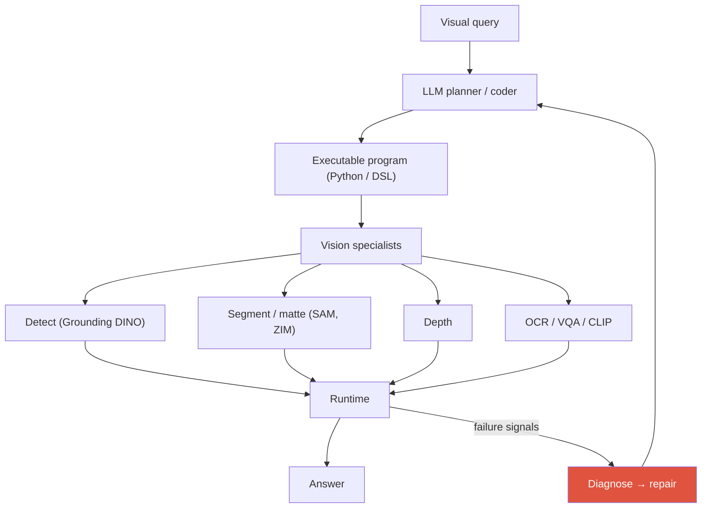
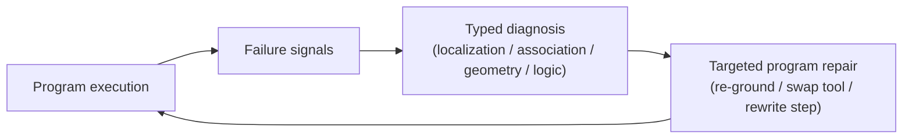

# Visual Reasoning Agents <span class="badge badge-2026">2026</span>

<div class="tag-row"><span class="tag">VisProg</span><span class="tag">ViperGPT</span><span class="tag">visual program synthesis</span><span class="tag">thinking with images</span><span class="tag">GUI grounding</span><span class="tag">spatial reasoning</span></div>

> [!NOTE] 이 챕터는 프런티어(심화) 주제입니다
> **한 줄 직관:** 보통의 VLM은 이미지 질문을 한 번의 forward pass로 "통째로" 답합니다. **visual agent(시각 에이전트)** 는 대신, 사람이 그러듯 **vision 도구(tool)를 반복적으로 호출**합니다 — 물체를 detect(검출)하고, 영역을 crop(잘라내기)/zoom(확대)하고, segment(분할)·depth(깊이)를 재고, 그 결과를 보고 다시 추론합니다. "한 번에 답" 대신 **관찰 → 도구 사용 → 재추론 → 답**의 루프죠. 이 챕터는 앞의 [Agentic AI & Tool Use](#/llm/agents)와 [Grounding](#/vlm/grounding)을 이미 봤다는 전제로, 그것을 *이미지* 에 적용합니다.

## 무엇을, 왜 — 왜 도구를 쓰나

end-to-end VLM은 강력하지만 정밀 mask·계수·기하 측정은 작업별 전문 모델이 더 나을 수 있습니다. visual agent는 planning과 perception tool을 조합합니다. 중간 결과를 **관찰 가능**하게 만들 수 있지만, 보인다는 것만으로 해석 가능하거나 검증된 것은 아닙니다. 각 tool의 confidence·단위·입출력 provenance와 독립 검사를 기록해야 오류 귀속이 가능합니다.

<figure>
<svg viewBox="0 0 640 220" xmlns="http://www.w3.org/2000/svg" font-family="Inter, sans-serif" font-size="12">
  <rect x="20" y="90" width="90" height="40" rx="8" fill="#0ea5e9"/><text x="65" y="114" text-anchor="middle" fill="#fff">이미지 질문</text>
  <rect x="150" y="90" width="90" height="40" rx="8" fill="#6366f1"/><text x="195" y="108" text-anchor="middle" fill="#fff" font-size="11">VLM 플래너</text><text x="195" y="123" text-anchor="middle" fill="#fff" font-size="10">"무엇을 볼까?"</text>
  <rect x="280" y="90" width="100" height="40" rx="8" fill="none" stroke="#12a150" stroke-width="1.8"/><text x="330" y="108" text-anchor="middle" fill="currentColor" font-size="11">도구 호출</text><text x="330" y="123" text-anchor="middle" fill="#98a3b2" font-size="10">detect·crop·depth</text>
  <rect x="420" y="90" width="90" height="40" rx="8" fill="none" stroke="#0ea5e9" stroke-width="1.8"/><text x="465" y="114" text-anchor="middle" fill="currentColor" font-size="11">관찰(결과)</text>
  <rect x="548" y="90" width="72" height="40" rx="8" fill="#e0533f"/><text x="584" y="114" text-anchor="middle" fill="#fff">답</text>
  <path d="M110 110 H150 M240 110 H280 M380 110 H420 M510 110 H548" stroke="#98a3b2" stroke-width="1.5" marker-end="url(#va)"/>
  <!-- loop back -->
  <path d="M465 130 C 465 180, 195 180, 195 132" fill="none" stroke="#e0533f" stroke-width="1.6" stroke-dasharray="5 4" marker-end="url(#va)"/>
  <text x="330" y="175" text-anchor="middle" fill="#e0533f" font-size="11">아직 부족하면 다시 계획 (루프)</text>
  <circle r="4" fill="#e0533f"><animateMotion dur="3s" repeatCount="indefinite" path="M110 110 H150 H240 H280 H380 H420 H510 H548"/></circle>
  <defs><marker id="va" markerWidth="8" markerHeight="8" refX="6" refY="3" orient="auto"><path d="M0 0 L6 3 L0 6" fill="#98a3b2"/></marker></defs>
</svg>
<figcaption>visual agent 루프: VLM이 "무엇을 볼지" 계획 → vision 도구가 측정 → 결과를 관찰 → 충분하면 답, 아니면 다시 계획. 빨간 점선이 반복 루프입니다.</figcaption>
</figure>

> [!TIP] 핵심 프레이밍
> visual reasoning agent는 visual query를 하나의 불투명한 forward pass가 아니라 **vision 전문가에 대한 실행 가능한 프로그램**(detect·segment·depth·OCR·track)으로 바꿉니다. 최근 연구 방향은 여기서 한 걸음 더 나아가, 조용한 perception 실패를 **typed diagnosis(유형화된 진단)** 로 바꾸어 **targeted program repair(표적 프로그램 수정)** 를 이끄는, 3D spatial reasoning을 위한 diagnostic framework를 다룹니다.
>
> 관련 본인 연구: [Deep-Dive: Grounded VLM/Agents](#/resume/grounded-vlm-agents)

## The paradigm

핵심 구조: **LLM/VLM이 "코더"가 되어, vision 전문가들을 호출하는 프로그램을 짠다.** 프로그램이 실행되며 실패 신호가 나오면 진단하고 고쳐서(repair) 다시 돕니다.



그 "프로그램"이 실제로 어떻게 생겼는지 감을 잡아 봅시다. "어느 차가 더 빠른가?" 같은 질문은 이런 코드로 합성됩니다:

```python
# 합성된 프로그램의 개념 예시
video, timestamps = load_video_with_timestamps(path)
cars = detect(video[0], "car")
t1 = track(video, cars[0])
t2 = track(video, cars[1])
v1 = apparent_speed_px_per_s(t1, timestamps)
v2 = apparent_speed_px_per_s(t2, timestamps)
answer = "A" if v1 > v2 else "B"
```

이 코드는 정의되지 않은 `image`를 피하고 시간 간격을 명시합니다. 그래도 비교되는 것은 **영상 평면상의 px/s**입니다. 실제 물리 속도(m/s)를 비교하려면 camera calibration, depth/scale와 perspective 보정이 필요합니다. 중간 box·track을 저장하면 검사 지점이 생기지만 자동으로 정답이 되는 것은 아닙니다.

## 1 · Visual program synthesis: the lineage

**visual program synthesis(시각 프로그램 합성)** = 이미지 질문을 도구 호출 프로그램으로 자동 변환하는 것. 계보:

| System | 무엇을 생성 | 도구 | 비고 |
| --- | --- | --- | --- |
| **VisProg** (CVPR 2023) | DSL 프로그램 | 고정 모듈 (OWL-ViT, CLIP, …) | 해석 가능, 학습 불필요 |
| **ViperGPT** (ICCV 2023) | vision API에 대한 Python | GLIP, MiDaS, X-VLM, … | 더 표현적, 실패 표면도 큼 |
| MM-ReAct / Visual Sketchpad | 추론+행동 교차, 시각 scratchpad | 여러 도구 | 그리고/주석 달며 추론 |
| 2025–26 사례 | crop/zoom·코드·시각 scratchpad를 쓰는 trace/policy | 도구 + 코드 실행 | task/reward에 따라 효용 검증 |

**왜 프로그램인가?** 프로그램은 (1) 해석 가능하고, (2) 재학습 없이 전문가를 *교체*할 수 있고, (3) 새로운 task에 zero-shot으로 조합되며, (4) 확인 가능한 중간 결과를 노출합니다. 비용: 고정된 API 표면, tool-error 민감성, 코드 버그.

## 2 · Tool-use agent vs. end-to-end VLM

**tool-use agent(도구 사용 에이전트)** 는 외부 전문가를 호출하고, **end-to-end VLM** 은 모든 걸 weight 안에서 처리합니다.

| Axis | End-to-end VLM | Program / tool agent |
| --- | --- | --- |
| 지식 | weight에 압축됨 | 외부 전문가 |
| 공간 정밀도 | 종종 약함 | seg/depth로 강화 |
| 새 task 적응 | fine-tune | API 추가 |
| 실패 | 불투명 | (이상적으로) 모듈별 추적 가능 |
| 비용 | 한 번의 forward pass | 다수 호출, 높은 latency |

> [!QUESTION] "그냥 VLM 하나를 fine-tune 하면 안 되나요?"
> **답:** 전문 tool은 정밀 mask·OCR·geometry에서 유리하고 독립 교체가 가능하지만 orchestration latency와 오류 전파가 생깁니다. end-to-end VLM은 single-shot latency와 공동 최적화에 유리할 수 있습니다. 따라서 hybrid가 항상 이긴다고 단정하지 말고 quality-latency-cost curve와 failure slice에서 세 방식을 비교하세요.

## 3 · Training-free agentic workflows

**training-free(학습 불필요)** = task별 label이나 fine-tuning 없이, 이미 있는 전문 vision 모델로부터 *query별 실행 가능한 workflow*를 그때그때 합성한다는 뜻입니다.

<div class="proscons"><div><div class="pros-t">Training-free 강점</div>

- task별 label이나 fine-tuning 없음 — 즉각적 새 task 커버리지.
- tool을 안전하게 업그레이드(더 나은 detector 투입)하되 재학습 없음.
- interpretable한 중간 출력; 모듈러 디버깅.
- SOTA 전문가를 그대로 활용.
</div><div><div class="cons-t">Training-free 한계</div>

- 강한 planner LLM에 의존(API/비용).
- 학습된 policy 없음 → suboptimal tool orchestration.
- Tool mis-calibration과 silent failure가 누적.
- 고정/hallucinate된 API; 임의 코드 = 보안 표면.
</div></div>

**Dynamic API 사례:** [VADAR (CVPR 2025)](https://openaccess.thecvf.com/content/CVPR2025/html/Marsili_Visual_Agentic_AI_for_Spatial_Reasoning_with_a_Dynamic_API_CVPR_2025_paper.html)는 spatial reasoning을 위해 동적으로 도구 코드를 구성합니다. 표현력과 함께 실행·보안·검증 표면도 커집니다. 아래 typed diagnosis/repair는 이를 다루는 **설계 제안**이며, 모든 dynamic-API agent의 확립된 표준으로 표현하지 않습니다.

## 4 · The silent-failure problem

> [!DANGER] Silent perception failure (조용한 지각 실패)
> Tool이 **틀린 box / mask / depth**를 반환하는데 예외가 발생하지 않고, 프로그램은 끝까지 실행되어 **자신 있게 틀린 답**이 나옵니다. Perception 오류가 reasoning trace에 흡수되기 때문에 파이프라인이 디버그 불가능합니다 — *어느* step이 거짓말했는지 알 수 없습니다.

이 방향의 개념적 프레이밍은 다음과 같습니다:



불투명한 틀린 답을 **typed diagnosis**로 바꾸면 repair policy를 구체화할 수 있습니다. localization 실패는 re-grounding, geometry 실패는 depth/scale 재확인, logic 실패는 program rewrite로 라우팅할 수 있습니다. 이는 검증할 연구 가설이며, "task별 학습 없이 프런티어 VLM에 필적"은 실험 목표이지 이미 달성된 일반 사실이 아닙니다.

<details class="concept-code">
<summary>개념 코드로 보기</summary>

> 아래는 시각 도구의 **정상 반환과 올바른 반환을 구분**하는 실행 의사코드입니다. 생성된 Python을 그대로 실행하는 예가 아닙니다.

```python
def execute_visual_plan(plan, media, max_repairs=2):
    typed_plan = dsl.typecheck(plan, allowed_ops=VISION_ALLOWLIST)
    state = {"media": media, "artifacts": []}

    for node in typed_plan.topological_order():
        for attempt in range(max_repairs + 1):
            args = resolve_inputs(node, state)
            result = sandbox.run(node.tool, args, timeout=node.timeout)
            node.tool.output_schema.validate(result)          # shape/type만 확인

            checks = geometry_checks(result, units=node.output_units)
            # box 범위, mask 크기, timestamp 단조성, track ID 연속성 등을 검사한다.
            if checks.ok and result.confidence >= node.min_confidence:
                break
            diagnosis = classify_failure(node, result, checks)
            if attempt == max_repairs:
                return Abstain(diagnosis, artifacts=state["artifacts"])
            node = targeted_repair(node, diagnosis)           # 같은 node를 다시 실행

        state[node.output_name] = result
        state["artifacts"].append(hash_and_store(result))      # 중간 결과 감사 가능

    return semantic_verifier.check(typed_plan.answer(state), evidence=state)
```

</details>

## 5 · Why multi-step spatial/temporal reasoning is hard

오류가 **복합(compound)** 됩니다: 틀린 detection → 틀린 depth sample → 틀린 "더 가깝다" 결론. Reference resolution × geometry × memory × tool noise가 모두 쌓입니다.

- **Spatial(공간):** metric 3D relation, multi-view, occlusion(가림). Diagnostic/repair benchmark(Omni3D-Bench와 spatial-reasoning set)가 reasoning→answer 격차를 탐침.
- **Temporal(시간):** track drift, event 순서, 긴 memory — 프로그램은 `track`, `get_state_at`, `compare_speed`가 필요. [Video-Language Models](#/vlm/video) 참고.

실패의 **typed taxonomy**(localization / association / geometry / logic)가 repair를 다룰 만하게 만듭니다 — 일반적 "다시 시도"는 *무엇*을 고칠지 모릅니다.

## 6 · "Thinking with images"

모델이 reasoning 중 crop·zoom·rotate·annotate·re-encode하는 패턴을 visual scratchpad로 볼 수 있습니다. 제품 사례는 OpenAI의 [Thinking with Images](https://openai.com/index/thinking-with-images/)처럼 기능 설명과 학습법이 공개된 연구 결과를 구분해 인용해야 합니다. 관련 visual-programming 연구인 [Transductive Visual Programming](https://arxiv.org/abs/2512.20934)은 경험에서 재사용 도구를 진화시키는 방식이지 process-reward RL 논문이 아닙니다. 특정 사례를 근거로 최종 답 reward만으로 올바른 grounding이 보편적으로 창발한다고 일반화하지 마세요.

## 7 · Computer-use & GUI agents

또 다른 큰 visual-agent 부류는 **컴퓨터를 사람처럼 조작**하는 에이전트입니다 — screenshot을 perceive(지각) → reasoning → 저수준 action emit(click (x,y), type, scroll). 이 계열(native vs. framework agent, OSWorld·WebArena 등 벤치마크, long-horizon 신뢰성)의 전반은 [Agentic AI & Tool Use](#/llm/agents)가 정식으로 다룹니다.

여기서 중요한 것은 **visual-grounding 관점**입니다: computer-use의 핵심 병목인 **GUI grounding**(UI 요소를 정밀 픽셀 좌표에 매핑)은 visual [Grounding](#/vlm/grounding)과 **동일한 좌표-emission 문제**입니다. 즉 이 챕터의 grounding 기법(coordinates-as-tokens, region feature 등)이 그대로 GUI 조작에 적용됩니다.

**관련 계열 — VLA:** OpenVLA는 visual feature와 action token을, $\pi_0$는 flow-matching action chunk를 사용합니다. Google DeepMind의 [Gemini Robotics](https://deepmind.google/blog/gemini-robotics-brings-ai-into-the-physical-world/)가 직접 행동을 출력하는 VLA이고, **Gemini Robotics-ER**은 embodied reasoning·spatial understanding을 제공해 controller와 연결되는 모델로 구분됩니다. discrete action token과 continuous action chunk의 우열은 control frequency·action space·데이터에 따라 달라집니다.

## 8 · Tool-API design principles

Tool이 고정이든 동적으로 작성되든, 같은 규율이 agent를 디버그 가능하게 유지합니다:

<dl class="kv">
<dt>Typed, unit-explicit signatures (타입·단위 명시)</dt><dd>meter vs. pixel vs. normalized coord를 모호함 없이 반환 — 대부분의 "geometry" 실패는 단위 혼동.</dd>
<dt>Explicit failure returns (명시적 실패 반환)</dt><dd>silent 틀린 box 대신 confidence와 no-detection 시 <code>null</code>을 반환 — typed diagnosis의 원자재.</dd>
<dt>Deterministic, side-effect-free (결정적·부작용 없음)</dt><dd>재현 가능한 실행이 repair loop를 의미 있게 만듦; nondeterminism은 결함을 숨김.</dd>
<dt>Sandboxed execution (샌드박스 실행)</dt><dd>임의 생성 코드는 보안 표면 — 격리하세요.</dd>
<dt>Least privilege &amp; budgets</dt><dd>도구 allowlist, 파일·network 권한 분리, CPU/GPU·시간·호출·재시도 상한, 입력/출력 schema 검증과 감사 로그를 둡니다.</dd>
</dl>

## Q&A

<details class="qa"><summary>VisProg vs. ViperGPT vs. dynamic-API agents — 무엇이 바뀌었고 왜?</summary>
<div class="qa-body">

**Short:** VisProg은 고정 모듈에 대한 제약된 DSL을 emit; ViperGPT는 vision API에 대한 일반 Python을 emit(더 표현적, 더 많은 failure surface); dynamic-API agent(VADAR)는 subproblem마다 *자체 helper 함수를 작성*하여 verifiability를 유연성과 맞바꿉니다.

**Deep:** 고정 DSL에서 일반 코드·동적 helper로 갈수록 표현력과 failure/security 표면이 함께 커집니다. verification·repair는 활발한 연구 방향이지만 하나의 표준 아키텍처로 수렴했다고 볼 수 없습니다. benchmark별 성능뿐 아니라 invalid-call rate, silent-error rate, repair success, latency와 sandbox violation을 보고해야 합니다.
</div></details>

<details class="qa"><summary>"silent perception failure"가 무엇이고, 어떻게 강건하게 만들까?</summary>
<div class="qa-body">

**Short:** Tool이 틀린 결과를 반환하고, 에러가 발생하지 않고, 프로그램이 완료되고, 답이 자신 있게 틀립니다 — perception 오류가 trace에서 보이지 않습니다. Robustness: failure signal을 감지하고, failure를 *type*하고, 특정 step을 repair.

**Deep:** 답만 감독하면 결함을 localize할 수 없습니다. downstream step이 쓰레기를 기꺼이 소비하기 때문입니다. 접근(공개 프레이밍): 실행을 failure signal(confidence, geometric inconsistency, cross-tool disagreement)로 계측하고, **typed diagnosis** — localization / association / geometry / logic — 로 분류하고, **targeted repair**로 라우팅: re-ground, tool swap, 또는 문제 step rewrite. Typing이 repair를 구체적으로 만듭니다; 맹목적 retry는 무엇이 깨졌는지 모릅니다. 목표: task별 학습 없이 3D spatial reasoning에서 프런티어 VLM에 필적. 전체 프레이밍: [Deep-Dive: Grounded VLM/Agents](#/resume/grounded-vlm-agents).
</div></details>

<details class="qa"><summary>언제 tool agent 대신 end-to-end VLM이 맞는 선택인가?</summary>
<div class="qa-body">

**Short:** Tool 호출로 분해되지 않는 open-ended commonsense, reading, 모호한 대화, soft semantics — 그리고 latency-민감한 single-shot 용도.

**Deep:** 프로그램은 detect→measure→compare처럼 명확히 분해되는 작업에 유리할 수 있고, holistic 이해나 낮은 latency에는 single model이 유리할 수 있습니다. 전문 tool도 domain shift와 calibration 오류가 있습니다. end-to-end, tool-only, hybrid를 같은 입력·예산·실패 slice에서 비교해 선택하세요.
</div></details>

**Follow-ups**

- "Tool API 설계 원칙?" (Typed input/unit (m, px), 명시적 failure 반환 (conf, null), deterministic, sandboxed 실행.)
- "GUI grounding이 visual grounding과 어떻게 관련되나?" (같은 좌표-emission 병목; element→pixel. computer-use 벤치마크·신뢰성은 [Agentic AI & Tool Use](#/llm/agents) 참고.)
- "최종-답변 reward가 언제 grounding 행동을 유도하나?" (도구 사용이 답을 개선하고 exploration·credit assignment가 가능할 때; spurious shortcut 여부를 별도 grounding metric으로 검증.)

## Cheat-sheet

| System / term | One-liner |
| --- | --- |
| visual agent | VLM이 vision 도구를 루프로 호출해 이미지를 추론 (한 번에 답 X) |
| VisProg | LLM → fixed visual module에 대한 DSL 프로그램 (CVPR 2023) |
| ViperGPT | LLM → vision API에 대한 Python (ICCV 2023) |
| VADAR | dynamic-API agent, 3D spatial (CVPR 2025) |
| Training-free synthesis | query별 실행 가능 workflow 구축, fine-tune 없음 |
| Silent failure | 틀린 tool 출력, 예외 없음, 자신 있게 틀린 답 |
| Typed diagnosis → repair | 분류 (localization/association/geometry/logic) → 그 step 수정 |
| Thinking with images | reasoning 도중 crop/zoom/annotate; vision을 scratchpad로 |
| GUI grounding | element → 픽셀 좌표; visual grounding과 같은 문제 (벤치마크는 [llm/agents](#/llm/agents)) |

**다음:** [Agentic AI & Tool Use](#/llm/agents) · [Deep-Dive: Grounded VLM/Agents](#/resume/grounded-vlm-agents) · [Grounding & Region Reasoning](#/vlm/grounding) · [Video-Language Models](#/vlm/video) · [Object Detection](#/cv/detection) · [The 2026 Landscape](#/start/landscape-2026)
