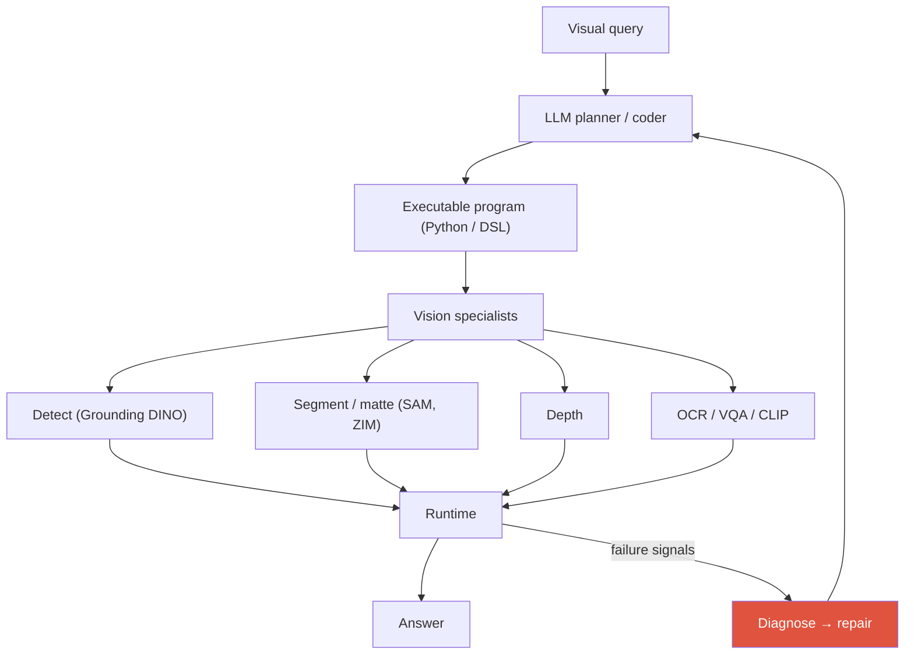
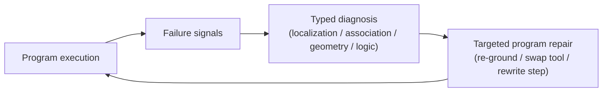

# Visual Reasoning Agents 2026

VisProgViperGPTvisual program synthesisthinking with imagesGUI groundingspatial reasoning

> [!TIP] 이건 지원자의 현재진행 연구 — 소유하세요
> Visual reasoning agent는 visual query를 하나의 불투명한 forward pass로 답하는 대신 **vision 전문가에 대한 실행 가능한 프로그램**(detect, segment, depth, OCR, track)으로 바꿉니다. 이것이 정확히 지원자의 진행 중 작업 — *training-free agentic program synthesis* — 이자 NeurIPS 2026 심사 중 방향입니다: 조용한 perception 실패를 **typed diagnosis**로 바꾸어 **targeted program repair**를 이끄는 **3D spatial reasoning을 위한 diagnostic framework**. 공개 계보는 자신 있게 말하고; 미공개 방법/수치는 빼세요.

## The paradigm

## 1 · Visual program synthesis: the lineage

| System | What it generates | Tools | Note |
| --- | --- | --- | --- |
| **VisProg** (CVPR 2023) | a DSL program | fixed modules (OWL-ViT, CLIP, …) | interpretable, no training |
| **ViperGPT** (ICCV 2023) | Python against a vision API | GLIP, MiDaS, X-VLM, … | more expressive, more failure surface |
| MM-ReAct / Visual Sketchpad | interleaved reason+act, visual scratchpad | assorted tools | draw/annotate to reason |
| 2025-26: RL-trained "thinking with images/code" | learned programs / traces | tools + code exec | e.g. code-as-reasoning agents |

**왜 프로그램인가?** 프로그램은 interpretable하고, 재학습 없이 전문가를 *교체*하게 하며, 새로운 task로 zero-shot 조합되고, 확인 가능한 중간 결과를 노출합니다. 비용: 고정된 API 표면, tool-error 민감성, 코드 버그.

## 2 · Tool-use agent vs. end-to-end VLM

| Axis | End-to-end VLM | Program / tool agent |
| --- | --- | --- |
| Knowledge | weight에 압축됨 | 외부 전문가 |
| Spatial precision | 종종 약함 | seg/depth로 강화 |
| Adapting to new task | fine-tune | API 추가 |
| Failure | 불투명 | (이상적으로) 모듈별 추적 가능 |
| Cost | 한 번의 forward pass | 다수 호출, 높은 latency |

> [!QUESTION] "Why not just fine-tune one VLM?"
> **답:** 정밀 측정(metric 3D relation, 정확한 mask, 픽셀 count)은 end-to-end VLM에서 여전히 뒤처지고, 제품급 전문가(SAM/ZIM급 segmenter, detector)는 개별적으로 강하고 독립적으로 업그레이드 가능합니다. 모듈러 agent는 그 전문가 품질을 유지하고, tool이 개선되면 교체하며 — 연구에 결정적으로 — *failure를 귀속 가능*하게 만듭니다. 열린 연구 질문은 "VLM이 할 수 있는가"가 아니라 "어떤 step이 틀렸을 때 task별 학습 없이 *진단하고 고칠* 수 있는가"입니다. 실무에서는 hybrid가 이깁니다: VLM이 plan하고, 전문가가 측정합니다.

## 3 · Training-free agentic workflows

지원자의 프레이밍: 전문 vision 모델로부터 *query별 실행 가능한 workflow*를 **training-free**로 synthesize.

Training-free strengths

- task별 label이나 fine-tuning 없음 — 즉각적 새 task 커버리지.
- tool을 안전하게 업그레이드(더 나은 detector 투입)하되 재학습 없음.
- interpretable한 중간 출력; 모듈러 디버깅.
- SOTA 전문가를 그대로 활용.

Training-free limits

- 강한 planner LLM에 의존(API/비용).
- 학습된 policy 없음 → suboptimal tool orchestration.
- Tool mis-calibration과 silent failure가 누적.
- 고정/hallucinate된 API; 임의 코드 = 보안 표면.

**Dynamic API (2025):** 고정 DSL 대신, agent가 subproblem을 위한 *helper 함수를 작성*합니다(VADAR-style, CVPR 2025), 3D spatial benchmark(예: Omni3D-Bench)에서 평가. 이는 표현력을 높이지만 *verifiability를 낮춥니다* — 이제 testing/repair 계층이 필요한데, 이것이 정확히 지원자의 diagnostic framework가 겨냥하는 격차입니다.

## 4 · The silent-failure problem (candidate's NeurIPS 2026 direction)

> [!DANGER] Silent perception failure
> Tool이 **틀린 box / mask / depth**를 반환하고, 예외가 발생하지 않고, 프로그램이 끝까지 실행되어, **자신 있게 틀린 답**이 나옵니다. Perception 오류가 reasoning trace에 흡수되기 때문에 파이프라인이 디버그 불가능합니다 — *어느* step이 거짓말했는지 알 수 없습니다.

심사 중 작업의 공개 프레이밍(방법 세부 미공개):

불투명한 틀린 답을 **typed diagnosis**로 바꾼다는 것은 repair policy가 구체적일 수 있다는 뜻입니다: *localization* 실패는 re-grounding을 촉발하고; *geometry* 실패는 depth/scale 재확인을 촉발하고; *logic* 실패는 프로그램 rewrite를 촉발합니다. 명시된 목표: **task별 학습 없이 3D spatial reasoning에서 프런티어 VLM에 필적.**

## 5 · Why multi-step spatial/temporal reasoning is hard

오류가 **복합**됩니다: 틀린 detection → 틀린 depth sample → 틀린 "더 가깝다" 결론. Reference resolution × geometry × memory × tool noise가 모두 쌓입니다.

- **Spatial:** metric 3D relation, multi-view, occlusion. Diagnostic/repair benchmark(Omni3D-Bench와 spatial-reasoning set)가 reasoning→answer 격차를 탐침.
- **Temporal:** track drift, event 순서, 긴 memory — 프로그램은 `track`, `get_state_at`, `compare_speed`가 필요. [Video-Language Models](#/vlm/video) 참고.

실패의 **typed taxonomy**(localization / association / geometry / logic)가 repair를 다룰 만하게 만드는 것입니다 — 일반적 "다시 시도"는 *무엇*을 고칠지 모릅니다.

## 6 · "Thinking with images"

프런티어 접목: 프로그램만 emit하는 대신, 모델이 reasoning 도중 **image를 조작**합니다 — crop, zoom, annotate, re-encode — vision을 scratchpad로 취급. o3/o4-mini가 agentic "think with images"를 대중화했고([reported]); 공개 작업은 최종-답변 reward가 grounding 행동을 창발시키는 zoom/crop policy를 RL-학습합니다([Grounding](#/vlm/grounding)과 연결). 이것은 end-to-end VLM과 full program synthesis 사이에 위치합니다: *모델*이 다시-보기를 하고, 외부 DSL이 필요 없습니다.

## 7 · Computer-use & GUI agents

또 다른 큰 2026 visual-agent 부류: screenshot을 perceive → reasoning → 저수준 action emit(click (x,y), type, scroll).

<dl class="kv">
<dt>Perception→reasoning→action loop</dt><dd>Screenshot in, CoT, action out, 반복. 병목은 <b>GUI grounding</b>: UI 요소를 정밀 픽셀 좌표에 매핑.</dd>
<dt>Native vs. framework</dt><dd><b>Native end-to-end</b> agent(UI-TARS-style, [VERIFIED] arXiv 2501.12326)는 순전히 screenshot 위에서 작동하며 prompt된 VLM framework(Operator/CUA)를 대체하는 중; 일반 VLM(Qwen3-VL, Gemini, Claude)은 GUI grounding을 base model에 접는 중.</dd>
<dt>Benchmarks</dt><dd><b>OSWorld</b>(369 real desktop/web task, human baseline ≈72% [VERIFIED]); Claude Sonnet 4.5가 <b>61.4%</b> 도달([VERIFIED primary], Sep 2025), 2024 출시 시 ~7%에서 상승. Web은 WebArena / WebVoyager / WebChoreArena.</dd>
</dl>

> [!WARNING] Beyond single-task success
> OSWorld가 human baseline에 접근하면서 프런티어는 **long-horizon, multi-app 신뢰성과 안전**(WebChoreArena, adversarial computer-use)으로 이동합니다. Top-1만이 아니라 신뢰성 *곡선*과 task당 비용을 평가하세요 — 그리고 [eval-integrity](#/start/landscape-2026) 교훈(harness reward-hacking)을 상기하세요. GUI grounding은 visual [Grounding](#/vlm/grounding)과 같은 좌표-emission 문제입니다.

**관련 계열 — VLA:** Vision-Language-Action model(OpenVLA는 DINOv2+SigLIP fuse; π₀ flow-matching action chunk; Gemini Robotics-ER)은 VLM backbone 위에 *embodied-reasoning* planning 계층을 더합니다. 같은 "perceive → plan → act" 척추, click 대신 물리적 actuator. Action은 **discrete autoregressive action token**(VLM이 tokenize된 로봇 명령 emit) 또는 **continuous flow-matching action chunk**(짧은 trajectory를 한 번에 예측)로 표현됩니다 — 후자가 고빈도 제어에 더 매끄럽습니다.

## 8 · Tool-API design principles

Tool이 고정이든 동적으로 작성되든, 같은 규율이 agent를 디버그 가능하게 유지합니다:

<dl class="kv">
<dt>Typed, unit-explicit signatures</dt><dd>meter vs. pixel vs. normalized coord를 모호함 없이 반환 — 대부분의 "geometry" 실패는 unit 혼동.</dd>
<dt>Explicit failure returns</dt><dd>silent 틀린 box 대신 confidence와 no-detection 시 <code>null</code>을 반환 — typed diagnosis의 원자재.</dd>
<dt>Deterministic, side-effect-free</dt><dd>재현 가능한 실행이 repair loop를 의미 있게 만듦; nondeterminism은 결함을 숨김.</dd>
<dt>Sandboxed execution</dt><dd>임의 생성 코드는 보안 표면 — 격리하세요.</dd>
</dl>

## Q&A

VisProg vs. ViperGPT vs. dynamic-API agents — what changed and why?

**Short:** VisProg은 고정 모듈에 대한 제약된 DSL을 emit; ViperGPT는 vision API에 대한 일반 Python을 emit(더 표현적, 더 많은 failure surface); dynamic-API agent(VADAR)는 subproblem마다 *자체 helper 함수를 작성*하여 verifiability를 유연성과 맞바꿉니다.

**Deep:** 궤적은 고정-어휘 → 일반 코드 → 자체-작성 코드입니다. 표현력이 상승(novel composition, 3D subroutine)하지만 failure/보안 표면도 상승 — hallucinate된 API, silent tool 오류, 무한 replan. 그것이 정확히 2025-26 프런티어가 *verification과 repair* 계층(test agent, verifier training, diagnostic framework)을 더하는 이유입니다: raw generation으로는 부족하고, 틀린 step을 잡아 고쳐야 합니다. 제 심사 중 작업은 3D spatial reasoning을 위한 그 repair 계층에 있습니다.

What is a "silent perception failure" and how would you make an agent robust to it?

**Short:** Tool이 틀린 결과를 반환하고, 에러가 발생하지 않고, 프로그램이 완료되고, 답이 자신 있게 틀립니다 — perception 오류가 trace에서 보이지 않습니다. Robustness: failure signal을 감지하고, failure를 *type*하고, 특정 step을 repair.

**Deep:** 답만 감독하면 결함을 localize할 수 없습니다. downstream step이 쓰레기를 기꺼이 소비하기 때문입니다. 접근(공개 프레이밍): 실행을 failure signal(confidence, geometric inconsistency, cross-tool disagreement)로 계측하고, **typed diagnosis** — localization / association / geometry / logic — 로 분류하고, **targeted repair**로 라우팅: re-ground, tool swap, 또는 문제 step rewrite. Typing이 repair를 구체적으로 만드는 것입니다; 맹목적 retry는 무엇이 깨졌는지 모릅니다. 목표: task별 학습 없이 3D spatial reasoning에서 프런티어 VLM에 필적. 전체 프레이밍: [Deep-Dive: Grounded VLM/Agents](#/resume/grounded-vlm-agents).

When is an end-to-end VLM the right choice over a tool agent?

**Short:** Tool 호출로 분해되지 않는 open-ended commonsense, reading, 모호한 대화, soft semantics — 그리고 latency-민감한 single-shot 용도.

**Deep:** 프로그램은 task가 측정 가능한 subproblem으로 분해될 때(detect → measure → compare) 빛납니다; holistic understanding에는 과하고 취약합니다. Latency도 중요 — 대화형 UX에는 한 번의 forward pass가 다수-호출 orchestration을 이깁니다. 프런티어 VLM이 개선되며 이것을 더 흡수하지만, *정밀 측정*(metric 3D, 정확한 mask, count)은 전문가 우위를 유지합니다 — 그래서 hybrid(VLM plan, tool measure)가 지배합니다. 제 perception-foundation 배경([ZIM](#/resume/zim), SAM 계보)이 전문가 품질을 루프에 유지하는 데 제가 관심 갖는 이유입니다.

**Follow-ups**

- "Tool API 설계 원칙?" (Typed input/unit (m, px), 명시적 failure 반환 (conf, null), deterministic, sandboxed 실행.)
- "GUI grounding이 visual grounding과 어떻게 관련되나?" (같은 좌표-emission 병목; element→pixel.)
- "OSWorld human baseline이 ~72% — long-horizon 신뢰성을 어떻게 평가하나?" (신뢰성 곡선, task당 비용, multi-app/long task, hack-저항적 harness.)
- "최종-답변 reward가 어떻게 grounding 행동을 유도하나?" (RL: 답을 개선하는 zoom/crop이 밀집 box label 없이 강화됨.)

## Cheat-sheet

| System / term | One-liner |
| --- | --- |
| VisProg | LLM → fixed visual module에 대한 DSL 프로그램 (CVPR 2023) |
| ViperGPT | LLM → vision API에 대한 Python (ICCV 2023) |
| VADAR | dynamic-API agent, 3D spatial (CVPR 2025) |
| Training-free synthesis | query별 실행 가능 workflow 구축, fine-tune 없음 |
| Silent failure | 틀린 tool 출력, 예외 없음, 자신 있게 틀린 답 |
| Typed diagnosis → repair | 분류 (localization/association/geometry/logic) → 그 step 수정 |
| Thinking with images | reasoning 도중 crop/zoom/annotate; vision을 scratchpad로 |
| GUI grounding | element → 픽셀 좌표; computer-use 병목 |
| OSWorld | 369 task, human ≈72%, Sonnet 4.5 61.4% (2025) |

**Related:** [Agentic AI & Tool Use](#/llm/agents) · [Deep-Dive: Grounded VLM/Agents](#/resume/grounded-vlm-agents) · [Grounding & Region Reasoning](#/vlm/grounding) · [Video-Language Models](#/vlm/video) · [Object Detection](#/cv/detection) · [The 2026 Landscape](#/start/landscape-2026)
