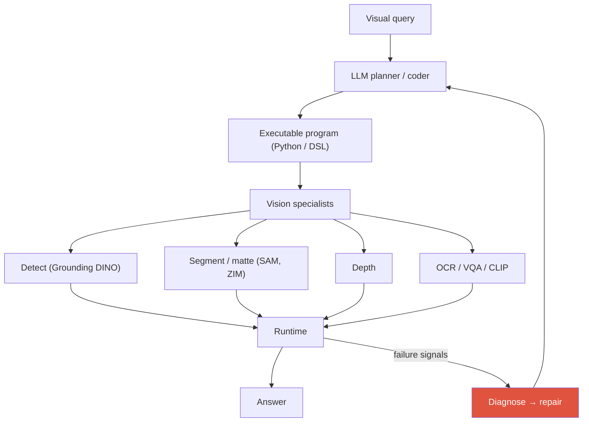
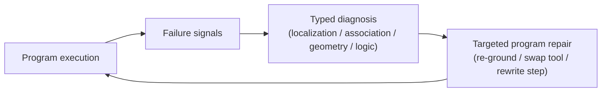

# Visual Reasoning Agents 2026

VisProgViperGPTvisual program synthesisthinking with imagesGUI groundingspatial reasoning

> [!TIP] This is the candidate's live research — own it
> A visual reasoning agent turns a visual query into an **executable program over vision specialists** (detect, segment, depth, OCR, track) instead of answering in one opaque forward pass. This is precisely the candidate's ongoing work — *training-free agentic program synthesis* — and the NeurIPS 2026 under-review direction: a **diagnostic framework for 3D spatial reasoning** that turns silent perception failures into **typed diagnoses** driving **targeted program repair**. Speak to the public lineage confidently; keep unpublished method/numbers out.

## The paradigm

## 1 · Visual program synthesis: the lineage

| System | What it generates | Tools | Note |
| --- | --- | --- | --- |
| **VisProg** (CVPR 2023) | a DSL program | fixed modules (OWL-ViT, CLIP, …) | interpretable, no training |
| **ViperGPT** (ICCV 2023) | Python against a vision API | GLIP, MiDaS, X-VLM, … | more expressive, more failure surface |
| MM-ReAct / Visual Sketchpad | interleaved reason+act, visual scratchpad | assorted tools | draw/annotate to reason |
| 2025-26: RL-trained "thinking with images/code" | learned programs / traces | tools + code exec | e.g. code-as-reasoning agents |

**Why programs?** They are interpretable, let you *swap* a specialist without retraining, compose to novel tasks zero-shot, and expose intermediate results you can check. The cost: a fixed API surface, tool-error sensitivity, and code bugs.

## 2 · Tool-use agent vs. end-to-end VLM

| Axis | End-to-end VLM | Program / tool agent |
| --- | --- | --- |
| Knowledge | compressed in weights | external specialists |
| Spatial precision | often weak | reinforced by seg/depth |
| Adapting to new task | fine-tune | add an API |
| Failure | opaque | (ideally) traceable per module |
| Cost | one forward pass | multiple calls, higher latency |

> [!QUESTION] "Why not just fine-tune one VLM?"
> **Answer:** Precise measurement (metric 3D relations, exact masks, pixel counts) still lags in end-to-end VLMs, and product-grade specialists (SAM/ZIM-class segmenters, detectors) are individually strong and independently upgradeable. A modular agent keeps that specialist quality, swaps tools as they improve, and — crucially for the research — makes *failure attributable*. The open research question isn't "can a VLM do it" but "when a step is wrong, can we *diagnose and repair* it without task-specific training." Hybrid wins in practice: VLM plans, specialists measure.

## 3 · Training-free agentic workflows

The candidate's framing: **training-free** synthesis of *query-specific, executable workflows* from specialist vision models.

Training-free strengths

- No per-task labels or fine-tuning — instant new task coverage.
- Safely upgrade a tool (drop in a better detector) with no retrain.
- Interpretable intermediate outputs; modular debugging.
- Leverages SOTA specialists as-is.

Training-free limits

- Depends on a strong planner LLM (API/cost).
- No learned policy → suboptimal tool orchestration.
- Tool mis-calibration and silent failures accumulate.
- Fixed/hallucinated APIs; arbitrary code = a security surface.

**Dynamic APIs (2025):** rather than a fixed DSL, the agent *writes helper functions* for a subproblem (VADAR-style, CVPR 2025), evaluated on 3D spatial benchmarks (e.g., Omni3D-Bench). This raises expressivity but *lowers verifiability* — you now need a testing/repair layer, which is exactly the gap the candidate's diagnostic framework targets.

## 4 · The silent-failure problem (candidate's NeurIPS 2026 direction)

> [!DANGER] Silent perception failure
> A tool returns a **wrong box / mask / depth**, no exception is raised, the program runs to completion, and a **confidently wrong answer** emerges. Because the perception error is absorbed into the reasoning trace, the pipeline is undebuggable — you can't tell *which* step lied.

The public framing of the under-review work (method details unpublished):

Turning an opaque wrong answer into a **typed diagnosis** means the repair policy can be specific: a *localization* failure triggers re-grounding; a *geometry* failure triggers a depth/scale recheck; a *logic* failure triggers a program rewrite. The stated goal: **rival frontier VLMs on 3D spatial reasoning without task-specific training.**

## 5 · Why multi-step spatial/temporal reasoning is hard

Errors **compound**: a wrong detection → wrong depth sample → wrong "closer than" conclusion. Reference resolution × geometry × memory × tool noise all stack.

- **Spatial:** metric 3D relations, multi-view, occlusion. Diagnostic/repair benchmarks (Omni3D-Bench and spatial-reasoning sets) probe the reasoning→answer gap.
- **Temporal:** track drift, event order, long memory — programs need `track`, `get_state_at`, `compare_speed`. See [Video-Language Models](#/vlm/video).

A **typed taxonomy** of failures (localization / association / geometry / logic) is what makes repair tractable — a generic "try again" doesn't know *what* to fix.

## 6 · "Thinking with images"

The frontier fold-in: instead of only emitting a program, the model **manipulates the image mid-reasoning** — crop, zoom, annotate, re-encode — treating vision as a scratchpad. o3/o4-mini popularized agentic "think with images" ([reported]); open work RL-trains zoom/crop policies where a final-answer reward makes grounding behavior emerge (connects to [Grounding](#/vlm/grounding)). It sits between end-to-end VLM and full program synthesis: the *model* does the looking-again, no external DSL required.

## 7 · Computer-use & GUI agents

The other big 2026 visual-agent class: perceive a screenshot → reason → emit low-level actions (click (x,y), type, scroll).

<dl class="kv">
<dt>Perception→reasoning→action loop</dt><dd>Screenshot in, CoT, action out, repeat. The bottleneck is <b>GUI grounding</b>: mapping a UI element to a precise pixel coordinate.</dd>
<dt>Native vs. framework</dt><dd><b>Native end-to-end</b> agents (UI-TARS-style, [VERIFIED] arXiv 2501.12326) operate purely on screenshots and are displacing prompted-VLM frameworks (Operator/CUA); general VLMs (Qwen3-VL, Gemini, Claude) are folding GUI grounding into the base model.</dd>
<dt>Benchmarks</dt><dd><b>OSWorld</b> (369 real desktop/web tasks, human baseline ≈72% [VERIFIED]); Claude Sonnet 4.5 reached <b>61.4%</b> ([VERIFIED primary], Sep 2025), up from ~7% at 2024 launch. WebArena / WebVoyager / WebChoreArena for web.</dd>
</dl>

> [!WARNING] Beyond single-task success
> As OSWorld approaches the human baseline, the frontier shifts to **long-horizon, multi-app reliability and safety** (WebChoreArena, adversarial computer-use). Evaluate reliability *curves* and cost-per-task, not just top-1 — and recall the [eval-integrity](#/start/landscape-2026) lesson (harness reward-hacking). GUI grounding is the same coordinate-emission problem as visual [Grounding](#/vlm/grounding).

**Related family — VLA:** Vision-Language-Action models (OpenVLA fuses DINOv2+SigLIP; π₀ flow-matching action chunks; Gemini Robotics-ER) add an *embodied-reasoning* planning layer over a VLM backbone. Same "perceive → plan → act" spine, physical actuators instead of clicks. Actions are represented either as **discrete autoregressive action tokens** (VLM emits tokenized robot commands) or **continuous flow-matching action chunks** (predict a short trajectory in one shot) — the latter is smoother for high-frequency control.

## 8 · Tool-API design principles

Whether tools are fixed or dynamically authored, the same discipline keeps an agent debuggable:

<dl class="kv">
<dt>Typed, unit-explicit signatures</dt><dd>Return meters vs. pixels vs. normalized coords unambiguously — most "geometry" failures are unit confusion.</dd>
<dt>Explicit failure returns</dt><dd>Return confidence and <code>null</code> on no-detection instead of a silent wrong box — the raw material for a typed diagnosis.</dd>
<dt>Deterministic, side-effect-free</dt><dd>Reproducible runs make repair loops meaningful; nondeterminism hides the fault.</dd>
<dt>Sandboxed execution</dt><dd>Arbitrary generated code is a security surface — isolate it.</dd>
</dl>

## Q&A

VisProg vs. ViperGPT vs. dynamic-API agents — what changed and why?

**Short:** VisProg emits a constrained DSL over fixed modules; ViperGPT emits general Python against a vision API (more expressive, more failure surface); dynamic-API agents (VADAR) *write their own helper functions* per subproblem, trading verifiability for flexibility.

**Deep:** The arc is fixed-vocabulary → general code → self-authored code. Expressivity rises (novel compositions, 3D subroutines) but so does the failure/security surface — hallucinated APIs, silent tool errors, infinite replans. That's exactly why the 2025-26 frontier adds *verification and repair* layers (test agents, verifier training, diagnostic frameworks): raw generation isn't enough, you need to catch and fix wrong steps. My under-review work lives in that repair layer for 3D spatial reasoning.

What is a "silent perception failure" and how would you make an agent robust to it?

**Short:** A tool returns a wrong result, no error fires, the program completes, and the answer is confidently wrong — the perception error is invisible in the trace. Robustness: detect failure signals, *type* the failure, and repair the specific step.

**Deep:** Answer-only supervision can't localize the fault because a downstream step happily consumes garbage. The approach (public framing): instrument execution for failure signals (confidence, geometric inconsistency, cross-tool disagreement), classify into a **typed diagnosis** — localization / association / geometry / logic — and route to a **targeted repair**: re-ground, swap a tool, or rewrite the offending step. Typing is what makes repair specific; a blind retry doesn't know what broke. Goal: match frontier VLMs on 3D spatial reasoning with no task-specific training. Full framing: [Deep-Dive: Grounded VLM/Agents](#/resume/grounded-vlm-agents).

When is an end-to-end VLM the right choice over a tool agent?

**Short:** Open-ended commonsense, reading, ambiguous conversation, and soft semantics that don't decompose into tool calls — plus latency-sensitive single-shot use.

**Deep:** Programs shine when a task factors into measurable subproblems (detect → measure → compare); they're overkill and brittle for holistic understanding. Latency matters too — one forward pass beats a multi-call orchestration for interactive UX. As frontier VLMs improve they absorb more of this, but *precise measurement* (metric 3D, exact masks, counts) keeps a specialist edge — which is why hybrids (VLM plans, tools measure) dominate. My perception-foundation background ([ZIM](#/resume/zim), SAM-lineage) is why I care about keeping specialist quality in the loop.

**Follow-ups**

- "Design principles for the tool API?" (Typed inputs/units (m, px), explicit failure returns (conf, null), deterministic, sandboxed execution.)
- "How does GUI grounding relate to visual grounding?" (Same coordinate-emission bottleneck; element→pixel.)
- "OSWorld human baseline is ~72% — how do you evaluate long-horizon reliability?" (Reliability curves, cost-per-task, multi-app/long tasks, hack-resistant harness.)
- "How would a final-answer reward induce grounding behavior?" (RL: zoom/crop that improves the answer gets reinforced without dense box labels.)

## Cheat-sheet

| System / term | One-liner |
| --- | --- |
| VisProg | LLM → DSL program over fixed visual modules (CVPR 2023) |
| ViperGPT | LLM → Python over a vision API (ICCV 2023) |
| VADAR | dynamic-API agents, 3D spatial (CVPR 2025) |
| Training-free synthesis | build query-specific executable workflows, no fine-tune |
| Silent failure | wrong tool output, no exception, confidently wrong answer |
| Typed diagnosis → repair | classify (localization/association/geometry/logic) → fix that step |
| Thinking with images | crop/zoom/annotate mid-reasoning; vision as scratchpad |
| GUI grounding | element → pixel coordinate; the computer-use bottleneck |
| OSWorld | 369 tasks, human ≈72%, Sonnet 4.5 61.4% (2025) |

**Related:** [Agentic AI & Tool Use](#/llm/agents) · [Deep-Dive: Grounded VLM/Agents](#/resume/grounded-vlm-agents) · [Grounding & Region Reasoning](#/vlm/grounding) · [Video-Language Models](#/vlm/video) · [Object Detection](#/cv/detection) · [The 2026 Landscape](#/start/landscape-2026)
