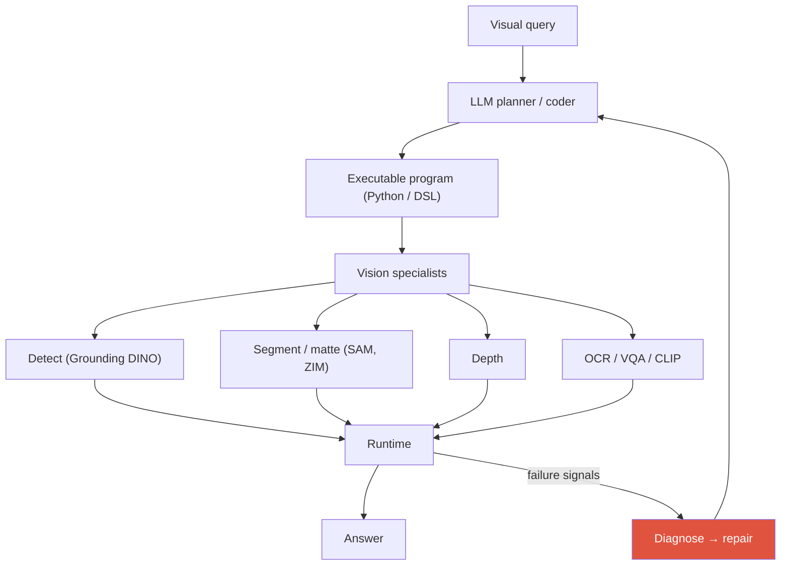
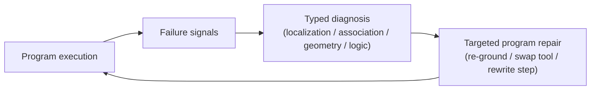

# Visual Reasoning Agents <span class="badge badge-2026">2026</span>

<div class="tag-row"><span class="tag">VisProg</span><span class="tag">ViperGPT</span><span class="tag">visual program synthesis</span><span class="tag">thinking with images</span><span class="tag">GUI grounding</span><span class="tag">spatial reasoning</span></div>

> [!NOTE] This chapter covers a frontier topic
> **One-line intuition:** A conventional VLM answers an image question “all at once” in a single forward pass. A **visual agent** instead behaves more like a person, repeatedly calling **vision tools**: detect an object, crop or zoom into a region, measure segmentation or depth, inspect the result, and reason again. It replaces “answer once” with a loop of **observe → use tools → reason again → answer**. This chapter assumes you have read [Agentic AI & Tool Use](#/llm/agents) and [Grounding](#/vlm/grounding), then applies those ideas to *images*.

## What and why — why use tools?

End-to-end VLMs are powerful, but task-specific specialists can be better at precise masks, counting, and geometric measurement. A visual agent combines planning with perception tools. It can make intermediate results **observable**, but visibility alone does not make them interpretable or verified. To attribute errors, record each tool's confidence, units, input/output provenance, and independent checks.

<figure>
<svg viewBox="0 0 640 220" xmlns="http://www.w3.org/2000/svg" font-family="Inter, sans-serif" font-size="12">
  <rect x="20" y="90" width="90" height="40" rx="8" fill="#0ea5e9"/><text x="65" y="114" text-anchor="middle" fill="#fff">Image query</text>
  <rect x="150" y="90" width="90" height="40" rx="8" fill="#6366f1"/><text x="195" y="108" text-anchor="middle" fill="#fff" font-size="11">VLM planner</text><text x="195" y="123" text-anchor="middle" fill="#fff" font-size="10">“What to inspect?”</text>
  <rect x="280" y="90" width="100" height="40" rx="8" fill="none" stroke="#12a150" stroke-width="1.8"/><text x="330" y="108" text-anchor="middle" fill="currentColor" font-size="11">Tool call</text><text x="330" y="123" text-anchor="middle" fill="#98a3b2" font-size="10">detect·crop·depth</text>
  <rect x="420" y="90" width="90" height="40" rx="8" fill="none" stroke="#0ea5e9" stroke-width="1.8"/><text x="465" y="114" text-anchor="middle" fill="currentColor" font-size="11">Observation</text>
  <rect x="548" y="90" width="72" height="40" rx="8" fill="#e0533f"/><text x="584" y="114" text-anchor="middle" fill="#fff">Answer</text>
  <path d="M110 110 H150 M240 110 H280 M380 110 H420 M510 110 H548" stroke="#98a3b2" stroke-width="1.5" marker-end="url(#va)"/>
  <!-- loop back -->
  <path d="M465 130 C 465 180, 195 180, 195 132" fill="none" stroke="#e0533f" stroke-width="1.6" stroke-dasharray="5 4" marker-end="url(#va)"/>
  <text x="330" y="175" text-anchor="middle" fill="#e0533f" font-size="11">Plan again if evidence is insufficient (loop)</text>
  <circle r="4" fill="#e0533f"><animateMotion dur="3s" repeatCount="indefinite" path="M110 110 H150 H240 H280 H380 H420 H510 H548"/></circle>
  <defs><marker id="va" markerWidth="8" markerHeight="8" refX="6" refY="3" orient="auto"><path d="M0 0 L6 3 L0 6" fill="#98a3b2"/></marker></defs>
</svg>
<figcaption>The visual-agent loop: a VLM plans what to inspect → a vision tool measures it → the VLM observes the result → it answers when the evidence is sufficient, or plans again otherwise. The red dashed path is the repeated loop.</figcaption>
</figure>

> [!TIP] Core framing
> A visual reasoning agent turns a visual query into an **executable program over vision specialists**—detect, segment, depth, OCR, and track—rather than one opaque forward pass. A recent research direction goes further: it turns silent perception failures into **typed diagnoses** that drive **targeted program repair**, forming a diagnostic framework for 3D spatial reasoning.
>
> Related personal research: [Deep-Dive: Grounded VLM/Agents](#/resume/grounded-vlm-agents)

## The paradigm

The core structure is that the **LLM/VLM acts as a coder, writing a program that invokes vision specialists**. The program runs; when failure signals appear, the system diagnoses and repairs it before trying again.



To make that “program” concrete, a question such as “Which car is moving faster?” might be synthesized into code like this:

```python
# Conceptual example of a synthesized program
video, timestamps = load_video_with_timestamps(path)
cars = detect(video[0], "car")
t1 = track(video, cars[0])
t2 = track(video, cars[1])
v1 = apparent_speed_px_per_s(t1, timestamps)
v2 = apparent_speed_px_per_s(t2, timestamps)
answer = "A" if v1 > v2 else "B"
```

This code avoids an undefined `image` and makes the time intervals explicit. What it compares, however, is still **px/s in the image plane**. Comparing real physical speed in m/s requires camera calibration, depth or scale, and perspective correction. Saving intermediate boxes and tracks creates inspection points; it does not make the answer automatically correct.

## 1 · Visual program synthesis: the lineage

**Visual program synthesis** means automatically converting an image question into a program of tool calls. The lineage:

| System | What it generates | Tools | Note |
| --- | --- | --- | --- |
| **VisProg** (CVPR 2023) | DSL program | fixed modules (OWL-ViT, CLIP, …) | interpretable, no training |
| **ViperGPT** (ICCV 2023) | Python against a vision API | GLIP, MiDaS, X-VLM, … | more expressive, larger failure surface |
| MM-ReAct / Visual Sketchpad | interleaved reasoning and action, visual scratchpad | assorted tools | reasons by drawing and annotating |
| 2025–26 examples | traces/policies using crop/zoom, code, and visual scratchpads | tools + code execution | utility must be validated for each task/reward |

**Why a program?** A program is (1) interpretable, (2) lets you *swap* specialists without retraining, (3) composes zero-shot for new tasks, and (4) exposes intermediate results that can be checked. The costs are a fixed API surface, sensitivity to tool errors, and code bugs.

## 2 · Tool-use agent vs. end-to-end VLM

A **tool-use agent** invokes external specialists; an **end-to-end VLM** handles everything inside its weights.

| Axis | End-to-end VLM | Program / tool agent |
| --- | --- | --- |
| Knowledge | compressed in weights | external specialists |
| Spatial precision | often weak | reinforced by segmentation/depth |
| Adapting to a new task | fine-tune | add an API |
| Failure | opaque | ideally traceable per module |
| Cost | one forward pass | multiple calls, higher latency |

> [!QUESTION] “Why not just fine-tune one VLM?”
> **Answer:** Specialist tools can be better at precise masks, OCR, and geometry and can be replaced independently, but they introduce orchestration latency and error propagation. End-to-end VLMs can benefit from single-shot latency and joint optimization. Do not assert that a hybrid always wins; compare end-to-end, tool-only, and hybrid systems on the quality–latency–cost curve and across failure slices.

## 3 · Training-free agentic workflows

**Training-free** means synthesizing a *query-specific executable workflow* on demand from existing specialist vision models, without task-specific labels or fine-tuning.

<div class="proscons"><div><div class="pros-t">Training-free strengths</div>

- No task-specific labels or fine-tuning—immediate coverage of new tasks.
- Upgrade a tool safely by inserting a better detector, without retraining.
- Interpretable intermediate outputs and modular debugging.
- Reuse state-of-the-art specialists as-is.
</div><div><div class="cons-t">Training-free limits</div>

- Depends on a strong planner LLM, with API and cost implications.
- No learned policy → suboptimal tool orchestration.
- Tool miscalibration and silent failures accumulate.
- Fixed or hallucinated APIs; arbitrary code creates a security surface.
</div></div>

**Dynamic API example:** [VADAR (CVPR 2025)](https://openaccess.thecvf.com/content/CVPR2025/html/Marsili_Visual_Agentic_AI_for_Spatial_Reasoning_with_a_Dynamic_API_CVPR_2025_paper.html) dynamically constructs tool code for spatial reasoning. Greater expressiveness also enlarges the execution, security, and verification surface. The typed diagnosis and repair below is a **design proposal** for addressing it, not an established standard shared by every dynamic-API agent.

## 4 · The silent-failure problem

> [!DANGER] Silent perception failure
> A tool returns a **wrong box, mask, or depth** without raising an exception. The program runs to completion and produces a **confidently wrong answer**. Because the perception error is absorbed into the reasoning trace, the pipeline becomes impossible to debug: you cannot tell *which* step lied.

The conceptual framing is:



Turning an opaque wrong answer into a **typed diagnosis** makes the repair policy specific. A localization failure can route to re-grounding, a geometry failure to rechecking depth and scale, and a logic failure to rewriting the program. This is a research hypothesis to test; “matching frontier VLMs without task-specific training” is an experimental objective, not an already established general fact.

<details class="concept-code">
<summary>View as conceptual code</summary>

> The pseudocode below distinguishes a visual tool's **successful return from a correct return**. It is not an example of executing generated Python directly.

```python
def execute_visual_plan(plan, media, max_repairs=2):
    typed_plan = dsl.typecheck(plan, allowed_ops=VISION_ALLOWLIST)
    state = {"media": media, "artifacts": []}

    for node in typed_plan.topological_order():
        for attempt in range(max_repairs + 1):
            args = resolve_inputs(node, state)
            result = sandbox.run(node.tool, args, timeout=node.timeout)
            node.tool.output_schema.validate(result)          # validates only shape/type

            checks = geometry_checks(result, units=node.output_units)
            # Check box bounds, mask size, monotonic timestamps, track-ID continuity, and more.
            if checks.ok and result.confidence >= node.min_confidence:
                break
            diagnosis = classify_failure(node, result, checks)
            if attempt == max_repairs:
                return Abstain(diagnosis, artifacts=state["artifacts"])
            node = targeted_repair(node, diagnosis)           # rerun the same node

        state[node.output_name] = result
        state["artifacts"].append(hash_and_store(result))      # preserve auditable intermediates

    return semantic_verifier.check(typed_plan.answer(state), evidence=state)
```

</details>

## 5 · Why multi-step spatial/temporal reasoning is hard

Errors **compound**: a wrong detection → a wrong depth sample → a wrong “closer than” conclusion. Reference resolution × geometry × memory × tool noise all accumulate.

- **Spatial:** metric 3D relations, multi-view reasoning, and occlusion. Diagnostic/repair benchmarks such as Omni3D-Bench and spatial-reasoning sets probe the reasoning→answer gap.
- **Temporal:** track drift, event order, and long memory—programs need `track`, `get_state_at`, and `compare_speed`. See [Video-Language Models](#/vlm/video).

A **typed taxonomy** of failures—localization, association, geometry, and logic—makes repair tractable. A generic “try again” does not know *what* to fix.

## 6 · “Thinking with images”

Patterns in which a model crops, zooms, rotates, annotates, and re-encodes during reasoning can be treated as a visual scratchpad. Distinguish product descriptions such as OpenAI's [Thinking with Images](https://openai.com/index/thinking-with-images/) from research results that disclose their training method. The related visual-programming work [Transductive Visual Programming](https://arxiv.org/abs/2512.20934) evolves reusable tools from experience; it is not a process-reward RL paper. Do not generalize from a particular example that final-answer reward universally causes correct grounding to emerge.

## 7 · Computer-use & GUI agents

Another major visual-agent family **operates computers like a person**: perceive a screenshot → reason → emit a low-level action such as click (x,y), type, or scroll. The full treatment of this family—native versus framework agents, benchmarks such as OSWorld and WebArena, and long-horizon reliability—belongs in [Agentic AI & Tool Use](#/llm/agents).

The key point here is the **visual-grounding perspective**. **GUI grounding**, the central bottleneck in computer use, maps a UI element to precise pixel coordinates. It is the **same coordinate-emission problem** as visual [Grounding](#/vlm/grounding). Techniques from that chapter, including coordinates-as-tokens and region features, therefore apply directly to GUI control.

**Related family — VLA:** OpenVLA uses visual features and action tokens, while $\pi_0$ uses flow-matching action chunks. Google DeepMind's [Gemini Robotics](https://deepmind.google/blog/gemini-robotics-brings-ai-into-the-physical-world/) is a VLA that emits actions directly; **Gemini Robotics-ER** instead provides embodied reasoning and spatial understanding to connect with a controller. The relative merits of discrete action tokens and continuous action chunks depend on control frequency, action space, and data.

## 8 · Tool-API design principles

Whether tools are fixed or dynamically authored, the same discipline keeps an agent debuggable:

<dl class="kv">
<dt>Typed, unit-explicit signatures</dt><dd>Return meters, pixels, and normalized coordinates unambiguously—many “geometry” failures are unit confusion.</dd>
<dt>Explicit failure returns</dt><dd>Return confidence and <code>null</code> on no-detection instead of a silent wrong box—the raw material for typed diagnosis.</dd>
<dt>Deterministic, side-effect-free</dt><dd>Reproducible execution makes a repair loop meaningful; nondeterminism hides faults.</dd>
<dt>Sandboxed execution</dt><dd>Arbitrary generated code is a security surface—isolate it.</dd>
<dt>Least privilege &amp; budgets</dt><dd>Use a tool allowlist; separate file and network permissions; cap CPU/GPU time, calls, and retries; validate input/output schemas; and keep audit logs.</dd>
</dl>

## Q&A

<details class="qa"><summary>VisProg vs. ViperGPT vs. dynamic-API agents—what changed and why?</summary>
<div class="qa-body">

**Short:** VisProg emits a constrained DSL over fixed modules; ViperGPT emits general Python against a vision API, gaining expressiveness and failure surface; a dynamic-API agent such as VADAR *writes its own helper functions* per subproblem, trading verifiability for flexibility.

**Deep:** Moving from a fixed DSL to general code and dynamic helpers increases both expressiveness and the failure/security surface. Verification and repair are active research directions, but the field has not converged on one standard architecture. Report invalid-call rate, silent-error rate, repair success, latency, and sandbox violations—not just benchmark performance.
</div></details>

<details class="qa"><summary>What is a “silent perception failure,” and how would you make an agent robust to it?</summary>
<div class="qa-body">

**Short:** A tool returns the wrong result, no error fires, the program completes, and the answer is confidently wrong—the perception error is invisible in the trace. Robustness means detecting failure signals, *typing* the failure, and repairing the specific step.

**Deep:** Answer-only supervision cannot localize the fault because downstream steps willingly consume garbage. One public framing instruments execution for failure signals such as confidence, geometric inconsistency, and cross-tool disagreement; classifies them into a **typed diagnosis**—localization, association, geometry, or logic—and routes them to a **targeted repair** such as re-grounding, swapping a tool, or rewriting the offending step. Typing makes repair specific; a blind retry does not know what broke. The objective is to match frontier VLMs on 3D spatial reasoning without task-specific training. Full framing: [Deep-Dive: Grounded VLM/Agents](#/resume/grounded-vlm-agents).
</div></details>

<details class="qa"><summary>When is an end-to-end VLM the right choice over a tool agent?</summary>
<div class="qa-body">

**Short:** For open-ended commonsense, reading, ambiguous conversation, and soft semantics that do not decompose naturally into tool calls—as well as latency-sensitive single-shot uses.

**Deep:** Programs can be advantageous when a task cleanly decomposes into detect → measure → compare; a single model can be better for holistic understanding or low latency. Specialist tools also suffer domain shift and calibration errors. Choose by comparing end-to-end, tool-only, and hybrid systems on the same inputs, budgets, and failure slices.
</div></details>

**Follow-ups**

- “Tool API design principles?” (Typed inputs and units such as m or px, explicit failure returns such as confidence or null, deterministic behavior, and sandboxed execution.)
- “How is GUI grounding related to visual grounding?” (It is the same coordinate-emission bottleneck: element→pixel. See [Agentic AI & Tool Use](#/llm/agents) for computer-use benchmarks and reliability.)
- “When can final-answer reward induce grounding behavior?” (When tool use improves the answer and exploration and credit assignment are feasible; test for spurious shortcuts with a separate grounding metric.)

## Cheat-sheet

| System / term | One-liner |
| --- | --- |
| visual agent | a VLM reasons over an image by calling vision tools in a loop, rather than answering once |
| VisProg | LLM → DSL program over fixed visual modules (CVPR 2023) |
| ViperGPT | LLM → Python against a vision API (ICCV 2023) |
| VADAR | dynamic-API agent for 3D spatial reasoning (CVPR 2025) |
| Training-free synthesis | build a query-specific executable workflow, with no fine-tuning |
| Silent failure | wrong tool output, no exception, confidently wrong answer |
| Typed diagnosis → repair | classify localization/association/geometry/logic → fix that step |
| Thinking with images | crop/zoom/annotate during reasoning; vision as a scratchpad |
| GUI grounding | element → pixel coordinate; the same problem as visual grounding (benchmarks in [llm/agents](#/llm/agents)) |

**Next:** [Agentic AI & Tool Use](#/llm/agents) · [Deep-Dive: Grounded VLM/Agents](#/resume/grounded-vlm-agents) · [Grounding & Region Reasoning](#/vlm/grounding) · [Video-Language Models](#/vlm/video) · [Object Detection](#/cv/detection) · [The 2026 Landscape](#/start/landscape-2026)
