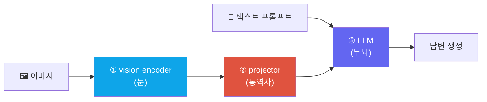

# VLM 101: 이미지가 토큰이 되는 과정

> [!NOTE] 이 챕터의 목표
> **VLM(Vision-Language Model, 비전-언어 모델)** 은 이미지를 "보고" 언어로 답하는 모델입니다. 이 챕터는 뒤따르는 모든 VLM 챕터가 전제하지만 아무도 처음부터 설명하지 않는 하나의 질문에 답합니다 — **"이미지가 어떻게 LLM이 읽는 토큰(token)이 되는가?"** 그림과 짧은 코드로 이걸 잡고 나면 [VLM Pretraining](#/vlm/pretraining)과 [VLM 구현 디테일](#/vlm/practical)이 술술 읽힙니다.

## 무엇을, 왜

LLM(대규모 언어 모델)은 오직 **텍스트 토큰**만 먹습니다. "The cat sat" 같은 문장을 단어 조각(토큰)으로 쪼개 각각을 벡터로 바꿔 넣는 게 전부죠. 그런데 우리는 "이 사진 속 사람이 뭘 하고 있어?"처럼 **이미지에 대해 언어로 묻고 답하기**를 원합니다.

방법은 놀랄 만큼 단순합니다 — **이미지를 LLM이 이해할 수 있는 "토큰"으로 바꿔서, 텍스트 토큰과 함께 넣어 주는 것**입니다. LLM 입장에서는 문장 앞에 "그림 단어" 몇 개가 더 붙었을 뿐입니다.

실무에서 유용한 첫 멘탈 모델은 **눈(vision encoder) + 연결기(projector/resampler) + 언어 모델**입니다. 이미지를 특징으로 만들고, 연결기가 LLM이 받을 수 있는 차원·토큰 수·형식으로 바꾼 뒤 텍스트와 융합합니다. 다만 encoder와 decoder를 공동학습한 모델, 단일 transformer, cross-attention형도 있으므로 이것은 VLM의 보편적 정의가 아니라 모듈러 계열의 설명입니다.



> [!TIP] 면접 한 줄
> "VLM의 핵심 설계 질문은 '이미지를 어떻게 토큰화하고, 언어와 어디서 합치는가'다." 이미지 → visual token(비주얼 토큰), 그리고 fusion(융합) 방식(projection vs cross-attention)을 짚으면 구조를 제대로 이해한 것으로 들립니다.

## 1단계 · 이미지를 패치로 자르기 (patchify)

텍스트는 자연스럽게 토큰(단어 조각)의 나열입니다. 그럼 이미지는? [백본 & 전이학습](#/cv/backbones-transfer)의 **ViT(Vision Transformer)** 가 답을 줍니다. ViT는 이미지를 **격자 모양의 작은 패치(patch, 정사각형 조각)** 로 자르고, 각 패치를 하나의 벡터(**patch embedding, 패치 임베딩**)로 만듭니다.

예를 들어 224×224 이미지를 16×16 크기 패치로 자르면 (224/16)² = 14×14 = **196개의 패치**가 나옵니다. 문장이 단어(토큰)의 나열이듯, **이미지는 패치(= visual token)의 나열**이 되는 것이죠. 이게 vision과 language를 잇는 다리입니다 — 둘 다 결국 "토큰의 시퀀스"니까요.

<figure>
<svg viewBox="0 0 640 210" xmlns="http://www.w3.org/2000/svg" font-family="Inter, sans-serif" font-size="12">
  <text x="70" y="24" text-anchor="middle" fill="#98a3b2">이미지</text>
  <rect x="30" y="34" width="80" height="80" rx="4" fill="none" stroke="#0ea5e9" stroke-width="1.6"/>
  <g stroke="#0ea5e9" stroke-width="0.8" opacity="0.7">
    <line x1="50" y1="34" x2="50" y2="114"/><line x1="70" y1="34" x2="70" y2="114"/><line x1="90" y1="34" x2="90" y2="114"/>
    <line x1="30" y1="54" x2="110" y2="54"/><line x1="30" y1="74" x2="110" y2="74"/><line x1="30" y1="94" x2="110" y2="94"/>
  </g>
  <path d="M118 74 H160" stroke="#98a3b2" stroke-width="1.5" marker-end="url(#a)"/>
  <text x="139" y="66" text-anchor="middle" fill="#98a3b2" font-size="10">patchify</text>
  <text x="230" y="24" text-anchor="middle" fill="#98a3b2">visual token (패치 임베딩)</text>
  <g fill="#0ea5e9">
    <rect x="168" y="60" width="26" height="26" rx="4"/><rect x="200" y="60" width="26" height="26" rx="4"/><rect x="232" y="60" width="26" height="26" rx="4"/><rect x="264" y="60" width="26" height="26" rx="4"/>
  </g>
  <text x="229" y="104" text-anchor="middle" fill="#98a3b2" font-size="10">… 196개 …</text>
  <path d="M298 74 H336" stroke="#98a3b2" stroke-width="1.5" marker-end="url(#a)"/>
  <text x="317" y="66" text-anchor="middle" fill="#e0533f" font-size="10">projector</text>
  <text x="480" y="24" text-anchor="middle" fill="#98a3b2">LLM 입력 시퀀스</text>
  <g>
    <rect x="344" y="60" width="26" height="26" rx="4" fill="#6366f1"/><rect x="372" y="60" width="26" height="26" rx="4" fill="#6366f1"/><rect x="400" y="60" width="26" height="26" rx="4" fill="#6366f1"/><rect x="428" y="60" width="26" height="26" rx="4" fill="#6366f1"/>
    <rect x="460" y="60" width="30" height="26" rx="4" fill="#12a150"/><rect x="494" y="60" width="30" height="26" rx="4" fill="#12a150"/><rect x="528" y="60" width="30" height="26" rx="4" fill="#12a150"/>
  </g>
  <text x="399" y="102" text-anchor="middle" fill="#6366f1" font-size="10">visual tokens</text>
  <text x="509" y="102" text-anchor="middle" fill="#12a150" font-size="10">"뭐 하고 있어?"</text>
  <rect x="340" y="54" width="222" height="38" rx="6" fill="none" stroke="#98a3b2" stroke-dasharray="4 3"/>
  <text x="450" y="160" text-anchor="middle" fill="#98a3b2" font-size="11">이미지 토큰과 텍스트 토큰이 한 시퀀스로 합쳐져 LLM에 들어갑니다</text>
  <defs><marker id="a" markerWidth="8" markerHeight="8" refX="6" refY="3" orient="auto"><path d="M0 0 L6 3 L0 6" fill="#98a3b2"/></marker></defs>
</svg>
<figcaption>핵심 멘탈 모델: 이미지 → 패치 → visual token → (projector로 LLM 언어 공간에 맞춤) → <b>텍스트 토큰과 나란히</b> LLM에 입력. LLM 입장에서는 앞쪽에 "그림 단어" 몇 개가 더 붙은 문장일 뿐입니다.</figcaption>
</figure>

## 2단계 · LLM 입력 인터페이스에 맞추기

vision encoder 출력과 LLM hidden state는 차원·분포·토큰 수가 다릅니다. **projector**나 resampler는 이 특징을 LLM이 조건으로 사용할 수 있는 차원과 형식으로 바꿉니다. 이를 흔히 "정렬" 또는 "번역"이라고 직관화하지만, 출력이 텍스트 임베딩과 거리 비교가 가능한 하나의 **공유 metric space**가 된다는 뜻은 아닙니다. 생성 loss를 통해 LLM 내부에서 유용한 조건 신호가 되도록 학습되는 경우가 많습니다.

**CLIP**은 별도의 global image/text embedding을 같은 metric space에 놓아 검색·분류를 학습합니다. LLaVA식 projector는 그 CLIP vision feature를 LLM 입력으로 연결하지만 목적 함수와 공간의 의미는 다릅니다. 자세한 대조 학습은 [자기지도학습 입문](#/cv/self-supervised)과 [VLM Pretraining](#/vlm/pretraining)을 참고하세요.

## 3단계 · 어디서 합치나 — 두 가지 fusion 방식

visual token을 만들었으면, 이걸 언어와 **어디서·어떻게** 합칠지가 남습니다. 크게 두 갈래입니다.

<figure>
<svg viewBox="0 0 660 250" xmlns="http://www.w3.org/2000/svg" font-family="Inter, sans-serif" font-size="12">
  <!-- A: projection / prefix -->
  <text x="165" y="24" text-anchor="middle" font-weight="700" fill="#e0533f">A. Projection / Prefix (LLaVA)</text>
  <g fill="#0ea5e9"><rect x="40" y="50" width="22" height="22" rx="4"/><rect x="66" y="50" width="22" height="22" rx="4"/><rect x="92" y="50" width="22" height="22" rx="4"/></g>
  <text x="77" y="90" text-anchor="middle" fill="#0ea5e9" font-size="10">visual tokens</text>
  <path d="M118 61 H150" stroke="#e0533f" stroke-width="1.5" marker-end="url(#b)"/>
  <text x="134" y="52" text-anchor="middle" fill="#e0533f" font-size="9">proj</text>
  <g fill="#6366f1"><rect x="154" y="50" width="22" height="22" rx="4"/><rect x="180" y="50" width="22" height="22" rx="4"/><rect x="206" y="50" width="22" height="22" rx="4"/></g>
  <g fill="#12a150"><rect x="234" y="50" width="22" height="22" rx="4"/><rect x="260" y="50" width="22" height="22" rx="4"/></g>
  <rect x="150" y="44" width="136" height="34" rx="6" fill="none" stroke="#98a3b2" stroke-dasharray="4 3"/>
  <text x="218" y="98" text-anchor="middle" fill="#98a3b2" font-size="10">[그림 토큰들] + [텍스트 토큰들]</text>
  <path d="M218 104 V128" stroke="#98a3b2" stroke-width="1.5" marker-end="url(#b)"/>
  <rect x="150" y="130" width="136" height="30" rx="6" fill="#6366f1"/>
  <text x="218" y="150" text-anchor="middle" fill="#fff">LLM (수정 없음)</text>
  <text x="165" y="188" text-anchor="middle" fill="#98a3b2" font-size="10">한 시퀀스로 이어 붙여 그대로 입력</text>
  <text x="165" y="204" text-anchor="middle" fill="#12a150" font-size="10">단순 · LLM 재사용 · 현재 주류</text>
  <!-- divider -->
  <line x1="330" y1="34" x2="330" y2="215" stroke="#98a3b2" stroke-width="0.8" stroke-dasharray="3 3"/>
  <!-- B: cross-attention -->
  <text x="500" y="24" text-anchor="middle" font-weight="700" fill="#0ea5e9">B. LLM cross-attention (Flamingo)</text>
  <g fill="#0ea5e9"><rect x="360" y="50" width="22" height="22" rx="4"/><rect x="386" y="50" width="22" height="22" rx="4"/><rect x="412" y="50" width="22" height="22" rx="4"/><rect x="438" y="50" width="22" height="22" rx="4"/></g>
  <text x="410" y="90" text-anchor="middle" fill="#0ea5e9" font-size="10">이미지 특징 (참조용)</text>
  <g fill="#12a150"><rect x="560" y="50" width="22" height="22" rx="4"/><rect x="586" y="50" width="22" height="22" rx="4"/></g>
  <text x="585" y="90" text-anchor="middle" fill="#12a150" font-size="10">텍스트</text>
  <path d="M585 96 V128" stroke="#98a3b2" stroke-width="1.5" marker-end="url(#b)"/>
  <rect x="500" y="130" width="150" height="30" rx="6" fill="#6366f1"/>
  <text x="575" y="150" text-anchor="middle" fill="#fff">LLM + cross-attn 블록</text>
  <path d="M462 61 C 500 61, 500 128, 505 132" fill="none" stroke="#e0533f" stroke-width="1.5" stroke-dasharray="3 2" marker-end="url(#b)"/>
  <text x="500" y="112" text-anchor="middle" fill="#e0533f" font-size="9">attend (참조)</text>
  <text x="505" y="188" text-anchor="middle" fill="#98a3b2" font-size="10">LLM 층 사이에 참조 블록 삽입</text>
  <text x="505" y="204" text-anchor="middle" fill="#0ea5e9" font-size="10">토큰 압축 · 긴 입력 효율 · LLM 수정 필요</text>
  <defs><marker id="b" markerWidth="8" markerHeight="8" refX="6" refY="3" orient="auto"><path d="M0 0 L6 3 L0 6" fill="#98a3b2"/></marker></defs>
</svg>
<figcaption>두 fusion 방식. <b>A(Projection)</b>: visual token을 텍스트 앞에 그냥 이어 붙이고 LLM은 손대지 않습니다. <b>B(Cross-attention)</b>: LLM 층 사이에 블록을 끼워 텍스트가 이미지 특징을 "참조"하게 하며, 보통 이미지 토큰 수를 소수로 압축합니다.</figcaption>
</figure>

<div class="proscons"><div><div class="pros-t">A. Projection / Prefix (LLaVA 방식)</div>

visual token을 projector로 변환해 **텍스트 토큰 앞에 그냥 붙입니다(prefix, 접두)**. LLM은 수정 없이 그대로 사용합니다. **단순하고 학습이 쉬워** 현재 오픈 VLM의 주류입니다. (LLaVA, Qwen-VL 등)

</div><div><div class="cons-t">B. LLM 내부 cross-attention (Flamingo)</div>

Flamingo는 Perceiver resampler로 visual token을 압축하고, frozen LLM 층 사이에 **gated cross-attention** 블록을 넣어 텍스트가 이미지 특징을 참조하게 합니다. 따라서 LLM 경로에 새 블록이 들어갑니다.

</div></div>

별도의 세 번째 패턴도 구분해야 합니다. [BLIP-2](https://arxiv.org/abs/2301.12597)의 **Q-Former**는 learnable query가 frozen vision feature에 cross-attend하는 *연결기*입니다. 그 출력은 projection을 거쳐 frozen LLM에 soft visual prompt/prefix로 들어가며, LLM 층 사이에 cross-attention을 삽입하는 [Flamingo](https://arxiv.org/abs/2204.14198)와 구조가 다릅니다. 즉 "cross-attention을 쓴다"보다 **어느 모듈 안에서 무엇이 무엇을 attend하는가**를 말해야 정확합니다.

> [!NOTE] "LLaVA를 머릿속으로 조립하기" — 처음부터 끝까지
> ① **vision encoder**로 이미지에서 patch feature를 얻고 → ② **projector**로 LLM hidden size에 맞춘 뒤 → ③ visual token과 텍스트 토큰을 한 시퀀스로 넣고 → ④ LLM이 답을 생성합니다. 토큰 수는 해상도와 patch size에 따라 다릅니다. 원형 LLaVA의 CLIP ViT-L/14@224는 16×16=**256** patch token, LLaVA-1.5의 @336은 24×24=**576**입니다(앞의 196은 p=16인 일반 예). 학습 단계와 freeze 범위도 버전별로 다르므로 [VLM Pretraining](#/vlm/pretraining), [Instruction Tuning](#/vlm/instruction-tuning)을 확인하세요.

<details class="concept-code">
<summary>개념 코드로 보기</summary>

> 아래는 두 fusion 방식의 tensor shape만 비교하는 PyTorch식 **의사코드**입니다. 특정 VLM의 실제 forward API가 아닙니다.

```python
def prefix_fusion(images, text_ids, text_mask):
    vision = vision_encoder(images)             # [B,Nv,Dv]
    visual = projector(vision)                  # [B,Nv,Dlm]
    text = token_embedding(text_ids)            # [B,Nt,Dlm]
    x = concat([visual, text], dim=1)            # [B,Nv+Nt,Dlm]
    mask = concat([ones(B, Nv), text_mask], 1)   # image padding/tiles도 실제론 mask
    labels = concat([full(B, Nv, IGNORE_INDEX), shifted_text_labels], 1)
    return decoder(inputs_embeds=x, attention_mask=mask, labels=labels)

def cross_attention_fusion(images, text_ids, text_mask):
    media = resampler(vision_encoder(images))    # [B,M,Dlm], 보통 M << Nv
    hidden = token_embedding(text_ids)           # [B,Nt,Dlm]
    for block in decoder_blocks:
        hidden = block.causal_self_attn(hidden, mask=text_mask)
        hidden = block.cross_attn(q=hidden, kv=media,
                                  kv_mask=media_valid_mask)     # q와 kv 길이가 다름
    return lm_head(hidden)
```

prefix 방식에서는 visual 위치를 정답 label에서 제외하되 attention에서는 보이게 해야 합니다. Cross-attention 방식에서는 텍스트의 causal mask와 media의 유효-token mask를 섞지 않는 것이 핵심입니다.

</details>

## 직접 돌려보기 — patchify

이미지를 패치로 자르는 첫 단계(1단계)를 직접 구현해 봅시다. `(H, W)` 흑백 이미지를 `p×p` 패치들로 잘라, 각 패치를 한 줄(길이 `p*p`)로 펼친 `(num_patches, p*p)` 배열로 만드세요. (H, W는 p로 나누어떨어진다고 가정. 왼→오, 위→아래 순서.)

<div class="widget" data-widget="code">
<script type="application/json" class="code-config">
{"func":"patchify","packages":["numpy"],"approx":true,"starter":"def patchify(img, p):\n    # img: (H, W) 2D 리스트, p: 패치 크기.\n    # p x p 패치로 자르고(왼->오, 위->아래 순서), 각 패치를 길이 p*p 로 flatten 해\n    # (num_patches, p*p) 리스트를 반환하세요.\n    import numpy as np\n    a = np.asarray(img, dtype=float)\n    # TODO\n    pass","tests":[{"args":[[[1,2,3,4],[5,6,7,8],[9,10,11,12],[13,14,15,16]],2],"expect":[[1.0,2.0,5.0,6.0],[3.0,4.0,7.0,8.0],[9.0,10.0,13.0,14.0],[11.0,12.0,15.0,16.0]]},{"args":[[[1,1],[1,1]],2],"expect":[[1.0,1.0,1.0,1.0]]}],"solution":"import numpy as np\n\ndef patchify(img, p):\n    a = np.asarray(img, dtype=float)\n    H, W = a.shape\n    out = []\n    for i in range(0, H, p):\n        for j in range(0, W, p):\n            out.append(a[i:i+p, j:j+p].reshape(-1).tolist())\n    return out"}
</script>
</div>

실제 VLM은 여기에 학습된 선형 투영을 더해 각 패치를 `d`차원 임베딩으로 만들지만, "이미지를 토큰 시퀀스로 쪼갠다"는 뼈대는 이게 전부입니다.

## Q&A

<details class="qa"><summary>이미지 토큰이 많으면 뭐가 문제인가요?</summary>
<div class="qa-body">

**짧게:** 토큰 수가 attention 비용(제곱)과 context(문맥) 길이를 잡아먹습니다.

**깊게:** 224²/16² = 196 토큰은 괜찮지만, 고해상도·다중 이미지·비디오면 수천~수만 토큰이 됩니다. Transformer의 self-attention은 토큰 수의 **제곱**에 비례해 비싸지므로, 이건 곧바로 속도·메모리 문제가 됩니다. 그래서 Q-Former(고정 개수로 압축), pixel-shuffle, token merging 같은 **visual token 압축**이 중요해집니다 — [VLM 구현 디테일](#/vlm/practical), [Video-Language](#/vlm/video)에서 이어집니다.
</div></details>

<details class="qa"><summary>projection 방식과 cross-attention 방식, 뭘 골라야 하나요?</summary>
<div class="qa-body">

**짧게:** 단순한 prefix는 LLaVA, LLM 내부 cross-attention은 Flamingo, query 기반 압축 연결기는 BLIP-2의 Q-Former입니다.

**깊게:** projection/prefix는 구현이 단순하지만 visual token 수가 그대로 context를 차지합니다. Flamingo식 cross-attention은 LLM 층을 수정하고 별도 visual memory를 참조합니다. Q-Former/Perceiver는 고정 수 query/latent로 압축하지만, Q-Former의 cross-attention 위치는 LLM 내부가 아닙니다. 압축률·정보 손실·재사용성·지연을 실제 데이터로 비교하세요.
</div></details>

<details class="qa"><summary>이미지 인코더는 왜 새로 학습하지 않고 CLIP 같은 걸 가져다 쓰나요?</summary>
<div class="qa-body">

**짧게:** CLIP은 이미 이미지·텍스트를 같은 의미 공간에 정렬해 놨기 때문에, LLM 언어로 번역하기가 쉬운 "언어 친화적" feature를 줍니다.

**깊게:** CLIP은 수억 장의 (이미지, 캡션) 쌍으로 학습되어, feature가 언어와 이미 짝지어져 있습니다. 그래서 projector라는 얇은 다리만으로도 LLM에 붙기 좋습니다. 밑바닥부터 vision encoder를 학습하려면 막대한 데이터·연산이 들죠. 어떤 encoder(CLIP vs SigLIP vs DINO)가 왜 좋은지는 [VLM Pretraining](#/vlm/pretraining)에서 다룹니다.
</div></details>

## Cheat-sheet

| 개념 | 한 줄 |
| --- | --- |
| 모듈러 VLM 멘탈 모델 | vision encoder + connector/projector + LLM (다른 joint/cross-attention 구조도 존재) |
| 이미지 → 토큰 | patchify: 이미지 → 패치 격자 → visual token 시퀀스 |
| patch 수 | (H/p)×(W/p) 개 (예: 224, p=16 → 196) |
| projector | vision feature를 LLM 입력의 차원·분포·토큰 형식에 맞춤; 공통 metric 공간 보장은 아님 |
| Fusion A | projection/prefix — 토큰을 앞에 붙임 (LLaVA), 단순·주류 |
| Fusion B/C | LLM 내부 gated cross-attn(Flamingo) vs connector 내부 query cross-attn 후 prefix(BLIP-2) |
| 공유 공간 원조 | CLIP (대조 학습) — 자세히는 self-supervised / pretraining |
| 병목 | visual token이 많으면 attention 비용(제곱)·context 압박 → 압축 필요 |

**다음:** [VLM Pretraining](#/vlm/pretraining) · [VLM 구현 디테일](#/vlm/practical)
