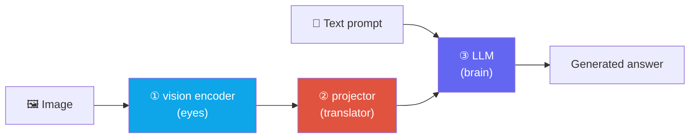

# VLM 101: How an Image Becomes Tokens

> [!NOTE] Goal of this chapter
> A **vision-language model (VLM)** sees an image and answers in language. This chapter addresses the question every later VLM chapter assumes but rarely explains from the beginning: **How does an image become tokens that an LLM can read?** Once the diagrams and short code make this concrete, [VLM Pretraining](#/vlm/pretraining) and [VLM Implementation Details](#/vlm/practical) become much easier to follow.

## What and why

An LLM consumes only **text tokens**. It splits a sentence such as "The cat sat" into pieces and turns each piece into a vector. But we want to ask and answer questions **about an image**, such as "What is this person doing?"

The solution is surprisingly simple: **turn the image into tokens the LLM can use, then feed those tokens alongside text tokens.** From the LLM's perspective, a few "visual words" have been placed before the sentence.

A useful first production mental model is **eyes (vision encoder) + connector (projector or resampler) + language model**. The encoder produces image features; the connector converts their dimension, token count, and format into an interface the LLM can consume; then the modalities are fused. This describes a modular family, not every VLM: some jointly train encoder and decoder, use a single Transformer, or fuse through cross-attention.



> [!TIP] Interview one-liner
> "The central VLM design questions are how to tokenize an image and where to fuse it with language." Mention image → visual tokens and the fusion choice—projection versus cross-attention—to demonstrate architectural understanding.

## Step 1 · Cut the image into patches

Text is naturally a sequence of word pieces. What about an image? The **Vision Transformer (ViT)** in [Backbones & Transfer Learning](#/cv/backbones-transfer) provides the answer. ViT divides an image into a grid of small square **patches** and maps each patch to a vector called a **patch embedding**.

For a 224×224 image with 16×16 patches, (224/16)² = 14×14 = **196** patches result. Just as a sentence is a sequence of tokens, **an image becomes a sequence of patches, or visual tokens**. This is the bridge between vision and language: both are ultimately token sequences.

<figure>
<svg viewBox="0 0 640 210" xmlns="http://www.w3.org/2000/svg" font-family="Inter, sans-serif" font-size="12">
  <text x="70" y="24" text-anchor="middle" fill="#98a3b2">Image</text>
  <rect x="30" y="34" width="80" height="80" rx="4" fill="none" stroke="#0ea5e9" stroke-width="1.6"/>
  <g stroke="#0ea5e9" stroke-width="0.8" opacity="0.7">
    <line x1="50" y1="34" x2="50" y2="114"/><line x1="70" y1="34" x2="70" y2="114"/><line x1="90" y1="34" x2="90" y2="114"/>
    <line x1="30" y1="54" x2="110" y2="54"/><line x1="30" y1="74" x2="110" y2="74"/><line x1="30" y1="94" x2="110" y2="94"/>
  </g>
  <path d="M118 74 H160" stroke="#98a3b2" stroke-width="1.5" marker-end="url(#a)"/>
  <text x="139" y="66" text-anchor="middle" fill="#98a3b2" font-size="10">patchify</text>
  <text x="230" y="24" text-anchor="middle" fill="#98a3b2">visual tokens (patch embeddings)</text>
  <g fill="#0ea5e9">
    <rect x="168" y="60" width="26" height="26" rx="4"/><rect x="200" y="60" width="26" height="26" rx="4"/><rect x="232" y="60" width="26" height="26" rx="4"/><rect x="264" y="60" width="26" height="26" rx="4"/>
  </g>
  <text x="229" y="104" text-anchor="middle" fill="#98a3b2" font-size="10">… 196 total …</text>
  <path d="M298 74 H336" stroke="#98a3b2" stroke-width="1.5" marker-end="url(#a)"/>
  <text x="317" y="66" text-anchor="middle" fill="#e0533f" font-size="10">projector</text>
  <text x="480" y="24" text-anchor="middle" fill="#98a3b2">LLM input sequence</text>
  <g>
    <rect x="344" y="60" width="26" height="26" rx="4" fill="#6366f1"/><rect x="372" y="60" width="26" height="26" rx="4" fill="#6366f1"/><rect x="400" y="60" width="26" height="26" rx="4" fill="#6366f1"/><rect x="428" y="60" width="26" height="26" rx="4" fill="#6366f1"/>
    <rect x="460" y="60" width="30" height="26" rx="4" fill="#12a150"/><rect x="494" y="60" width="30" height="26" rx="4" fill="#12a150"/><rect x="528" y="60" width="30" height="26" rx="4" fill="#12a150"/>
  </g>
  <text x="399" y="102" text-anchor="middle" fill="#6366f1" font-size="10">visual tokens</text>
  <text x="509" y="102" text-anchor="middle" fill="#12a150" font-size="10">"What is happening?"</text>
  <rect x="340" y="54" width="222" height="38" rx="6" fill="none" stroke="#98a3b2" stroke-dasharray="4 3"/>
  <text x="450" y="160" text-anchor="middle" fill="#98a3b2" font-size="11">Visual and text tokens form one sequence for the LLM</text>
  <defs><marker id="a" markerWidth="8" markerHeight="8" refX="6" refY="3" orient="auto"><path d="M0 0 L6 3 L0 6" fill="#98a3b2"/></marker></defs>
</svg>
<figcaption>The central mental model: image → patches → visual tokens → projector maps them to the LLM interface → feed them <b>alongside text tokens</b>. From the LLM's perspective, the sentence simply begins with several "visual words."</figcaption>
</figure>

## Step 2 · Match the LLM input interface

Vision-encoder outputs and LLM hidden states differ in dimension, distribution, and token count. A **projector** or resampler maps the visual features into a dimension and format that the LLM can use as conditioning. It is often described intuitively as alignment or translation, but this does not imply that the result lies in one **shared metric space** where distances can be compared directly with text embeddings. In many systems, generation loss trains it to become useful conditioning inside the LLM.

**CLIP** learns separate global image and text embeddings in a common metric space for retrieval and classification. A LLaVA-style projector connects CLIP vision features to an LLM input, but the objective and meaning of the space differ. See [Self-Supervised Learning](#/cv/self-supervised) and [VLM Pretraining](#/vlm/pretraining) for contrastive learning.

## Step 3 · Where to combine them — two fusion strategies

After producing visual tokens, we must decide **where and how to fuse them with language**. There are two broad approaches.

<figure>
<svg viewBox="0 0 660 250" xmlns="http://www.w3.org/2000/svg" font-family="Inter, sans-serif" font-size="12">
  <!-- A: projection / prefix -->
  <text x="165" y="24" text-anchor="middle" font-weight="700" fill="#e0533f">A. Projection / Prefix (LLaVA)</text>
  <g fill="#0ea5e9"><rect x="40" y="50" width="22" height="22" rx="4"/><rect x="66" y="50" width="22" height="22" rx="4"/><rect x="92" y="50" width="22" height="22" rx="4"/></g>
  <text x="77" y="90" text-anchor="middle" fill="#0ea5e9" font-size="10">visual tokens</text>
  <path d="M118 61 H150" stroke="#e0533f" stroke-width="1.5" marker-end="url(#b)"/>
  <text x="134" y="52" text-anchor="middle" fill="#e0533f" font-size="9">proj</text>
  <g fill="#6366f1"><rect x="154" y="50" width="22" height="22" rx="4"/><rect x="180" y="50" width="22" height="22" rx="4"/><rect x="206" y="50" width="22" height="22" rx="4"/></g>
  <g fill="#12a150"><rect x="234" y="50" width="22" height="22" rx="4"/><rect x="260" y="50" width="22" height="22" rx="4"/></g>
  <rect x="150" y="44" width="136" height="34" rx="6" fill="none" stroke="#98a3b2" stroke-dasharray="4 3"/>
  <text x="218" y="98" text-anchor="middle" fill="#98a3b2" font-size="10">[visual tokens] + [text tokens]</text>
  <path d="M218 104 V128" stroke="#98a3b2" stroke-width="1.5" marker-end="url(#b)"/>
  <rect x="150" y="130" width="136" height="30" rx="6" fill="#6366f1"/>
  <text x="218" y="150" text-anchor="middle" fill="#fff">LLM (unchanged)</text>
  <text x="165" y="188" text-anchor="middle" fill="#98a3b2" font-size="10">Concatenate into one input sequence</text>
  <text x="165" y="204" text-anchor="middle" fill="#12a150" font-size="10">Simple · reuses LLM · common today</text>
  <!-- divider -->
  <line x1="330" y1="34" x2="330" y2="215" stroke="#98a3b2" stroke-width="0.8" stroke-dasharray="3 3"/>
  <!-- B: cross-attention -->
  <text x="500" y="24" text-anchor="middle" font-weight="700" fill="#0ea5e9">B. LLM cross-attention (Flamingo)</text>
  <g fill="#0ea5e9"><rect x="360" y="50" width="22" height="22" rx="4"/><rect x="386" y="50" width="22" height="22" rx="4"/><rect x="412" y="50" width="22" height="22" rx="4"/><rect x="438" y="50" width="22" height="22" rx="4"/></g>
  <text x="410" y="90" text-anchor="middle" fill="#0ea5e9" font-size="10">image features (memory)</text>
  <g fill="#12a150"><rect x="560" y="50" width="22" height="22" rx="4"/><rect x="586" y="50" width="22" height="22" rx="4"/></g>
  <text x="585" y="90" text-anchor="middle" fill="#12a150" font-size="10">text</text>
  <path d="M585 96 V128" stroke="#98a3b2" stroke-width="1.5" marker-end="url(#b)"/>
  <rect x="500" y="130" width="150" height="30" rx="6" fill="#6366f1"/>
  <text x="575" y="150" text-anchor="middle" fill="#fff">LLM + cross-attn blocks</text>
  <path d="M462 61 C 500 61, 500 128, 505 132" fill="none" stroke="#e0533f" stroke-width="1.5" stroke-dasharray="3 2" marker-end="url(#b)"/>
  <text x="500" y="112" text-anchor="middle" fill="#e0533f" font-size="9">attend (reference)</text>
  <text x="505" y="188" text-anchor="middle" fill="#98a3b2" font-size="10">Insert reference blocks between LLM layers</text>
  <text x="505" y="204" text-anchor="middle" fill="#0ea5e9" font-size="10">Compression · long-input efficiency · modifies LLM</text>
  <defs><marker id="b" markerWidth="8" markerHeight="8" refX="6" refY="3" orient="auto"><path d="M0 0 L6 3 L0 6" fill="#98a3b2"/></marker></defs>
</svg>
<figcaption>Two fusion strategies. <b>A, projection</b>: concatenate visual tokens before text without modifying the LLM. <b>B, cross-attention</b>: insert blocks between LLM layers so text can attend to image features, often after compressing the visual sequence to a small fixed set.</figcaption>
</figure>

<div class="proscons"><div><div class="pros-t">A. Projection / Prefix (LLaVA style)</div>

Transform visual tokens with a projector and **place them directly before text tokens**. The LLM itself remains unchanged. The approach is **simple and easy to train**, and is common in open VLMs such as LLaVA and Qwen-VL.

</div><div><div class="cons-t">B. Cross-attention inside the LLM (Flamingo)</div>

Flamingo compresses visual tokens with a Perceiver resampler and inserts **gated cross-attention** blocks between frozen LLM layers so text can reference image features. This adds new blocks to the LLM path.

</div></div>

Distinguish a third pattern as well. In [BLIP-2](https://arxiv.org/abs/2301.12597), a **Q-Former** is a connector whose learned queries cross-attend to frozen vision features. Its output is projected into a frozen LLM as a soft visual prompt or prefix. That differs from [Flamingo](https://arxiv.org/abs/2204.14198), which inserts cross-attention between LLM layers. Instead of saying only "it uses cross-attention," specify **which module contains the attention and what attends to what**.

> [!NOTE] Assemble LLaVA in your head, end to end
> ① Extract patch features with a **vision encoder** → ② match the LLM hidden size with a **projector** → ③ place visual and text tokens in one sequence → ④ generate an answer with the LLM. Token count depends on image resolution and patch size. Original LLaVA's CLIP ViT-L/14@224 produces 16×16=**256** patch tokens, while LLaVA-1.5 at 336 produces 24×24=**576**. The earlier 196-token example used the generic case p=16. Training stages and frozen modules vary by version; consult [VLM Pretraining](#/vlm/pretraining) and [Instruction Tuning](#/vlm/instruction-tuning).

<details class="concept-code">
<summary>View conceptual code</summary>

> The following PyTorch-style **pseudocode** compares only the tensor shapes of the two fusion patterns. It is not the actual forward API of a specific VLM.

```python
def prefix_fusion(images, text_ids, text_mask):
    vision = vision_encoder(images)             # [B,Nv,Dv]
    visual = projector(vision)                  # [B,Nv,Dlm]
    text = token_embedding(text_ids)            # [B,Nt,Dlm]
    x = concat([visual, text], dim=1)            # [B,Nv+Nt,Dlm]
    mask = concat([ones(B, Nv), text_mask], 1)   # Real systems also mask padded tiles.
    labels = concat([full(B, Nv, IGNORE_INDEX), shifted_text_labels], 1)
    return decoder(inputs_embeds=x, attention_mask=mask, labels=labels)

def cross_attention_fusion(images, text_ids, text_mask):
    media = resampler(vision_encoder(images))    # [B,M,Dlm], commonly M << Nv
    hidden = token_embedding(text_ids)           # [B,Nt,Dlm]
    for block in decoder_blocks:
        hidden = block.causal_self_attn(hidden, mask=text_mask)
        hidden = block.cross_attn(q=hidden, kv=media,
                                  kv_mask=media_valid_mask)     # q and kv lengths differ.
    return lm_head(hidden)
```

In prefix fusion, exclude visual positions from target labels but keep them visible to attention. In cross-attention fusion, do not confuse the text causal mask with the valid-media-token mask.

</details>

## Try it yourself — patchify

Implement the first step: split a grayscale image of shape `(H, W)` into `p×p` patches, flatten each patch to one row of length `p*p`, and return an array of shape `(num_patches, p*p)`. Assume H and W are divisible by p, and scan left to right, top to bottom.

<div class="widget" data-widget="code">
<script type="application/json" class="code-config">
{"func":"patchify","packages":["numpy"],"approx":true,"starter":"def patchify(img, p):\n    # img: a 2D list of shape (H, W); p: patch size.\n    # Split into p x p patches from left to right and top to bottom, flatten each\n    # to length p*p, and return a list of shape (num_patches, p*p).\n    import numpy as np\n    a = np.asarray(img, dtype=float)\n    # TODO\n    pass","tests":[{"args":[[[1,2,3,4],[5,6,7,8],[9,10,11,12],[13,14,15,16]],2],"expect":[[1.0,2.0,5.0,6.0],[3.0,4.0,7.0,8.0],[9.0,10.0,13.0,14.0],[11.0,12.0,15.0,16.0]]},{"args":[[[1,1],[1,1]],2],"expect":[[1.0,1.0,1.0,1.0]]}],"solution":"import numpy as np\n\ndef patchify(img, p):\n    a = np.asarray(img, dtype=float)\n    H, W = a.shape\n    out = []\n    for i in range(0, H, p):\n        for j in range(0, W, p):\n            out.append(a[i:i+p, j:j+p].reshape(-1).tolist())\n    return out"}
</script>
</div>

A real VLM adds a learned linear projection that maps each patch into a d-dimensional embedding. The essential structure remains: turn the image into a token sequence.

## Q&A

<details class="qa"><summary>Why are many image tokens a problem?</summary>
<div class="qa-body">

**Short:** They consume context length and can raise attention cost quadratically.

**Deep:** 196 tokens from a 224×224 image with 16×16 patches are manageable, but high-resolution images, multiple images, or video can produce thousands or tens of thousands of tokens. Transformer self-attention scales quadratically in token count, directly creating speed and memory pressure. Visual-token compression through a fixed-size Q-Former, pixel shuffle, token merging, or another mechanism therefore matters; see [VLM Implementation Details](#/vlm/practical) and [Video-Language Models](#/vlm/video).
</div></details>

<details class="qa"><summary>How do I choose projection versus cross-attention?</summary>
<div class="qa-body">

**Short:** LLaVA uses a simple prefix; Flamingo inserts cross-attention into the LLM; BLIP-2's Q-Former is a query-based compression connector.

**Deep:** Projection/prefix is simple, but every visual token consumes context. Flamingo-style cross-attention modifies LLM layers and references a separate visual memory. Q-Former and Perceiver mechanisms compress to fixed query or latent counts, but Q-Former cross-attention is not inside the LLM. Compare compression ratio, information loss, reuse, and latency on actual data.
</div></details>

<details class="qa"><summary>Why reuse an image encoder such as CLIP instead of training one from scratch?</summary>
<div class="qa-body">

**Short:** CLIP already learns language-aligned image features, providing a language-friendly starting point that is easier to connect to an LLM.

**Deep:** CLIP is trained on hundreds of millions of image-caption pairs, so its features are already associated with language. A relatively thin projector can connect those features to an LLM, whereas training a vision encoder from scratch requires enormous data and compute. [VLM Pretraining](#/vlm/pretraining) explains why encoders such as CLIP, SigLIP, or DINO differ.
</div></details>

## Cheat-sheet

| Concept | One line |
| --- | --- |
| Modular VLM mental model | vision encoder + connector/projector + LLM; joint and cross-attention designs also exist |
| Image → tokens | Patchify the image into a grid, then a visual-token sequence |
| Patch count | (H/p)×(W/p); for 224 and p=16, 196 patches |
| Projector | Match visual features to the LLM input dimension, distribution, and token format; does not guarantee a shared metric space |
| Fusion A | Projection/prefix: prepend tokens, as in LLaVA; simple and common |
| Fusion B/C | Gated cross-attention inside the LLM, as in Flamingo, versus query cross-attention inside a connector followed by a prefix, as in BLIP-2 |
| Shared-space origin | CLIP contrastive learning; see self-supervised learning and pretraining |
| Bottleneck | Many visual tokens create quadratic attention cost and context pressure, motivating compression |

**Next:** [VLM Pretraining](#/vlm/pretraining) · [VLM Implementation Details](#/vlm/practical)
